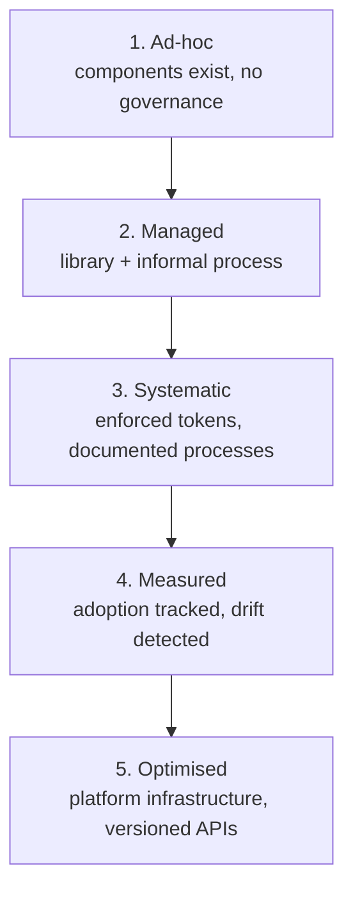

# Component Governance

## The principle

Governance is how a design system decides things on purpose: what gets in, what gets removed, and how those decisions are remembered. A governed system can tell you *why* it looks the way it does; an ungoverned one just accumulates. And governance itself matures in stages — most teams aren't at the end state, and that's fine, as long as they know which stage they're at.

## Why it exists

Without recorded decisions, teams re-litigate the same questions forever. One team's knowledge notes put it plainly: "A team that has maintained records for two years knows why their system looks the way it does. A team that has not is perpetually re-litigating the same questions." The fix is lightweight — a decision record needs only context, options considered, the decision, and its consequences — but it has to cover the decisions a new team member would need to understand, including *declined* proposals, so a future team doesn't reverse something without knowing it was already considered.

— design-system-ops, knowledge-notes/component-governance.md

## How it shows up in practice

Two decisions come up constantly, and the same team's notes give criteria for both.

**What gets in.** A contribution earns a place in the system only if it meets *all* of: **recurrence** (multiple teams need it, not one), **generality** (it solves the category of problem, not one instance), **accessibility** (achievable without design compromise), **ownership** (someone will own its build, docs, and maintenance), and **fit** (it's consistent with existing patterns — "a contribution that requires the system to contradict itself... is not a contribution, it is a fork"). A team building something locally isn't automatically drifting, either: a healthy local implementation is documented, intentional, doesn't conflict with system patterns, and gets flagged as a contribution candidate if the need turns out to be general.

**What gets out.** Deprecation is triggered by any of: a better alternative exists with a clear migration path; usage is at or near zero; accessibility debt can't be resolved; maintenance cost is disproportionate to value; or the component no longer fits the system's direction. Deprecation always ships with a timeline and a migration path, not just a warning.

As a brief aside — governance also matures in *direction*, not just rigor. Murphy Trueman argues that in a bidirectional system, "when a developer implements better error handling, that pattern informs the design system" — knowledge flows upstream from implementation, not only downstream from design. — [Murphy Trueman, "The bidirectional design system: When code talks back to design"](https://blog.murphytrueman.com/the-bidirectional-design-system/)

## Diagram

The knowledge notes describe five stages of governance maturity — a progression, not a scorecard:

— design-system-ops, knowledge-notes/component-governance.md

## Common mistake

Treating governance as gatekeeping. A contribution process that exists to protect the system *from* contributors — rather than to help contributors build the system well — feels rigorous, but the signal it produces is the opposite: contribution rates drop, and teams quietly build locally instead. The system stays "pure" and becomes irrelevant. If nobody is contributing, the process isn't working; it's just being avoided.
