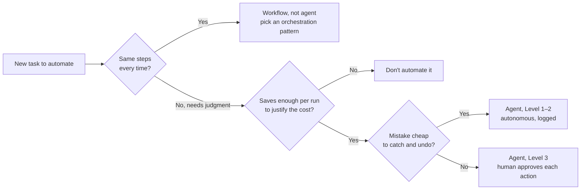

# Agentic Workflow Design

## The principle

Agentic workflows are a coordination problem, not a magic-more-capability problem. When you chain AI agents together — small automated workers, each doing one job — the hard part isn't making any single agent smarter. It's defining how they hand work to each other, and exactly where a human steps in. Skip either definition and you get output nobody can trust or explain.

## Why it exists

Two independent voices point at the same failure mode from different angles. One team's knowledge notes warn: "Never silently skip a failed step — a skipped audit is worse than a failed audit because the consumer assumes the audit passed" (— design-system-ops, knowledge-notes/agent-orchestration-guide.md). That's opacity without accountability. Romina Kavcic attacks it from the economics side: "find the simplest solution possible, and only increase complexity when needed" — if a task follows the same steps every time, you want a workflow, not an agent, and if a run saves less than $0.10 of human time, an agent doesn't pay for itself (— [Romina Kavcic, "Should you build an agent for your design system"](https://learn.thedesignsystem.guide/p/should-you-build-an-agent-for-your)). Complexity without payoff on one side, hidden failures on the other — both come from building the automation before designing the coordination.

## How it shows up in practice

The design-system-ops notes describe four orchestration patterns — named ways agents pass work around. A **sequential chain** runs agents in order, each feeding the next (Component Generator → Description Writer → Accessibility Auditor): easy to debug, but slow and fragile to early failures. A **feedback loop** pairs a generator with a reviewer that critiques and sends work back — higher quality than a single pass, but it "can loop indefinitely if convergence criteria are not defined," so cap it at about three iterations (— design-system-ops, knowledge-notes/agent-orchestration-guide.md).

For the human side, the same practitioner's oversight framework starts from "Agents execute; humans are accountable," and assigns an autonomy level per *action*, not per agent. At one pole, Level 1 (fully autonomous) covers deterministic, programmatically verifiable work like generating a prop list from a TypeScript interface. At the other useful pole, Level 3 (human-in-the-loop) means the agent prepares the action but a human approves it before it executes — publishing a component update, applying a breaking token change (— design-system-ops, knowledge-notes/human-oversight-framework.md). One discipline for anything an agent publishes on its own: scope claims to what was actually inspected — "no X was found in the files scanned," never "the system has no X" (— design-system-ops, knowledge-notes/output-discipline.md).

## Diagram

Should this task get an agent at all — and how much rope?

The left branch is Kavcic's workflow-vs-agent test; the autonomy levels on the right are from the design-system-ops oversight framework.

## Common mistake

Treating "the agent *can* do X" as the same question as "the agent should be trusted to do X unsupervised." They're different questions — that's the opening argument of the oversight framework: teams that never define the boundary either over-trust agents (unchecked output quietly degrades the system) or under-trust them (so much review the productivity gain evaporates) (— design-system-ops, knowledge-notes/human-oversight-framework.md).
