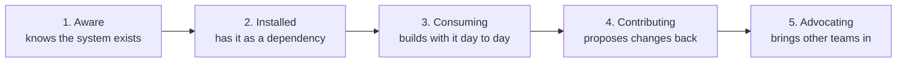

# Adoption Measurement

The Principle

## Coverage measures supply; adoption measures demand

Coverage and adoption answer two different questions. Coverage asks whether the system *provides* what teams need; adoption asks whether teams *actually use* what's provided. A system can score high on one and low on the other, and the fixes are opposites: low coverage is a supply problem (build more), while low adoption with high coverage is a demand problem (figure out why teams aren't consuming what already exists).

Why It Exists

## Confusing the two means fixing the wrong problem

Without this distinction, teams misdiagnose the problem and pour effort into the wrong fix. The classic failure: a system has 100% component coverage but 20% adoption, because product teams keep building custom implementations instead of consuming the library. The instinctive response is "we need more components" — more supply — when the real question is why nobody wants the supply that's already there. That question might lead to onboarding gaps, API friction, or missing documentation, none of which get solved by shipping component number forty-one.

---

## In Practice

#### 1. Usage signals by team

One practitioner's knowledge notes describe four signals worth tracking, and two of them are especially concrete. The first is **component consumption**, measured by import analysis — literally scanning codebases to see which components teams pull into their code. The shape of the distribution matters more than the headline: "a system where 5 components account for 90% of imports and 30 components are rarely used has an adoption problem in the tail, even if the headline number looks good."

The second is **token compliance** — whether teams reference design tokens or hardcode raw color and spacing values. The notes call this "the adoption signal that most directly correlates with system value," because token adoption is what makes theming, rebranding, and consistency actually possible. A team can use every component and still undermine the system by hardcoding values around them.

Whatever you measure, break it down by team, not just system-wide: "a system with 85% overall token compliance might have three teams at 98% and two teams at 40%. The system-level number suggests health; the team-level numbers reveal a problem." The notes also describe five adoption stages — aware, installed, consuming, contributing, advocating — each with a different right intervention, from onboarding help at the start to governance involvement at the end:

— design-system-ops, knowledge-notes/adoption-measurement.md

#### 2. Trust vs. adoption as separate signals

Trust isn't usually the bottleneck people assume it is. zeroheight's 2026 survey of 147 practitioners found 42% report high trust in their system and 49% moderate — only 8% low. Adoption still lags: just 7% describe their system as fully adopted across all teams. People trust the system and still don't reach for it, which rules out "build a better system and they'll come" as the fix. The real blockers tend to be missing mandate, incomplete coverage, and weak communication, not trust. Murphy Trueman frames the underlying psychology similarly: adoption gaps are often about friction and habit, not quality. — [Murphy Trueman, "The component adoption gap: understanding the psychology behind design system success"](https://murphytrueman.substack.com/p/the-component-adoption-gap-understanding); zeroheight, *Design Systems Report 2026*

#### 3. Purpose-built adoption tooling

**Pinterest** built FigStats to track component use directly from the Figma API. **Atlassian** built a custom adoption scanner for the same purpose. Both are examples of teams deciding that survey-based or manual tracking wasn't precise enough and investing in custom instrumentation instead. — via zeroheight help centre, "How to measure the dev side of a design system"

#### 4. Common measurement pitfalls

It's worth knowing the naive approaches fail in specific, well-documented ways rather than just "being hard." **Productboard** tried coloring every design-system component on a screen to see visual coverage at a glance — genuinely informative, but they found it couldn't be cleanly quantified as a single metric, because almost no real screen uses *only* system components. Every screen needed a manually-set, somewhat arbitrary coverage threshold.

**Mews** went further and tried building adoption measurement from production data, and found three specific reasons the obvious approaches broke:

- import-based measurement is inaccurate because components get extended and re-exported internally, so it's unclear what should even count
- visual coverage is distorted because large container components dominate the visible area while representing a small fraction of actual component count
- complexity goes unweighted — a simple tag counts the same as a complex datepicker in most naive metrics

Citing these honestly, including where they failed, is more useful than presenting adoption measurement as solved. — [Productboard, "How we measure adoption of a design system at Productboard"](https://www.productboard.com/blog/how-we-measure-adoption-of-a-design-system-at-productboard/); [Mews Developers, "Building a design system adoption metric from production data"](https://developers.mews.com/design-system-adoption-metric-building/)

#### 5. Adoption earned over time

Ness Grixti frames it directly: adoption is "earned. Slowly, through trust, relevance and usefulness," not through a launch event or a mandate — trust compounds through consistency: responding to feedback, honoring promised updates, pairing with teams through problems, and being transparent about changes. The clearest evidence from her own work: **Wise's** rebuild — the same brand-driven token restructure covered in [Brand alignment](brand-alignment.md) — was built on deep audits and open conversation with the teams that would use it, and won Best Adoption at the 2023 zeroheight Design System Awards. The system that wins on adoption isn't necessarily the most polished one; it's the one people were involved in building. Her sharpest diagnostic for when it's slipping: fading adoption tends to show up as quiet disengagement — teams that stop asking questions or stop showing up — more than as active complaints. A team still complaining is still engaged enough to want the system to work; a team gone silent may have already built around it. — [Ness Grixti, "The Hidden Work Behind Design System Adoption"](https://nessgrixti.com/articles/the-hidden-work-behind-design-system-adoption/)

## Common mistakes

Turning team-level breakdowns into a competitive ranking. Publishing a league table of "best adopters" and "worst adopters":

- **Undermines trust.** Ranking teams publicly creates political dynamics that make people defensive instead of honest about their numbers.
- **Flattens context that matters.** A team building a custom data-visualization library isn't failing to adopt; the system may simply not cover their domain.
- **Conflates two different findings.** A good adoption report distinguishes "chose not to use" from "needed something the system doesn't provide," because only the first one is an adoption problem at all. — design-system-ops, knowledge-notes/adoption-measurement.md

These numbers also stop at "is it used" — they don't say whether a used, adopted component is actually helping or hurting once it's live in a specific flow. See [Component performance in context](contextual-component-performance.md) for that next layer.
