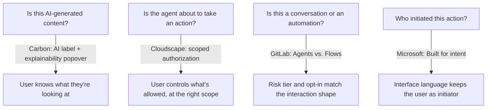

# Designing Agentic UI Patterns

The Principle

## AI isn't only something your system is consumed by — it's a product surface your system has to design for

The rest of this section treats AI as a consumer of the design system: an agent reading tokens, components, and docs to generate correct output. That's one direction. The other direction is a design problem in its own right: your product now ships chat interfaces, generated content, and agents that take actions on a user's behalf, and your design system needs real patterns — components, not just guidelines — for that surface. A handful of mature systems have already published theirs.

Why It Exists

## Without shared patterns, every team invents its own AI transparency and authorization model

Two problems repeat across every product that ships an AI feature: does the user know they're looking at AI-generated content, and does the user actually control what an agent is allowed to do on their behalf? Left to individual teams, both get solved inconsistently — one screen discloses AI generation with a badge, another with a tooltip, a third not at all; one flow asks permission before every action, another asks once and never again regardless of risk. A shared pattern language turns both into deliberate, reusable design decisions instead of ad hoc choices made under deadline pressure.

---

## In Practice

#### 1. Transparency as a component, not a policy

IBM Carbon's **Carbon for AI** extension gives AI-generated content "a visually and behaviorally distinct identity," and makes explainability mandatory at the component level: "Each AI component is required to have an embedded AI label and explainability popover that alerts users to AI-generated content." It ships as an AI label, an AI chat framework, and AI-variant versions of Carbon's core components — so the transparency requirement travels with the component instead of living in a separate guidelines page a team can skip. — [Carbon Design System, "Carbon for AI"](https://carbondesignsystem.com/guidelines/carbon-for-ai/)

#### 2. Authorization scoped to risk, not asked once or asked every time

AWS Cloudscape's **user-authorized actions** pattern is the most concrete authorization model published by any of these systems. Instead of a single yes/no prompt, it offers a scope selector: "Allow this time," "Allow for this chat," or "Always allow" — so trust is granted at the level the user actually intends. Two rules sharpen it further: "Don't show the authorization dialog for a tool that is already trusted for the session," and for actions that can't be undone, require typed confirmation before the Allow button even enables. — [AWS Cloudscape, "User-authorized actions"](https://cloudscape.design/gen-ai/patterns/user-authorized-actions/)

This is a UI-level version of the same problem [Scaling AI effort to risk](scaling-ai-effort.md) and [Agentic workflow design](agentic-workflow-design.md) solve for agent access and autonomy levels — the pattern differs, but the underlying judgment (scale trust to risk and reversibility, not to convenience) is the same one.

#### 3. Naming the difference between a conversation and an automation

GitLab's Pajamas design system draws an explicit line between two shapes of AI interaction: **Agents**, which are conversational and iterative, and **Flows**, which are automated and repeatable — each carrying different risk tiers and different opt-in requirements. Their underlying principle: "Design AI to be collaborative, not autonomous. AI should suggest and assist while users remain in control." High-risk features specifically require "opt-in ... and showing users a review step before execution." — [GitLab Pajamas, "AI-human interaction"](https://design.gitlab.com/patterns/ai-human-interaction/). GitLab's own page flags that these patterns are still in development — worth treating as an emerging reference, not a finished standard.

#### 4. Keeping the user as the initiator, not the agent

Microsoft's agent design guidelines name three principles: **Built for intent** (agents support judgment, they don't replace it), **Differentiated from humans** (interface language should say "process" or "analyze," not "understand" or "think"), and **Bias resistant** (design for who else might see or act on the agent's output, not just the immediate user). The intent principle has a concrete UI consequence: phrase actions as "Summarize with Copilot," not "Copilot, summarize" — small enough to miss, but it's the difference between the user staying the initiator and the agent appearing to act on its own. — [Microsoft Learn, "Human-centered design for agents"](https://learn.microsoft.com/en-us/agents/design-guidelines/human-centered-design). Note: this page is marked as AI-generated content on an official Microsoft Learn doc, not an individually authored piece — flagged here in keeping with this wiki's sourcing discipline, not as a reason to discount it.

## Diagram

Four systems, the same underlying question asked at a different point in the interaction:

---

## Common mistakes

- **Treating AI transparency as a guidelines page instead of a shipped component.** A disclosure rule that isn't embedded in the component itself will drift out of sync with what actually ships — Carbon's AI label solves this by making the transparency mechanism part of the component, not a separate document about the component.
- **Using one authorization model for every action regardless of risk or reversibility.** A single "allow AI to do this?" prompt either under-protects irreversible actions or over-interrupts trivial ones — Cloudscape's scoped model and GitLab's risk-tiered opt-in both exist to avoid that flattening.
- **Letting interface language imply the agent is the actor.** Microsoft's phrasing rule exists because small copy choices ("Copilot, summarize" vs. "Summarize with Copilot") shift who the user perceives as in control, independent of what the system actually does.
