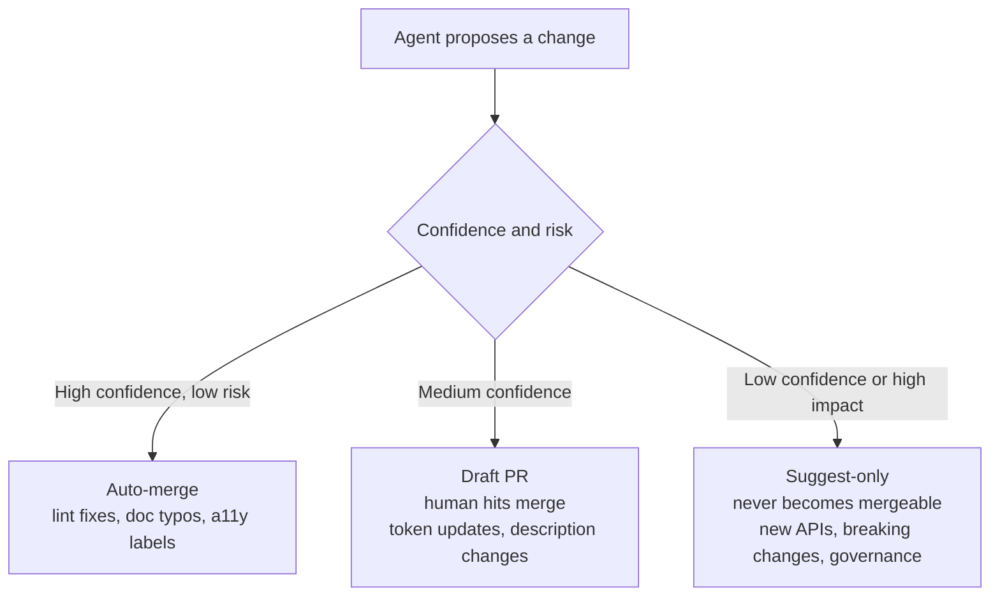

# CI for Agentic Workflows

The Principle

## CI is where an agent's write access becomes a reviewable, revertible artifact

[Agentic workflow design](agentic-workflow-design.md) sets an autonomy level per action — how much review it needs before it takes effect. CI (continuous integration — the automated pipeline that tests and ships code changes) is the specific place most of those levels get enforced for anything that touches code, tokens, or docs. An agent that can write files but can't merge them on its own is only actually constrained if something sits between "the agent produced this" and "this is now live" — and that something is almost always a CI job.

Why It Exists

## Without a gate, "the agent wrote it" and "it shipped" are the same event

Give an agent the same write permissions a human contributor has, and a bad output stops being a draft someone reviews — it's already in the system. GitHub's own security architecture for its agentic-workflows product states the underlying problem plainly: an agent that can act directly on a repository is one prompt-injection or misconfiguration away from an unauthorized change, because there's no boundary between "the agent decided this" and "the repository now reflects it." Their fix separates the two: "agents run read-only and request actions via structured output, while separate permission-controlled jobs execute those requests," which "provides least privilege, defense against prompt injection, auditability, and controlled limits per operation." (— [GitHub, "Safe Outputs"](https://github.github.com/gh-aw/reference/safe-outputs/))

Romina Kavcic names the same failure from the design-system side: without a gate, a drift-fixing agent's confidence and a design system's actual risk tolerance have no relationship to each other — a low-risk lint fix and a breaking token change get the same treatment by default, which means either everything requires a human (and the automation isn't worth building) or nothing does (and a breaking change slips through unreviewed). (— Romina Kavcic, describing her CI trust-tier system at the AI Design Systems Conference 2026, [via Sil Bormüller, "Your Design System Is Not Ready for AI Agents"](https://www.intodesignsystems.com/blog/design-system-not-ready-for-ai-agents))

---

## In Practice

#### 1. Safe outputs: the agent proposes, a separate job decides

GitHub Agentic Workflows runs the agent itself with no write permissions at all. It can only emit a structured request — "create this issue," "open this PR" — which a separate, permission-controlled job then validates and executes. GitHub's docs describe this as a three-step separation: the agent runs read-only, it produces a structured request instead of calling the write API directly, and a distinct job with write access is what actually touches the repository. (— [GitHub, "Safe Outputs"](https://github.github.com/gh-aw/reference/safe-outputs/))

Jan Six's team applies exactly this pattern to GitHub's own Primer design system: agentic workflows run daily QA and maintenance, but they're wired so the agent "can only create an issue, never merge code." (— Jan Six, describing GitHub Primer's agentic QA workflow, [via Sil Bormüller, "Your Design System Is Not Ready for AI Agents"](https://www.intodesignsystems.com/blog/design-system-not-ready-for-ai-agents)) The write permission never touches the agent — it lives in whatever job processes the agent's output, which is what makes the boundary real instead of a convention someone could forget to follow.

#### 2. Trust tiers assigned per CI action, not per agent

[Agentic workflow design](agentic-workflow-design.md) already covers per-action autonomy levels for agent work generally. Kavcic's version of the same idea, applied specifically to what a CI pipeline is allowed to do with an agent's output, sorts by confidence and risk into three tiers: auto-merge for high-confidence, low-risk changes like linting fixes, documentation typos, and accessibility labels; draft PR for medium-confidence changes like token value updates or component description changes, where a human still has to hit merge; and suggest-only for anything low-confidence or high-impact — new component APIs, breaking changes, governance decisions — where the agent's output never becomes a mergeable artifact at all. (— Romina Kavcic, [via Sil Bormüller, "Your Design System Is Not Ready for AI Agents"](https://www.intodesignsystems.com/blog/design-system-not-ready-for-ai-agents))

The tier follows the *change*, not the agent that produced it — the same agent can land in auto-merge for a lint fix and suggest-only for a breaking API change in the same afternoon.

#### 3. Drift detection as a scheduled CI job, not a one-time check

Design-system-ops's guidance treats stale documentation as something a pipeline should catch on its own schedule: "a scheduled process (CI pipeline, GitHub Action, or recurring skill run) compares the component's current prop interface against its documented props. Mismatches are surfaced as findings, not silently ignored." (— design-system-ops, knowledge-notes/ai-readiness.md)

Kavcic's framing of the same mechanism widens the inputs beyond just prop interfaces: a drift-scoring engine fed by "Figma API, CI hooks, and usage analytics" flags inconsistencies and opens the fix as a pull request automatically. (— Romina Kavcic, [via Sil Bormüller, "Your Design System Is Not Ready for AI Agents"](https://www.intodesignsystems.com/blog/design-system-not-ready-for-ai-agents)) Read against #1 and #2 above, this is the same safe-outputs shape applied to drift specifically: the scoring engine proposes, it doesn't merge, and the resulting PR's tier depends on what kind of drift it's fixing.

#### 4. Optimize what triggers the pipeline, not just how often it runs

A CI job that re-reads a component's full prose documentation on every run pays a real, recurring cost — in the money sense as much as the reliability sense. Diana Wolosin's team at Indeed restructured their pipeline to auto-trigger on MDX updates and convert the changed content to JSON metadata before an agent ever sees it, rather than feeding raw prose into every run. The JSON path used 80% fewer tokens than the equivalent prose pass and cut their annual cost from roughly $1,500 to $300 across a 77-component system. (— Diana Wolosin, [via Sil Bormüller, "Your Design System Is Not Ready for AI Agents"](https://www.intodesignsystems.com/blog/design-system-not-ready-for-ai-agents)) This is the same point [Context engineering](context-engineering.md) makes about structured formats over prose, applied to what a CI trigger actually costs to run.

#### 5. Lint-before-handoff as a merge gate, not a suggestion

Design-system-ops treats incomplete metadata as a release blocker with the same weight as a failing test: "before a component is considered release-ready, its metadata should pass a quality gate: all props documented, all interactive states defined, accessibility contract complete, structured JSON metadata in sync with text description... treating incomplete documentation with the same seriousness as failing tests." (— design-system-ops, knowledge-notes/ai-readiness.md) Wiring that gate into CI, rather than leaving it as a manual pre-release checklist, is what actually stops an under-documented component from reaching consumers — a checklist item gets skipped under deadline pressure; a failing pipeline doesn't merge.

## Diagram

Where a CI-triggered agent action lands depends on confidence and risk, not on which agent produced it:

Underneath all three tiers, the agent itself never holds write access — it produces a request, and a separate, permission-controlled job is what actually merges, per GitHub's safe-outputs separation.

---

## Common mistakes

- **Giving the agent direct write or merge permissions "to save a step."** The entire trust boundary described above depends on the agent being read-only and a separate job handling the write — collapse that separation and a prompt-injected or simply wrong output ships without anyone reviewing it.
- **Assigning trust tiers per agent instead of per action.** The same agent should be able to land in auto-merge for a lint fix and suggest-only for a breaking change on the same day — a blanket "this agent is trusted" or "this agent needs review" ignores that risk lives in the change, not the actor.
- **Running drift detection but leaving the resulting PRs unowned.** A scheduled job that opens PRs no one is assigned to review just relocates the staleness problem from the docs to an ignored PR queue.
- **Feeding CI the same prose a human reads instead of a structured format.** Wolosin's Indeed numbers exist because the format the pipeline runs against changes both the cost and the reliability of every run — an unoptimized trigger makes automated checks expensive enough that teams quietly narrow how often they run.
