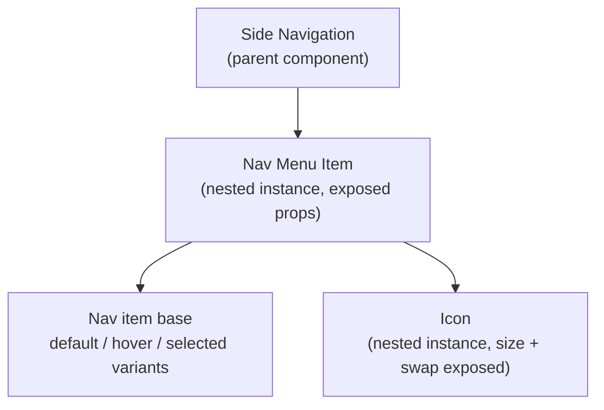

# Layered Component Architecture

The Principle

## A component's flexibility comes from nesting smaller components inside it, not from adding more variants and booleans to one flat layer

Once a team has the vocabulary from [Component taxonomy](component-taxonomy.md) — primitive, subcomponent, slot — the next question is mechanical: how do you actually build that structure in Figma? Nathan Curtis's answer is to stop treating every new need as a new variant or a new boolean toggle, and instead build components as **nested instances**: smaller subcomponents placed inside a parent, with their properties exposed up through the parent's properties panel. The alternative — one flat component with a growing pile of variant switches and boolean layers — is the same "configuration collapse" failure mode from [Component API design](component-api-design.md), just showing up in the Figma file instead of the code. — [Nathan Curtis, "Architecting Subcomponents"](https://www.youtube.com/watch?v=NiDoqI_ZhvY), Schema by Figma, 2022

Why It Exists

## Flat components run out of room, and designers detach to compensate

A component built as one flat layer tree with variants for every case eventually hits a wall: a real product request doesn't match any existing variant, and there's no way to combine two variants that were built as mutually exclusive options. The designer's only way forward is to detach the instance and hand-edit it — which quietly removes that instance from the system. It stops getting updates, stops showing up in coverage metrics, and nobody notices until an audit finds it. Curtis's talk frames the whole subcomponent approach as a response to exactly this: rather than the design system team "playing constant catch-up, adding prop after prop" to keep pace with requests, the system offers composable parts and lets the requester assemble their own answer. — [Nathan Curtis, "Architecting Subcomponents"](https://www.youtube.com/watch?v=NiDoqI_ZhvY), Schema by Figma, 2022

---

## In Practice

#### 1. Component properties: Figma's equivalent of props

Figma's component properties feature — variant, boolean, text, and instance-swap properties attached directly to a component — is, as Figma's own team has put it, "essentially React properties for Figma components." Every property added here is the design-tool equivalent of a prop in code: it should earn a permanent place the same way a code prop does, not get added reflexively because one request needs it. The same discipline from [Component API design](component-api-design.md) — configurable for the common case, composable for the uncommon one — applies here before a single property gets added. — [Figma, "Taking cues from code"](https://www.figma.com/blog/taking-cues-from-code/)

#### 2. Nested instances with exposed properties

A subcomponent placed inside a parent — an icon inside a Button, a `CardMedia` inside a Card — is a nested instance. Figma lets a parent component expose a nested instance's own properties (its instance-swap slot, its boolean visibility, its text content) up into the parent's properties panel, so a designer working on the Button never has to drill into the icon's layer to change it. This is the mechanical form of a slot: the nested instance is the subcomponent, the exposed property is what makes it swappable from the parent's surface. — [fourzerothree.in, "Crafting Components with Subcomponents and Nested Instances"](https://www.fourzerothree.in/p/crafting-components-with-subcomponents)

#### 3. Layered nesting, base components first

fourzerothree.in's worked example builds bottom-up: a base component set (a nav item with default/hover/selected states) becomes the foundation nested inside a larger Nav Menu Item, which is itself nested inside a Side Navigation component — each level exposing only the properties relevant at that level, rather than every property from every layer bubbling all the way to the top. Icon components follow the same pattern one level down: a master icon component with size and icon-swap properties exposed, reused as a nested instance inside buttons, inputs, and nav items alike, instead of a separate icon baked into each. — [fourzerothree.in, "Crafting Components with Subcomponents and Nested Instances"](https://www.fourzerothree.in/p/crafting-components-with-subcomponents)

#### 4. Variants still have a place

Nested instances aren't a replacement for variants — they solve different problems. A variant set is right for a closed set of mutually exclusive states on one component (a button's default/hover/active/disabled). Nesting is right when a piece needs its own independent property surface, or gets reused inside more than one parent. Reaching for a new variant when the actual need is a swappable nested piece is how a variant set quietly grows past the point anyone can read it at a glance.

#### 5. The same warning as code: don't over-architect

fourzerothree.in's own caution applies here directly: over-nesting for flexibility that isn't needed yet creates a component so deep that other designers can't find the layer they're supposed to edit, and simple, predictable naming stops being simple. The bar for splitting a piece into its own nested instance is the same [rule of three](contribution-models.md) that governs splitting out a new component at all — wait for a second real reuse, don't pre-build for a hypothetical one. — [fourzerothree.in, "Crafting Components with Subcomponents and Nested Instances"](https://www.fourzerothree.in/p/crafting-components-with-subcomponents)

## Diagram

How a Side Navigation component nests down to its base states:

---

## Common mistakes

- **Adding a component property reflexively instead of treating it like a code prop.** Every variant, boolean, or instance-swap property is a permanent surface someone has to maintain and every consumer has to learn — the same "earn its place" discipline from [Component API design](component-api-design.md) applies inside Figma, not just in code.
- **Detaching instead of nesting.** If the system doesn't yet expose the flexibility a designer needs, the fix is to add a well-scoped nested instance or property to the source component, not to detach and hand-edit a copy that silently drops out of the system.
- **Over-nesting for hypothetical flexibility.** Splitting off a nested instance before a second real use case exists produces a component tree too deep for other designers to navigate confidently — the same rule of three that governs new components applies to new nested pieces.
- **Letting every nested property bubble all the way to the top-level component.** Exposing everything at every level defeats the point of layered nesting; expose only what's relevant to the level that's actually being edited.
