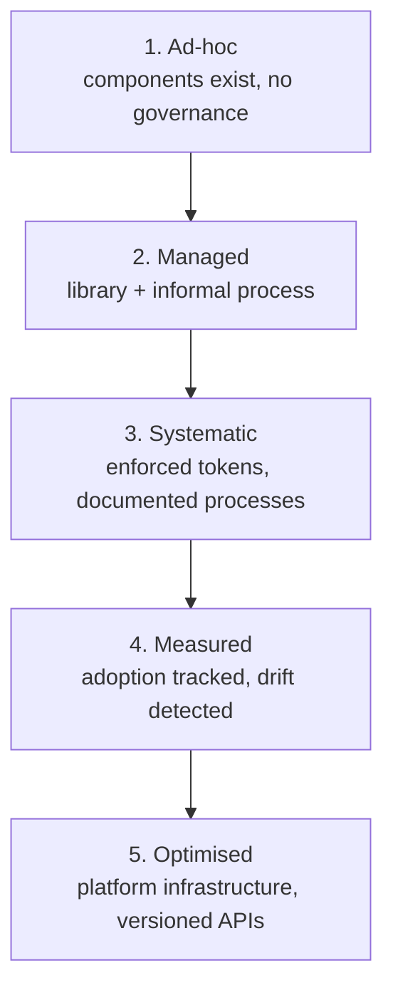

# Component Governance

The Principle

## Governance is deciding on purpose, not accumulating by default

Governance is how a design system decides things on purpose: what gets in, what gets removed, and how those decisions are remembered. A governed system can tell you *why* it looks the way it does; an ungoverned one just accumulates. And governance itself matures in stages — most teams aren't at the end state, and that's fine, as long as they know which stage they're at.

Why It Exists

## Undocumented decisions get re-litigated forever

Without recorded decisions, teams re-litigate the same questions forever. One team's knowledge notes put it plainly: "A team that has maintained records for two years knows why their system looks the way it does. A team that has not is perpetually re-litigating the same questions." The fix is lightweight — a decision record needs only context, options considered, the decision, and its consequences — but it has to cover the decisions a new team member would need to understand, including *declined* proposals, so a future team doesn't reverse something without knowing it was already considered.

— design-system-ops, knowledge-notes/component-governance.md

> "The biggest existential threat to any system is neglect."
> — Alex Schleifer, Airbnb, quoted in Brad Frost, *Atomic Design*, Chapter 5

Schleifer's line names the failure mode this page is about directly: governance doesn't die from a bad decision, it dies from decisions nobody bothered to make or record.

## How it shows up in practice

Governance also matures in *direction*, not just rigor. Murphy Trueman argues that in a bidirectional system, "when a developer implements better error handling, that pattern informs the design system" — knowledge flows upstream from implementation, not only downstream from design. — [Murphy Trueman, "The bidirectional design system: When code talks back to design"](https://blog.murphytrueman.com/the-bidirectional-design-system/)

Jina Bolton, describing the same dynamic from her time at Salesforce, puts it as a loop rather than a direction:

> "The Design System informs our Product Design. Our Product Design informs the Design System."
> — Jina Bolton, Salesforce, quoted in Brad Frost, *Atomic Design*, Chapter 5

Two practitioners at different companies landing on the same shape of answer independently is worth noticing — it suggests this isn't a house style, it's what a governance process looks like once it's actually working in both directions.

**A concrete decision tree for what happens to a proposal**, rather than a general principle about recording decisions: Inayaili de León Persson's Canonical Vanilla Framework sorts every incoming pattern change into one of three lanes before it goes anywhere:

- **Modification** — feature additions, bug fixes, visual tweaks, performance improvements to something that already exists.
- **Addition** — a genuinely new pattern filling a gap, with explicit safeguards against bloat.
- **Removal** — deprecation shipped with advance notice, not a surprise.

Sorting the request into a lane first, before debating its merits, keeps a "should we add a new component" conversation from accidentally being argued as if it were a five-minute bug-fix review, or vice versa. — Brad Frost, *Atomic Design*, Chapter 5

This page covers the mechanics of recording and maturing decisions. The separate question of *who* gets to propose and decide — and the specific criteria for what enters or leaves the system — is covered in [Contribution models](contribution-models.md), where it can get the depth it deserves rather than being squeezed into a subsection here.

## Diagram

The knowledge notes describe five stages of governance maturity — a progression, not a scorecard:

— design-system-ops, knowledge-notes/component-governance.md

## Common mistake

Treating governance as gatekeeping. A contribution process that exists to protect the system *from* contributors — rather than to help contributors build the system well — feels rigorous, but the signal it produces is the opposite: contribution rates drop, and teams quietly build locally instead. The system stays "pure" and becomes irrelevant. If nobody is contributing, the process isn't working; it's just being avoided.
