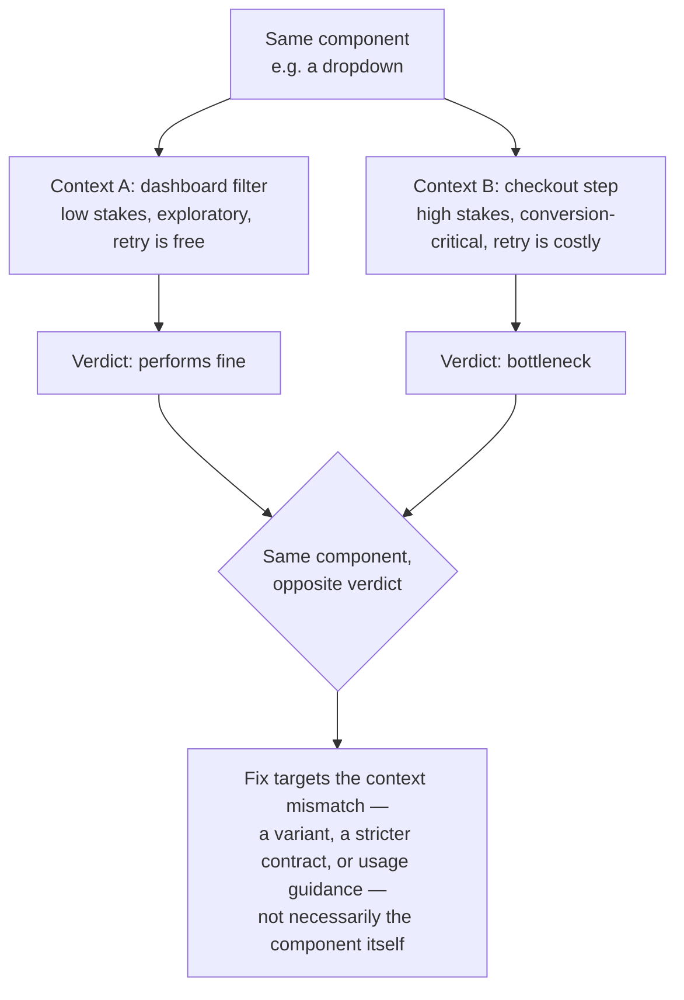

# Component Performance in Context

The Principle

## A component's quality is contextual, not intrinsic

A component that passes isolated testing — accessibility checks, visual QA, token compliance — can still fail where it actually lives. The same dropdown, table, or modal behaves differently depending on what it's embedded in: a filter dropdown on a dashboard tolerates a moment of confusion; the same dropdown inside a checkout step doesn't, because the cost of hesitation there is a lost conversion, not a re-click. [Adoption measurement](adoption-measurement.md) already separates "does the system provide this" from "do teams use it" — this page adds a third question neither one answers: *does it perform, specifically, in the context it's placed in, and within the journey that context is part of.* A component can be imported everywhere, pass every isolated check, and still be quietly working against the one flow where it matters most.

Why It Exists

## Isolated testing and aggregate usage both miss context-specific failure

Two of the most common measurement habits in a design system practice — isolated component QA and system-wide usage analytics — share a blind spot: neither one is context-aware. Isolated QA asks "does this component work correctly," in a vacuum, once. Usage analytics asks "how often is this component used," summed across every place it appears. Both answers can look healthy while the component is actively hurting one specific, high-stakes flow. A high import count and a passing test suite say nothing about what happens when the component sits inside a journey where the surrounding task, stakes, and user attention differ from every other place it's deployed.

Without measuring in situ (in its actual place of use, not in isolation), a team makes one of two mistakes. It either misdiagnoses the fix — rebuilding a component that's actually fine in 9 of 10 contexts — or misses the fix entirely, because the component's aggregate numbers stay green while it bottlenecks the one journey the business cares most about.

---

## In Practice

#### 1. The instrumentation gap

Product analytics tools built for measuring friction — funnel drop-off (where users abandon a multi-step flow), rage clicks (repeated fast clicks on something that isn't responding), dead clicks (a click that triggers no visible response), session replay (a recorded playback of a real user's screen) — are page- and flow-aware by design. But they have no native concept of "design system component."

Component usage tooling is the mirror image. Import scanners like **Pinterest's** FigStats or **Atlassian's** custom scanner (see [Adoption measurement](adoption-measurement.md)) are component-aware but context-blind: an import count doesn't know or care whether that instance sits in a checkout step or a settings panel. Closing the gap means deliberately tagging analytics events with both the component identity *and* its journey context — a practice that has to be built in-house, because no tool ships this connection out of the box.

#### 2. Risk as component × context

[Scaling AI effort](scaling-ai-effort.md) borrows a Challenge Rating (CR) concept that ranks how dangerous a component is to implement incorrectly — badges low, date pickers and data tables high. That rating is usually treated as a fixed property of the component. In practice it isn't: the same dropdown can be CR 1 in a dashboard filter and effectively CR 6 in a payment step, because the cost of the same mistake scales with what the surrounding journey is trying to accomplish. A context-aware practice re-asks the CR question per placement, not just per component.

#### 3. Slice detachment/override spikes by page

**Figma's** design-system metrics research quotes **athenahealth's** Veronica Agne treating a rise in component detachment as a flag worth investigating — "it can mean one of three things: there's a bug, people want an enhancement, or..." — [Figma, "Design systems 104: Making metrics matter"](https://www.figma.com/blog/design-systems-104-making-metrics-matter/). That diagnosis sharpens considerably once it's sliced by *where* the detachment happens: a component detached everywhere points to a flaw in the component itself; a component detached only on one journey's screens points to a context mismatch the shared version doesn't handle — evidence for a variant or contract change, not a rebuild.

#### 4. Bottleneck or accelerant, not just usage

A component can be adopted, accessible, and on-brand, and still be the specific step where a critical journey slows down or drops users — checkout, onboarding, upgrade flows. That question is answerable with the same funnel and friction instrumentation product teams already run; the missing piece is connecting a drop-off step back to the specific component instance sitting at that step, so the finding routes to the design system team instead of dead-ending as a generic "step 3 has high abandonment."

#### 5. Measurement failure modes worsen with context

**Mews's** account of building adoption metrics from production data found that import-based counts are unreliable once components get extended and re-exported, that large container components distort visual measurement, and that complexity goes unweighted in naive metrics (cited in [Adoption measurement](adoption-measurement.md)). Slicing any of those measurements down to a single journey or page type shrinks the sample further and amplifies the same noise — a context-level finding needs more evidence, not less, before it's trusted.

## Diagram

The same component can pass in one context and fail in another — the difference isn't the component, it's what's riding on it:

## Emerging ideas: closing the loop with unified analytics platforms

No team appears to be doing this publicly yet — this section is a speculative sketch, not a documented practice, offered because the tooling to attempt it now genuinely exists in one place for the first time.

The instrumentation gap described above — product analytics is context-aware but component-blind, component analytics is usage-aware but context-blind — has historically required stitching together two separate vendors (a product-analytics tool and a component/design-tooling scanner) by hand.

Platforms like [PostHog](https://posthog.com/docs/llm-analytics) have recently started closing that gap natively. They unify product analytics — funnels, session replay, feature flags (toggles that turn a feature on for some users without a new deploy) — with LLM/agent observability: traces (a step-by-step record of what an AI agent did), evaluations, and cost and latency per model call. In that combined system, "every trace has a person behind it" — an LLM call and the human session around it already share one identity graph (a single record linking everything tied to that person), natively. That's a materially different starting point than wiring two disconnected tools together, and it opens up a few concrete possibilities worth naming even though nobody has written them up as a pattern yet:

**Tag component instances the same way you'd tag an LLM trace.** If a design system's runtime components already emit an analytics event on mount or interaction (many do, for adoption tracking — see [Adoption measurement](adoption-measurement.md)), extending that event with a `journey_stage` or `page_type` property costs almost nothing and immediately makes the existing funnel and session-replay tooling component-aware, without needing a separate contextual-analytics product.

**Let an agentic authoring or migration workflow's LLM trace and the component's runtime outcome share one record.** [Agentic workflow design](agentic-workflow-design.md) already argues that agent actions need scoped, auditable output. If the same platform captures both "an agent generated or migrated this component" (an LLM trace) and "this component then underperformed in the checkout journey" (a product-analytics signal), the two facts can be joined automatically instead of requiring a human to notice the correlation later — turning a one-off finding into a standing feedback signal an agentic design-system workflow could act on.

**Run context-specific variants as flagged experiments, not one-off audits.** A suspected context mismatch (the dropdown that's fine on dashboards, costly at checkout) becomes testable directly: ship a checkout-specific variant behind a feature flag, and read the conversion delta from the same platform that already holds the baseline behavior — rather than running a separate A/B tool and manually reconciling the two datasets.

**Treat a component-in-context regression as an anomaly a scheduled process can flag, not something a human has to remember to look for.** Some of these platforms already run a scheduled process that explores usage data and files a report when a slice regresses against its baseline, aimed at LLM cost, latency, and error rate. Pointing that same mechanism at "this component's completion rate dropped in this specific journey stage" is a natural extension of a capability that already exists — not something documented, but not a stretch either.

The caution attached to all of this: this is custom instrumentation glue a team would have to build deliberately, not a turnkey feature any vendor ships today for design systems specifically. It's the same discipline [AI context & readiness](ai-context-and-readiness.md) argues for at the token and component-metadata level, applied one layer up — treat context quality in your analytics events as an investment that compounds, because right now almost no design system is making it.

---

## Common mistakes

- **Treating a single global number as the whole answer.** "94% token compliance" or "imported in 40 repos" can be true system-wide while the component is actively working against the one journey leadership actually tracks.
- **Rebuilding on the strength of one bad flow.** Seeing a component underperform in a single high-visibility journey and rebuilding it outright, without first checking whether it's fine everywhere else — when the real fix is a context-specific variant or guidance, not a system-wide change.

Neither mistake is visible from aggregate metrics alone — both require asking the performance question at the level of a specific context and journey, not the system as a whole.
