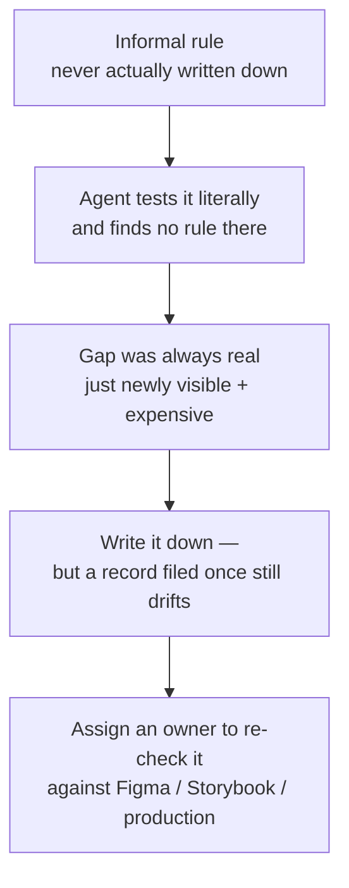

# Governance for AI

The Principle

## Agents treat every documentation gap as a rule to follow literally

[AI context & readiness](ai-context-and-readiness.md) is about whether a system's metadata is explicit enough for an agent to consume. This page makes a sharper, related claim: an agent doesn't just need explicit metadata. It treats every gap, every stale doc, and every "everyone just knows" convention as a rule to follow literally, because it has no instinct to fall back on when the written rule and the real one disagree.

A human contributor papers over that gap without noticing. An agent doesn't paper over anything — it executes exactly what's written, or exactly what it can infer from the code, whichever is more concrete. Shane P Williams, founding editor of the Design Systems Collective, has spent a 2026 run of essays on exactly this shift: governance and documentation problems that were tolerable when only humans read them, and stop being tolerable once agents do. — [Shane P Williams, "Legibility Is the New Governance"](https://designsystemscollective.substack.com/p/legibility-is-the-new-governance)

Why It Exists

## An agent bypassing your library is a legibility failure, not a tool failure

Williams frames the failure mode precisely: "When an agent is handed your documentation and still reaches for freshly generated code instead of your component library, the system failed a legibility test, not a tool test." The instinct is to blame the tool or the model. The actual cause is almost always upstream — an ambiguous name, an undocumented exception, a rule that only lived in one engineer's head. "If your design system cannot be understood without a human translator, it was never really infrastructure. It was craft, maintained by goodwill." — [Shane P Williams, "Legibility Is the New Governance"](https://designsystemscollective.substack.com/p/legibility-is-the-new-governance)

---

## In Practice

#### 1. Formalizing informal agreements

Williams's sharpest claim: a lot of what teams call "governance" was never actually enforced. It was a shared understanding that humans navigated by instinct, tone, and relationship, not by a rule anyone could point to.

"The informal contract that humans could navigate by instinct becomes a hard boundary an agent will test without mercy," because "when a machine consumes your design system, it does not interpret intent. It executes whatever you actually built, not what you meant to build." His conclusion about what that arrangement actually was: "That was never a system. It was a relationship" — and a relationship doesn't scale to a consumer that can't read tone. The fix isn't stricter enforcement of the old informal rule; it's admitting the rule was never written down, and writing it down now, before something tests it. — [Shane P Williams, "The Informal Contract Is Over"](https://designsystemscollective.substack.com/p/the-informal-contract-is-over)

#### 2. Cost of deferred maintenance

The corollary to the point above: gaps a team has been living with for years — an under-documented edge case, a component that technically has two conflicting "correct" usages — don't cause new damage the day an agent shows up. They were always a cost. Williams's framing: "the work that teams quietly deferred has not gone away. It has simply become more visible, and considerably more expensive." This connects directly to [documentation coverage](documentation-coverage.md)'s three-rung model — a component stuck at "exists" instead of "guided" was already a risk for new human contributors; an agent just removes the grace period.

#### 3. Written records vs. true records

[Component governance](component-governance.md) already argues for decision records so a system doesn't re-litigate the same question every 18 months. Williams pushes past that: writing the record down solves the *memory* problem but not the *staleness* problem. "Every design system claims a source of truth. Fewer are honest about how long ago anyone last checked it," and — more bluntly — "writing something down is not the same as keeping it true."

What he found actually prevented drift in practice wasn't better documentation tooling — it was a habit: "one origin for a fact, checked against reality instead of copied from memory." A rule survives not because someone wrote it once, but because "someone rewrote it, in the open, reasoning intact," when reality (a browser update, a new edge case) proved the old version wrong. The practical takeaway: a decision record needs an owner who periodically re-checks it against the real system, not just an author who filed it once. — [Shane P Williams, "Drift Doesn't Announce Itself"](https://designsystemscollective.substack.com/p/drift-doesnt-announce-itself)

#### 4. A referee for competing sources of truth

Design intent (Figma), documented behavior (Storybook), and what's actually running in production routinely disagree. Not because someone is lying, but because "none of the three is lying. They are each authoritative for a different question." Figma answers "what was intended," Storybook answers "what was built and documented," production answers "what's actually shipped."

Williams argues this creates a job that mostly doesn't formally exist yet: "once truth lives in layers, who is actually responsible for keeping them honest with each other." Telling a healthy, deliberate divergence (production adapted for a real constraint) apart from unintentional decay (nobody updated Storybook after a change) "is judgment, and judgment needs an owner, not a dashboard."

His description of the job itself is worth keeping verbatim: "the job is deciding, in public, which layer governs a given decision and being able to say why." He's explicit that better tooling doesn't remove the need for this role — "it will not do the deciding" — it just produces better evidence for the person still doing it. — [Shane P Williams, "The Job Nobody Is Hiring For Yet"](https://designsystemscollective.substack.com/p/the-job-nobody-is-hiring-for-yet)

## Diagram

Williams's four essays form a progression, not four separate claims:

---

## Common mistakes

- **Treating this as an AI-specific problem with an AI-specific fix** — better prompts, a bigger context window, a smarter agent. "Legibility has become a design constraint, not just a documentation problem. The systems that will hold up are the ones built to be understood without a human in the loop." The gap an agent exposes was already a gap for a new hire, a contractor, or a contributor from another team — the agent just removes the last few people willing to quietly fill it in from memory.
- **Relying on an informal, tribal understanding instead of a written rule.** "The informal contract that humans could navigate by instinct becomes a hard boundary an agent will test without mercy" — a relationship doesn't scale to a consumer that can't read tone.
- **Treating a written record as permanently true.** Writing a decision down solves the memory problem, not the staleness problem — a rule survives because someone periodically re-checks it against reality, not because someone filed it once.
- **Leaving no one accountable when Figma, docs, and production disagree.** Design intent, documented behavior, and what's actually shipped are each authoritative for a different question; telling healthy divergence apart from unintentional decay is judgment that needs an owner, not a dashboard.

As Williams puts it, closing the loop on why this matters now rather than later: "the question is not whether to operate your design system. The question is whether you have been honest with yourself about what operating it actually requires." — [Shane P Williams, "Legibility Is the New Governance"](https://designsystemscollective.substack.com/p/legibility-is-the-new-governance)
