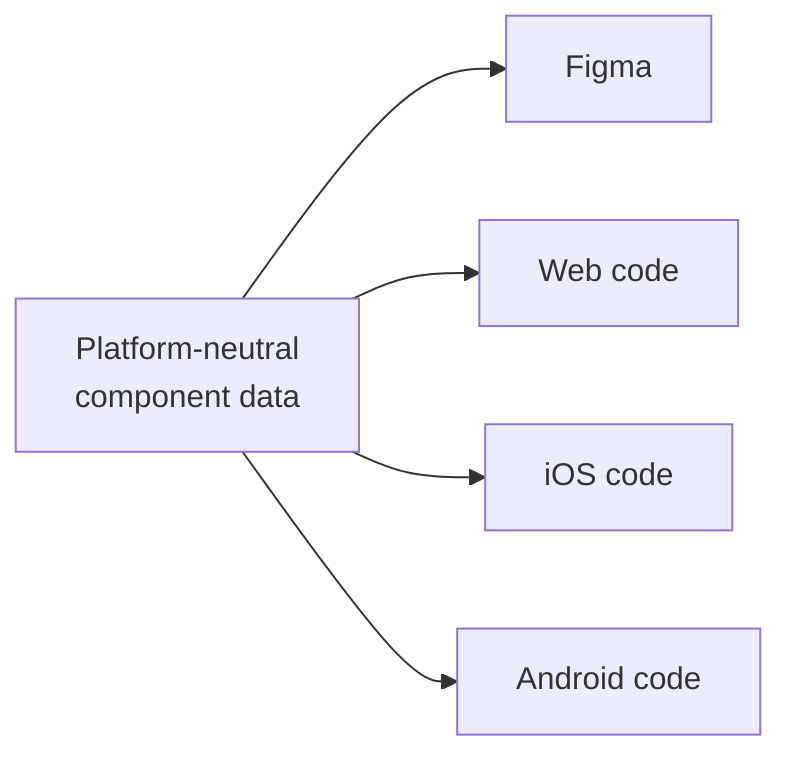

# Multi-Platform Component Specs

The Principle

## A component's source of truth has to be platform-neutral data, not a single tool's file, for independent platform teams to build the same thing without drifting apart

Most design systems no longer ship to one codebase. Nathan Curtis notes that "a three platform setup (iOS, Android, and web) is common, and some systems like IBM Carbon spread across many more" — and once that's true, one design decision has to reach several independent development teams who will never sit in the same standup. — [Nathan Curtis, "Component Specifications"](https://medium.com/eightshapes-llc/component-specifications-1492ca4c94c)

If the source of truth is a single Figma file, each platform team reads the same screen and fills in the gaps differently: one guesses a spacing value, another rounds a corner radius, a third invents a prop name. The fix isn't better redlining — it's moving the source of truth out of any one tool and into structured, platform-neutral data (anatomy, props, styles, token references) that Figma, iOS, Android, and web code can all be generated *from*, rather than each guessing independently *at* a shared picture.

Why It Exists

## Without a neutral source, multi-platform systems drift into three different products

When each platform team's only shared reference is a visual mockup, small interpretation gaps compound. A button's disabled state looks slightly different on iOS than on Android within a year, not because anyone decided that, but because nobody had to reconcile it — each team built from their own reading of the same file. Curtis's framing makes this explicit: past a certain platform count, "one design serves many independent development teams," and independent teams without a shared, unambiguous artifact will independently diverge. The failure isn't visible until a user hops between platforms and notices the same "concept" behaving differently, which is usually too late to be a quick fix. — [Nathan Curtis, "Component Specifications"](https://medium.com/eightshapes-llc/component-specifications-1492ca4c94c)

## In Practice

#### 1. Specs as the bridge between independent teams

As systems grow past a single platform, spec quality has to rise to compensate — Curtis argues that a spec's job is no longer just documenting a design for one dev team sitting next to the designer; it's declaring intent precisely enough that platform teams who never talk to each other still build the same thing. The [EightShapes Specs plugin](https://nathanacurtis.substack.com/p/the-eightshapes-specs-figma-plugin-2892f21adc96) exists because manually itemizing elements, props, and token mappings by hand doesn't scale once that spec has to serve three or more independent audiences at once. — [Nathan Curtis, "Component Specifications"](https://medium.com/eightshapes-llc/component-specifications-1492ca4c94c)

#### 2. Components as structured data, not a Figma file

Curtis's more recent move is to stop treating Figma as the source at all. In "Components as Data," a component's anatomy, props, styles, and variants are authored directly as structured data (YAML/JSON) — Figma becomes one *output* of that data, alongside generated code, rather than the input everything else is reverse-engineered from. The same neutral definition can drive a pipeline of generated, cross-platform code, and because it's structured rather than a picture, it can also be audited mechanically — Curtis gives the example of a raw color value showing up in a variant where a token reference was required, an error invisible in a rendered mockup but obvious in the data. This is the same shift [Component API design](component-api-design.md) describes for props and variants, applied one layer earlier — to how the component is defined in the first place, not just how its API is shaped. — [Nathan Curtis, "Components as Data"](https://medium.com/@nathanacurtis/components-as-data-2be178777f21)

#### 3. A shared token standard as the multi-platform floor

Tokens are the piece of this most systems get to first, and as of October 2025 there's a shared, tool-independent format to build on: the Design Tokens Community Group's specification reached its first stable release, with editors from Figma, Adobe, Google, Microsoft, Meta, and others aligning on one file format that Style Dictionary, Tokens Studio, Terrazzo, and Figma itself can all read. Co-chair Kaelig Deloumeau-Prigent frames the goal in the same terms as Curtis's components work: "design systems teams can now maintain one source of truth that works everywhere — from design to production code across iOS, Android, and web." [Token architecture](token-architecture.md) covers the primitive/semantic/component tiering this format organizes; this is the interoperability layer underneath it, the reason a token file authored once doesn't need re-authoring per platform or per tool. — [Design Tokens Community Group, "Design Tokens Specification Reaches First Stable Version"](https://www.w3.org/community/design-tokens/2025/10/28/design-tokens-specification-reaches-first-stable-version/), W3C, October 2025

## Common mistakes

- **Treating a Figma file as the spec** instead of a rendering of one. Once more than one platform team is building from it, ambiguity in the visual file becomes divergence in the shipped product — the fix is a structured definition Figma is generated *from*, not read *for*. — [Nathan Curtis, "Components as Data"](https://medium.com/@nathanacurtis/components-as-data-2be178777f21)
- **Writing one spec per platform** by hand instead of one neutral definition that outputs to all of them. Hand-maintained parallel specs drift from each other the same way hand-maintained parallel implementations do.
- **Confusing multi-platform with cross-platform.** The goal isn't one implementation forced to look identical everywhere — see [Component API design](component-api-design.md) on Wealthfront's "design once, build anywhere" — it's one set of decisions expressed idiomatically per platform, which still requires that the *decisions* live somewhere neutral.
- **Adopting the DTCG token format without checking tool support.** The specification reaching a stable release doesn't mean every tool in a given stack has caught up; verify the specific version of Style Dictionary, Tokens Studio, or another pipeline tool actually implements 2025.10 before depending on it.
