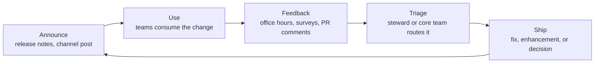

# Communication

The Principle

## Governance decides what's true; cadence makes sure people know it

[Governance](component-governance.md) decides what's in the system and why. Operating cadence is the separate, ongoing practice of making sure people actually *know* that — through channels, a release rhythm, a standing door to ask questions, a named person to guide bigger work, a program to build advocates, and a route for feedback to get back in. A system can be perfectly governed and still fail in practice if nobody outside the core team ever hears about a change, knows who to ask, or has anywhere to send a complaint.

Why It Exists

## An undesigned rhythm defaults to whoever's in the room

Nathan Curtis observes that "not every system team runs a predictable cadence... but every system has some kind of cadence to plan, work, critique, demo, and release things" — the question isn't whether a rhythm exists, it's whether it's designed or accidental. — [Nathan Curtis, "Design System Communications"](https://medium.com/eightshapes-llc/design-system-communications-ca679ffc36d3)

Left undesigned, communication defaults to whoever happens to be in the room, which is also why [adoption measurement](adoption-measurement.md) keeps surfacing "weak communication" as a top blocker even on systems people already trust — trust isn't the same as knowing what changed, who to ask, or where to send feedback.

---

## In Practice

#### 1. Channels organized by audience

Curtis recommends organizing around who needs to hear what, not around subject matter:

- `#system-design` for help, shared ideas, cross-product visibility, and critique-meeting notes.
- `#system-development` for API/PR review calls and working-session summaries.
- `#system-general` as the catch-all for major announcements, sprint reviews, and calls for planning participation.

He also recommends a "message matrix" — plotting problem, channel, audience, and frequency together — as a planning tool for keeping cadence intentional rather than ad hoc. — [Nathan Curtis, "Design System Communications"](https://medium.com/eightshapes-llc/design-system-communications-ca679ffc36d3)

#### 2. Regular release cadence, with hotfix exceptions

**EightShapes'** account of release cadence across several production systems — **Morningstar**, **Discovery Ed's Comet**, **Adobe Spectrum**, and **Shopify** — describes teams aiming for regular minor releases roughly every sprint (commonly two weeks). They still allow irregular "hot fix" releases for browser defects, documentation typos, or malformed elements, which ship informally, outside the normal cycle, rather than waiting for the next planned release. — [Nathan Curtis, "Design System Release Cadence"](https://medium.com/eightshapes-llc/design-system-release-cadence-2e3e6694ba21)

For anything bigger than a routine release — a redesign, a tool migration (Sketch to Figma), a framework upgrade — Curtis argues the team should shift mindset entirely, treating the rollout "like a marketing campaign," with a planned sequence of messages spanning before, during, and after the change, instead of one announcement and silence. — [Nathan Curtis, "Design System Communications"](https://medium.com/eightshapes-llc/design-system-communications-ca679ffc36d3)

#### 3. Scheduled, recurring office hours

**Twilio's** Paste design system runs weekly office hours every Thursday, where teams can plan UI needs, get feedback on an implementation, or debug an issue — backed by a public `#help-design-system` Slack channel and an "Office Hours" category on GitHub Discussions for anyone in a different timezone. — [Twilio Paste, GitHub Discussions: Office Hours](https://github.com/twilio-labs/paste/discussions/categories/office-hours)

**GOV.UK's** Design System team runs the same idea at a slower cadence: a monthly community chat mixing show-and-tell with lean-coffee-style open discussion, hosted on Zoom with room for up to 500 attendees, deliberately scheduled on a different weekday each month so the same working pattern doesn't get excluded every time. — [GOV.UK Design System, "A guide to the design system monthly chat"](https://team-playbook.design-system.service.gov.uk/community/a-guide-to-the-design-system-monthly-chat)

**Mozilla's** Acorn Design System runs a third variant worth naming because it names its own purpose explicitly: weekly office hours every Monday, alternating between an 11:00 AM EST and 2:00 PM EST slot so both US and EU-friendly timezones get a regular turn. Attendees sign up ahead of time through an intake form so the team can prepare, but drop-ins are welcome and a team member stays in the room for last-minute visitors. The team states the goal directly — "provide an alternative communication avenue for teams to ask questions" and "foster collaboration between teams." That's a useful reminder that office hours are a communication channel with a stated purpose, not just a courtesy slot on a calendar. — [Acorn Design System, "Office hours"](https://acorn.firefox.com/latest/support/help-and-support/office-hours-UePgrNIe)

Brad Frost's *Atomic Design* frames both cadences as part of the same idea: schedule regular office hours so makers are reliably available to field questions, and separately schedule periodic "state of the union" meetings that bring makers, users, and stakeholders into the same room to review what's working and discuss the roadmap together, rather than leaving each group to hear about the other secondhand. — Brad Frost, *Atomic Design*, Chapter 5

#### 4. Named steward for larger contributions

Curtis's language for this role — he settles on "steward," though "shepherd" was the other strong contender — describes someone "selfless, knowledgeable, attentive, and warm," whose job is to guide a contributor through work they don't yet know how to finish. The need is specific to scale: a bug fix or small enhancement can be autonomous and fast. But "most prospective contributors don't know, or want to know, every step involved" in delivering something larger, and without a steward attached, that work stalls or never starts. See [Contribution models](contribution-models.md) for how this connects to the size-tiered workflow it's part of. — [Nathan Curtis, "Stewarding Design System Contributions"](https://medium.com/eightshapes-llc/stewarding-design-system-contributions-817665b6c7dd)

#### 5. Ongoing advocacy program

Figma's Design Executive Council research lists concrete tactics teams use to build internal advocates:

- hands-on workshops and FigJam working sessions
- concise documentation over exhaustive documentation
- short videos showing real use cases rather than abstract feature lists
- presentations timed to land inside existing team meetings and quarterly planning rather than competing with them
- for teams that want it to stick, a formal internal advocate program with recognition that shows up in performance reviews, not just a shout-out in Slack

Two named examples from the same research. **Spotify's** team explicitly prioritized collaboration and feedback loops when reworking their design system implementation. **News UK** leaned on onboarding resources and empowered advocates to ship a multi-brand system. (Grammarly's ten-person advocate network, covered in more depth in [Governance case studies](governance-case-studies.md), is the same idea running at smaller, more sustainable scale.) — [Figma / Design Executive Council, "The Future of Design Systems is Marketing"](https://www.figma.com/blog/the-future-of-design-systems-is-marketing/)

Two more named programs show what triggers the move to a formal ambassador structure, and what it buys once running. **Salesforce** built its Lightning Design System Ambassador program specifically because central support had become "centralized with a design systems team, and not scaling well" against company growth. Implementation was inconsistent, contribution paths were unclear, and response times from the core team were slow; ambassadors embedded in product teams closed that gap. — [Catriona Shedd, "Design Systems Ambassador at Salesforce"](http://www.catrionashedd.com/portfolio/design-systems-ambassador-at-salesforce/)

**Thomson Reuters** runs a similar model at much larger scale — a system spanning 150+ brands, organized into more than a dozen product "pods," each with a dedicated ambassador (usually at lead level or higher) who joins a standing weekly ambassador meeting. Design + Design Systems director Guy Segal frames the payoff as bidirectional visibility rather than one-way broadcast: one ambassador described the meetings as "the first time...we can all come together as a group and see what all the other teams are working on." — [Omlet, "Scaling adoption and advocacy for an enterprise-wide design system with Guy Segal"](https://omlet.dev/blog/scaling-design-system-adoption-and-advocacy-with-guy-segal/)

#### 6. Dedicated feedback route

Frost's list of mechanisms is deliberately plural rather than a single "the" feedback channel: issue trackers (GitHub, Jira), open forums for community-driven support, proactive outreach to developers already using the system, and periodic surveys or interviews rather than waiting for complaints to arrive unprompted.

**Shyp's** Micah Sivitz automates the loop instead of relying on someone remembering to check: "whenever someone makes a pull request, it sends a notification to our `#Design` Slack channel." Feedback surfaces where the team already is, instead of requiring a separate trip to go looking for it. — Brad Frost, *Atomic Design*, Chapter 5

## Common mistake

Designing a cadence for a team you don't have. Weekly office hours, three audience-split Slack channels, a formal advocate program with performance-review recognition, and a monthly state-of-the-union meeting is a reasonable operating model — for a team with the headcount to sustain it. zeroheight's 2026 survey of 147 practitioners found 56% name staffing as their single biggest challenge, ahead of buy-in or tooling. 16% of design systems are maintained by one person, 61% of teams have five or fewer people, and only 23% feel they have adequate resources for the work in front of them.

Layering the full version of everything on this page onto a one- or two-person team doesn't produce a well-run system — it produces obligations that get quietly dropped within a month, which damages trust worse than never having promised them. Start with the smallest cadence that covers releases and a standing way to ask a question, and add channels only once the existing ones are actually running without heroics. — zeroheight, *Design Systems Report 2026*
