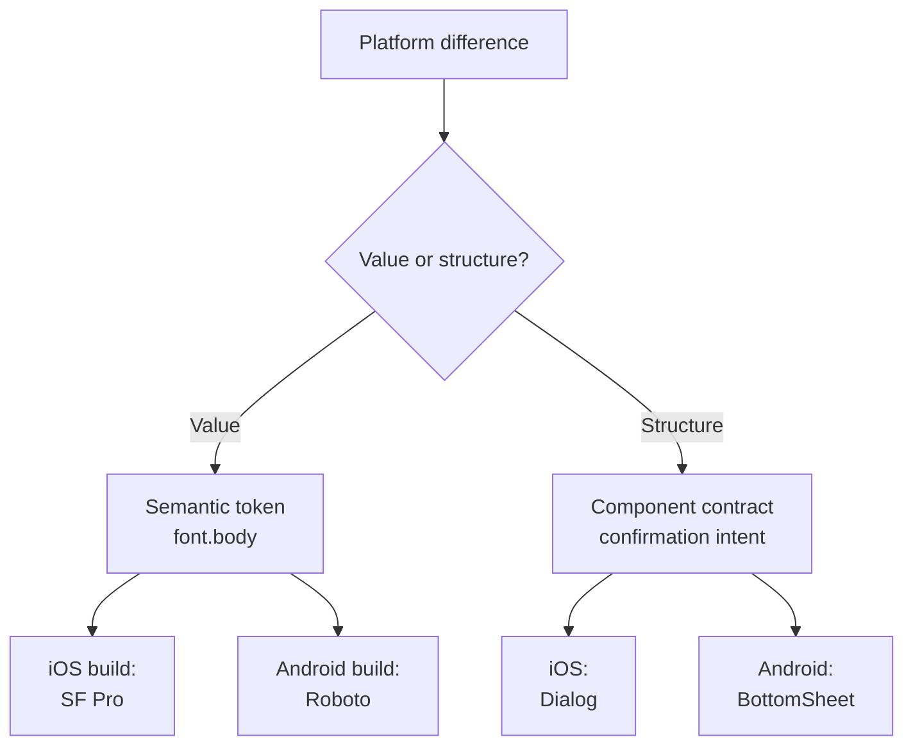

# Platform Divergence

<p class="eyebrow">The Idea</p>

## Every platform difference is either a value or a structure, and each is fixed at a different layer of the system

A multi-platform design system doesn't stay identical across iOS, Android, and web forever — some divergence is legitimate, not drift. Nathan Curtis frames the moment this becomes explicit as a shift in the conversation itself: early on, teams talk about "how design is the same" across platforms; once the fundamentals are shared, the conversation moves to "how design is different and how teams draw boundaries around such exceptions." — [Nathan Curtis, "Finding Platform Balance in a Design System"](https://medium.com/eightshapes-llc/finding-platform-balance-in-a-design-system-47eaae48de98)

That boundary-drawing splits into two unrelated problems that get conflated constantly. A **value** difference — San Francisco on iOS, Roboto on Android, the same type role on both — is resolved by [token layering](token-architecture.md): the semantic token stays one thing, and platform becomes a dimension the build pipeline exports against. A **structural** difference — a confirmation pattern that's a centered Dialog on iOS but a bottom-anchored sheet on Android for heavier content — can't be resolved by a token at all, because there's no shared value to alias; it's resolved by a **component contract**, which declares the *intent* once and lets each platform implement it natively. Confusing the two produces exactly the failure modes below: teams either try to force one Dialog implementation everywhere platforms have real conventions, or fork a token per platform for something that was never a value problem to begin with.

<p class="eyebrow">Why It Exists</p>

## Undocumented divergence looks identical to unintentional drift

Nothing in a component's file distinguishes "this platform is different on purpose" from "nobody reconciled this yet." Curtis's own example is a system that adopted the Streamline icon set everywhere, until Android designers pointed out that "the design system shouldn't project a Streamline-based icon set unaltered onto that platform" — the platform already had its own iconography conventions, and forcing Streamline onto it would have fought the OS rather than fit it. — [Nathan Curtis, "Finding Platform Balance in a Design System"](https://medium.com/eightshapes-llc/finding-platform-balance-in-a-design-system-47eaae48de98)

That call was legitimate precisely because it was made explicitly and recorded somewhere. The same divergence made silently — one platform team just quietly builds it differently because nobody wrote down that it should match — is indistinguishable from a bug until a user switches devices and notices the "same" feature behaving two different ways. The fix isn't preventing divergence; it's forcing every case through one of the two mechanisms below, so a difference is either a token resolving per platform or a contract explicitly naming what's allowed to vary — never an unrecorded judgment call by whichever team touched it last.

---

## In Practice

#### 1. Token layering: platform as a build dimension, not a maintained set

[Token architecture](token-architecture.md) already covers the primitive → semantic → component tiers and the rule that platform differences get handled by transformation tooling rather than baked into a token's name. This is what that looks like end to end. Curtis traces a token's actual path through a production pipeline: a value defined once in Style Dictionary doesn't reach a component directly — it flows through a build step into platform-specific output files, and design teams are often unaware this intermediate layer even exists. A `font.body` semantic token resolves to a different platform file, not a different token:

```
tokens/semantic.json
{
  "font": {
    "body": {
      "$type": "typography",
      "$value": {
        "fontFamily": "{font.family.platformDefault}",
        "fontSize": "{font.size.100}",
        "fontWeight": "{font.weight.regular}"
      }
    }
  }
}
```

`{font.family.platformDefault}` is itself a primitive alias, not a hardcoded name — and it's the one primitive Style Dictionary resolves differently per build target:

```
// iOS build target
"font.family.platformDefault": "SF Pro Text"

// Android build target
"font.family.platformDefault": "Roboto"

// Web build target
"font.family.platformDefault": "-apple-system, Roboto, sans-serif"
```

`font.body` never forks. One semantic token, three build targets, three output files (Swift, XML, SCSS) — the platform lives in the pipeline's transform config, not in a second copy of the token. — [Nathan Curtis, "Reimagining a Token Taxonomy"](https://medium.com/eightshapes-llc/reimagining-a-token-taxonomy-462d35b2b033)

#### 2. Component contracts: intent declared once, implementation native per platform

A structural difference has no value to alias, so it's handled a level up, at the component's definition rather than its tokens. Curtis's distinction: "a description informs. A contract arbitrates." A description is documentation a team can read and interpret loosely; a contract is what a component *must* do, precise enough that React, iOS, Android, Web Components, and Figma can each build against it independently and still converge on the same behavior. The contract specifies the *what* — for a confirmation pattern, that might be "block interaction until the user acknowledges or dismisses, present the heaviest content without truncation" — and leaves the *how* to each platform: centered Dialog on iOS, a bottom-anchored sheet on Android when the content is heavy enough to want more vertical room, in line with the same design-once-per-platform reasoning behind [Component API design](component-api-design.md)'s Dialog/BottomSheet example. — [Nathan Curtis, "Component Contracts and Schemas"](https://nathanacurtis.substack.com/p/component-contracts-and-schemas)

A contract only holds if it's checkable, not just written down. Curtis lists what makes one durable: well-typed rather than loose prose, platform-neutral (not secretly biased toward whichever tool authored it first), and verifiable — a machine, not just a reviewer, can confirm an implementation still satisfies it after either side changes.

#### 3. The rule of thumb: push values down, push structure up, decide explicitly

Put together, the two mechanisms give a working default: when a difference is a *value* — a size, a color, a type role — resolve it at the semantic token layer, so one alias serves every platform. When a difference is *structural or behavioral* — which control appears, how it's triggered, what happens on dismiss — push it up to the component contract, where each platform is free to implement natively. Neither mechanism decides the interesting case for you: whether a given difference should end up unified or platform-idiomatic is a judgment call, the same one Curtis's Android icon team made explicitly rather than by default. The discipline isn't picking one answer for every case — it's writing the decision down wherever it's made, in the token file or the contract, so the next platform team inherits a decision instead of reverse-engineering one.

## Diagram

<div class="mermaid-wrap">



</div>

---

## Common mistakes

- **Forking a token per platform for something that was never a value problem.** If two platforms need different components, not different values, adding `spacing.4.ios` and `spacing.4.android` doesn't fix the mismatch — it just hides a contract problem inside the token layer, where the next person to touch it won't think to look. — [Nathan Curtis, "Reimagining a Token Taxonomy"](https://medium.com/eightshapes-llc/reimagining-a-token-taxonomy-462d35b2b033)
- **Forcing one structural implementation everywhere platforms have real conventions.** Projecting a single component (or a single icon set) unaltered onto a platform that has its own established patterns fights the OS instead of fitting it — Curtis's Android icon example is the corrective, not the norm to avoid. — [Nathan Curtis, "Finding Platform Balance in a Design System"](https://medium.com/eightshapes-llc/finding-platform-balance-in-a-design-system-47eaae48de98)
- **Writing a contract as a description instead of a contract.** Loose prose a platform team can interpret differently isn't arbitrating anything; if it isn't well-typed and machine-verifiable, two platforms will read the same paragraph and build two different things. — [Nathan Curtis, "Component Contracts and Schemas"](https://nathanacurtis.substack.com/p/component-contracts-and-schemas)
- **Letting a platform diverge without recording why.** An undocumented exception is indistinguishable from an unnoticed bug — the fix isn't avoiding divergence, it's never letting one happen without a decision attached to it.
