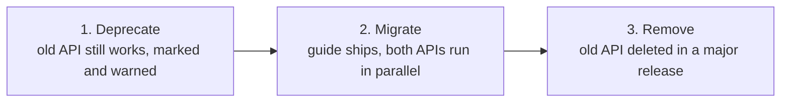

# Release Management

The Principle

## A version number is a promise about impact, not a build artifact

Semantic Versioning (SemVer) gives a design system a shared vocabulary for the *impact* of a change before anyone reads the diff: major means something will break, minor means something new is safe to ignore, patch means nothing about your code needs to change. [Nathan Curtis](https://medium.com/eightshapes-llc/versioning-design-systems-48cceb5ace4d) notes that essentially every design system he's worked with uses SemVer for exactly this reason — it's cheap to adopt and it's the one signal a consuming team can act on without reading release notes first. The version number, the changelog entry, and the migration guide are three views of the same underlying event; this page treats them as one practice, not three separate chores.

Why It Exists

## Undermarked change either gets ignored or gets feared

Without a reliable signal for impact, teams do one of two unproductive things: they upgrade blindly and get broken by changes they had no warning about, or they stop upgrading altogether because every past upgrade cost them unplanned work. Both failure modes have the same root cause — the version number, changelog, and migration path didn't tell the truth about what changing would cost. [zeroheight](https://zeroheight.com/blog/handling-breaking-changes-in-a-design-system-without-causing-chaos/) frames breaking changes as a lifecycle with three phases — **deprecation, migration, removal** — precisely because skipping straight to removal is what turns an upgrade into an incident.

---

## In Practice

#### 1. System-wide versioning vs. component-level versioning

These are a real tradeoff, not a right-and-wrong choice. System-wide versioning gives every consumer one number to track ("we're on 4.2") and forces synchronized releases, which suits a centralized team shipping tokens, components, and guidelines together. Component-level versioning lets one component ship a fix without forcing every other component's consumers into an unrelated upgrade, at the cost of consumers now tracking many numbers instead of one. [Supernova's survey of real systems](https://www.supernova.io/blog/8-examples-of-versioning-in-leading-design-systems) shows both strategies in active production use — the right choice tracks how centralized the team and the consuming teams already are, not which approach is more "correct."

#### 2. Design tokens need their own version discipline

Tokens sit underneath every component, so a token change affects the largest number of components of any change type in the system — a renamed or re-scoped color token can silently break dozens of components downstream that never touched the components' own code. Treat token changes as release events in their own right, with their own major/minor/patch reasoning, rather than folding them quietly into a component release where their impact is easy to miss. ([Design Tokens Substack, "How to Manage Breaking Changes in Design Tokens"](https://designtokens.substack.com/p/how-to-manage-breaking-changes-in))

#### 3. Deprecation-to-removal lifecycle

A breaking change that lands as a surprise removal is a design failure, not just a communication failure. The three-phase shape:

zeroheight's concrete deprecation mechanics: mark the deprecated item in its own description field with a visible marker like `[DEPRECATED]`, and where possible wire build tooling to detect continued usage and warn — or, for a system with enough maturity, fail the build. The point isn't the specific marker; it's that deprecation has to be *discoverable at the point of use*, not just announced once in a changelog nobody was reading that week. — [zeroheight, "Deprecating in design systems: When it's time to say goodbye"](https://help.zeroheight.com/hc/en-us/articles/36474257606555-Deprecating-in-design-systems-When-it-s-time-to-say-goodbye)

This maps directly onto the modification/addition/removal decision tree already covered in [Component governance](component-governance.md) — Inayaili de León Persson's removal lane ("deprecation shipped with advance notice, not a surprise") is the governance-side version of the same lifecycle described here from the release-mechanics side.

#### 4. Aggregated migration guides

**Carbon Design System's** public [migration guide](https://v10.carbondesignsystem.com/help/migration-guide/design/) is cited repeatedly as the reference example: rather than scattering breaking changes across scrollback in a changelog, every breaking change for a release is pulled into one page, paired directly with what to do instead. A migration guide that only says what changed, without saying what a consumer should now do, has done half the job.

#### 5. Changelog structure

The [Keep a Changelog](https://keepachangelog.com) categories — Added, Changed, Deprecated, Removed, Fixed, Security — give every entry a home and make a release scannable in seconds: a consumer checking "does this affect me" should be able to answer it from category headers alone, before reading a single line of prose. Pair every entry with the version number and date. ([UXPin, "How to Create a Design System Changelog"](https://www.uxpin.com/studio/blog/how-to-create-a-design-system-changelog/))

#### 6. Changelog as a trust mechanism

A visible, public changelog — even something as lightweight as a shared Notion page — builds trust with consuming teams: "when people can see what changed and why, they're more likely to update their implementations and less likely to fork the system out of frustration." ([UXPin, "How to Create a Design System Changelog"](https://www.uxpin.com/studio/blog/how-to-create-a-design-system-changelog/)) This is the same neglect-is-the-real-threat dynamic named on the [Component governance](component-governance.md) page — a changelog that goes stale reads to consumers exactly like an unmaintained system, whether or not the system itself is actually healthy.

#### 7. Push-based notifications

A changelog that requires a consumer to remember to go check it will get missed by exactly the teams who most need the warning. Automated notification — a Slack post, a release email — on every release, not just major ones, is what converts a written record into something teams actually act on before they're broken by it.

---

## Common mistakes

- **Treating the version bump as the deliverable and the migration guide as optional polish.** A major version with no migration guide forces every consuming team to independently reverse-engineer the same diff — the cost of writing the guide once is far lower than the aggregate cost of dozens of teams doing that discovery work in parallel. If a release is significant enough to warrant a major version, it's significant enough to warrant the guide that makes that version usable.
- **Skipping straight to removal instead of deprecating first.** A breaking change that lands as a surprise removal is a design failure, not just a communication one — deprecation has to be discoverable at the point of use, with advance notice, before it disappears.
- **Folding a token change quietly into a component release.** Tokens affect the largest number of components of any change type; bundling them in without their own versioning makes their impact easy to miss until it breaks something downstream.
- **Letting the changelog go stale.** A changelog that isn't kept current reads to consuming teams exactly like an unmaintained system, whether or not the system itself is actually healthy.
