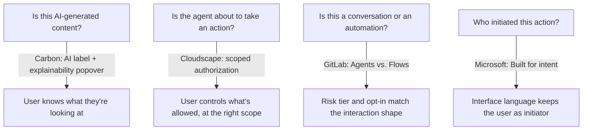

The rest of this section treats AI as a consumer of the design system: an agent reading tokens, components, and docs. This page covers the other direction. Your product now ships chat interfaces, generated content, and agents that act on a user's behalf, and the design system needs real patterns for that surface: components, not just guidelines. A handful of mature systems have already published theirs.

:::tip[Key takeaways]
- Ship AI transparency as a component, not a policy page
- Scope authorization to risk and reversibility
- Treat conversations and automations as different interactions
- Phrase actions so the user stays the initiator
:::

## The problem

Two problems repeat in every product that ships an AI feature. Does the user know they're looking at AI-generated content? And does the user actually control what an agent may do for them? Left to individual teams, both get solved inconsistently. One screen discloses AI with a badge, another with a tooltip, a third not at all. One flow asks permission before every action, another asks once and never again, whatever the risk.

Four systems each answer the same underlying question at a different point in the interaction:

## Practices

### Ship transparency as a component

IBM Carbon's [**Carbon for AI**](https://carbondesignsystem.com/guidelines/carbon-for-ai/) extension gives AI-generated content "a visually and behaviorally distinct identity," and makes explainability mandatory at the component level: "Each AI component is required to have an embedded AI label and explainability popover that alerts users to AI-generated content." It ships as an AI label, an AI chat framework, and AI versions of Carbon's core components. The transparency requirement travels with the component, instead of living on a guidelines page a team can skip or that drifts from what ships.

### Scope authorization to risk

AWS Cloudscape's [**user-authorized actions**](https://cloudscape.design/gen-ai/patterns/user-authorized-actions/) pattern is the most concrete authorization model any of these systems publish. Instead of one yes/no prompt, it offers a scope selector: "Allow this time," "Allow for this chat," or "Always allow," so trust is granted at the level the user intends. Two rules sharpen it. "Don't show the authorization dialog for a tool that is already trusted for the session." And for actions that can't be undone, the user has to type a confirmation before the Allow button enables.

It's the UI version of the problem [Scaling AI effort to risk](/scaling-ai-effort/) and [Agentic workflow design](/agentic-workflow-design/) solve for agent access: scale trust to risk and reversibility, not convenience.

### Separate conversations from automations

GitLab's [Pajamas design system](https://design.gitlab.com/patterns/ai-human-interaction/) draws a line between two shapes of AI interaction. **Agents** are conversational and iterative. **Flows** are automated and repeatable. Each carries different risk tiers and opt-in requirements. The principle behind it: "Design AI to be collaborative, not autonomous. AI should suggest and assist while users remain in control." High-risk features require "opt-in ... and showing users a review step before execution." GitLab flags these patterns as still in development, so treat them as an emerging reference, not a finished standard.

### Keep the user as the initiator

[Microsoft's agent design guidelines](https://learn.microsoft.com/en-us/agents/design-guidelines/human-centered-design) name three principles. **Built for intent**: agents support judgment, they don't replace it. **Differentiated from humans**: interface language should say "process" or "analyze," not "understand" or "think." **Bias resistant**: design for who else might see or act on the agent's output, not just the immediate user.

The intent principle has a concrete UI consequence. Write "Summarize with Copilot," not "Copilot, summarize." It's small enough to miss, but it decides whether the user stays the initiator or the agent seems to act on its own. (The Microsoft Learn page is marked as AI-generated content, not an individually authored piece. That's noted here for sourcing discipline, not as a reason to discount it.)

## Common mistakes

- **Using one authorization model for every action.** A single "allow AI to do this?" prompt either under-protects irreversible actions or over-interrupts trivial ones. Cloudscape's scoped model and GitLab's risk-tiered opt-in both exist to avoid that flattening.
