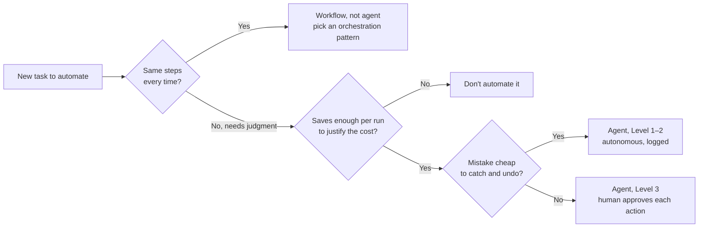

Agentic workflows are a coordination problem, not a capability problem. When you chain AI agents together (small automated workers, each doing one job), the hard part isn't making any one agent smarter. It's defining how they hand work to each other, and exactly where a human steps in. Skip either and you get output nobody can trust or explain.

:::tip[Key takeaways]
- Use a plain workflow, not an agent, when the steps are the same every time
- Pick the simplest orchestration pattern that does the job
- Set autonomy per action, not per agent
- Never silently skip a failed step
- Scope every claim to what the agent actually inspected
:::

## The problem

Two voices point at the same failure from different angles. The design-system-ops orchestration guide (`knowledge-notes/agent-orchestration-guide.md`) warns: "Never silently skip a failed step — a skipped audit is worse than a failed audit because the consumer assumes the audit passed." That's opacity without accountability. [Romina Kavcic](https://learn.thedesignsystem.guide/p/should-you-build-an-agent-for-your) comes at it from cost: "find the simplest solution possible, and only increase complexity when needed." Complexity without payoff on one side, hidden failures on the other: both come from building the automation before designing the coordination.

## Choosing an orchestration pattern

First decide whether the task needs an agent at all. Kavcic's test: if a task follows the same steps every time, you want a workflow, not an agent. And if a run saves less than $0.10 of human time, an agent doesn't pay for itself.

The left branch is Kavcic's workflow-vs-agent test. The autonomy levels on the right come from the design-system-ops oversight framework (see the practices below). Then pick among the four patterns in the orchestration guide, which the [glossary](/ds101/glossary/) calls agentic workflow patterns:

### Sequential chain

Agents run in order, each feeding the next (Component Generator → Description Writer → Accessibility Auditor). It's easy to debug. The cost: it's slow, and one broken early step blocks everything behind it.

### Parallel agents

Agents run at once on separate pieces of the same task, like an Accessibility Auditor and a Performance Auditor working on the same component. The guide calls this a parallel fan-out. It trades the chain's slowness for a new cost: someone has to reconcile what each branch found.

### Supervisor

One agent delegates subtasks to others and decides when enough has been delegated, instead of following a fixed order or splitting the work up front.

### Generator/reviewer loop

A generator paired with a reviewer that sends work back. The guide calls it the **feedback loop**. It's the only pattern of the four with no built-in stopping point, which is why it gets its own page: [Generative loops](/ds101/generative-loops/).

## Practices

### Set autonomy per action, not per agent

The design-system-ops oversight framework (`knowledge-notes/human-oversight-framework.md`) starts from "Agents execute; humans are accountable," and assigns an autonomy level to each *action*. At one end, Level 1 (fully autonomous) covers predictable work that can be checked automatically, like generating a prop list from a TypeScript interface. At the other useful end, Level 3 (human-in-the-loop) means the agent prepares the action but a person approves it first, like publishing a component update or applying a breaking token change.

### Never silently skip a failed step

From the orchestration guide: a skipped audit is worse than a failed one, "because the consumer assumes the audit passed." Every step either succeeds, fails visibly, or reports that it didn't run.

### Scope claims to what was inspected

Anything an agent publishes on its own should scope its claims to what it actually checked: "no X was found in the files scanned," never "the system has no X" (`knowledge-notes/output-discipline.md`). [AI output discipline](/ds101/ai-output-discipline/) has the fuller rule.

## Common mistakes

- **Treating "the agent *can* do X" as "the agent should do X unsupervised."** They're different questions. Teams that never draw the line end up in one of two places. Over-trusting the agent lets unchecked output quietly degrade the system. Under-trusting it layers on so much review that the productivity gain disappears (design-system-ops oversight framework).
