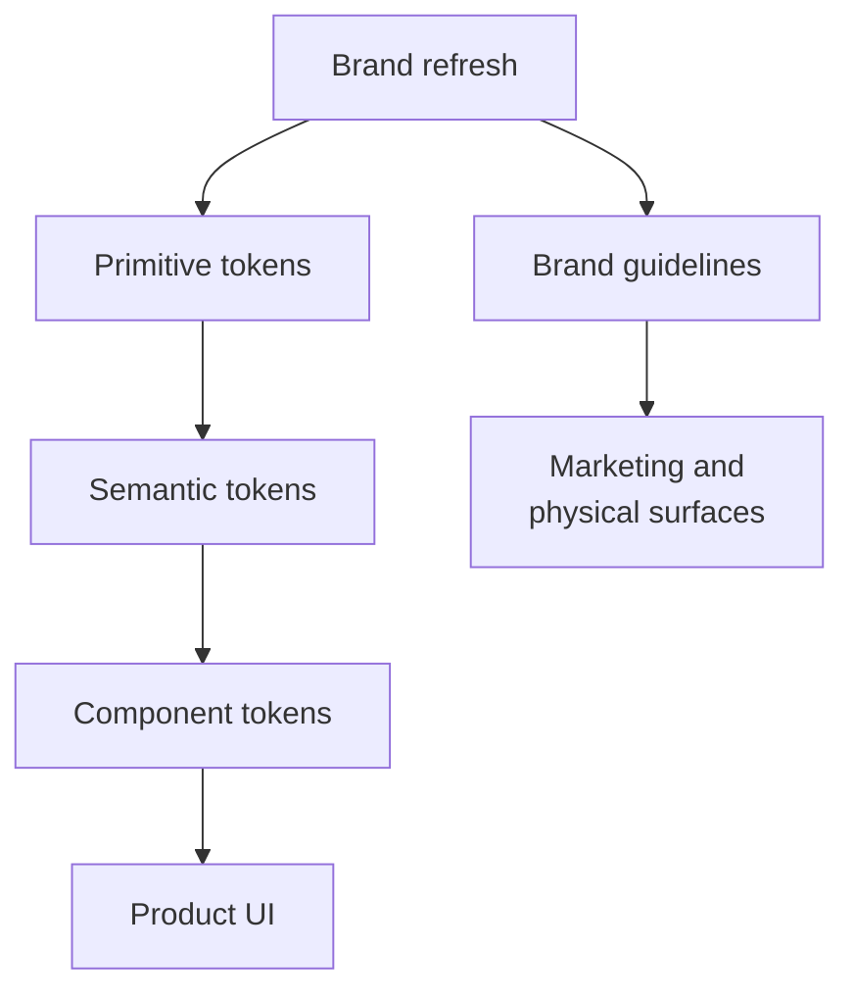

A design system implements brand identity. It doesn't own it. The design system covers product UI, built and maintained by designers and engineers. Brand guidelines cover something wider: visual identity across digital and physical surfaces, for marketers, agencies, and vendors who will never open a component library. The system should stay visually aligned with the brand without trying to be the thing that owns it.

:::tip[Key takeaways]
- Keep product UI in the design system and campaign work in brand guidelines
- Let a brand refresh flow through the token layer, not around it
- Keep brand values at the primitive token tier
- Align brand and product teams on a recurring cadence
:::

## The problem

Brand and marketing teams need to move fast on campaigns, ship one-off pages, and stay flexible enough to chase a moment. A governed, contribution-reviewed component library is the wrong tool for that. And a set of static brand templates is the wrong tool for a data table that has to handle twenty edge cases correctly. Treating one team's tooling as enough for the other's job produces a marketing team that goes around the design system entirely, and a design system that tries to grow print-shop features it was never built for.

## Choosing what the design system owns

Draw the line by what a surface is for. [userQ's comparison](https://userq.com/design-systems-vs-brand-guidelines-understanding-the-key-differences/) puts it this way: a surface whose job is persuasion and campaign flexibility belongs with brand guidelines, and one that needs consistent, reusable interaction patterns belongs in the design system.

### Product UI: the design system

Interactive, digital product surfaces that need reusable patterns and correct edge-case behavior. Governed by the system's contribution and release process.

### Marketing and physical surfaces: brand guidelines

Print, packaging, signage, campaign pages, and usually the marketing or brochure site. **DHL's** Brand Hub shows what this side looks like at scale: 10,000+ templates, an AI layout generator, and a custom typeface, built for global brand consistency across marketing and physical materials. It's brand tooling for marketers and vendors, not a component library for product teams, and the two were never meant to merge.

## Practices

### Let a brand refresh flow through the token layer

**Wise's** 2023 brand refresh is the clearest real example. It didn't stay a marketing-only exercise. It drove a 2024 rebuild of the product system's token infrastructure (the "Editorial Design System") to carry the new identity through to product surfaces ([Ness Grixti's case study](https://nessgrixti.com/portfolio/wise-multi-brand/)). [Governance case studies](/governance-case-studies/) covers what went wrong when a related brand-theming change was handled as a local fork instead of a system-wide change.

### Keep brand values at the primitive tier

[Token architecture](/token-architecture/)'s three tiers (primitive → semantic → component) are where brand and product actually meet in code. A rebrand should mean updating the primitive-tier values that encode the brand's colors, type, and spacing in one place, with the semantic and component tiers picking up the change automatically. If brand values get hardcoded further down the stack, the next rebrand means hunting down every reference instead of changing one layer.

### Align brand and product on a recurring cadence

The fix isn't picking one team to own both. It's cross-functional alignment on a regular schedule, so brand identity and product implementation stay two things aimed at the same target, instead of one team's tool quietly standing in for the other's.

## Common mistakes

- **Assuming a mature product design system automatically covers marketing's needs, or the reverse.** A large, polished brand platform isn't a design system, and a design system isn't a brand platform. Each side inherits the other's constraints when one tries to stand in for the other.
