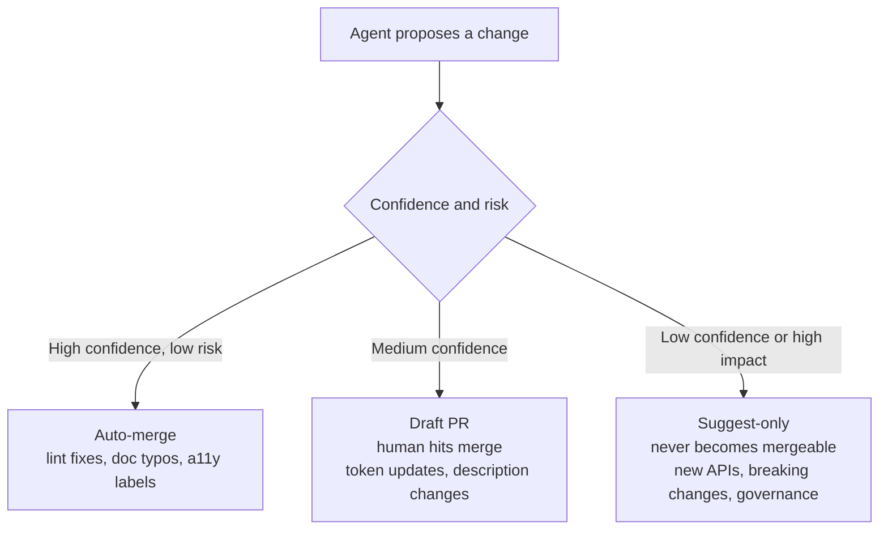

[Agentic workflow design](/ds101/agentic-workflow-design/) sets an autonomy level per action: how much review it needs before it takes effect. CI (continuous integration, the automated pipeline that tests and ships code changes) is where most of those levels actually get enforced for anything touching code, tokens, or docs. An agent that can write files but can't merge them is only really constrained if something sits between "the agent produced this" and "this is live." That something is almost always a CI job.

:::tip[Key takeaways]
- Keep the agent read-only, and let a separate job do the writing
- Assign trust tiers per change, not per agent
- Run drift detection on a schedule, and give its PRs an owner
- Feed the pipeline structured metadata, not prose
- Make metadata completeness a merge gate, like a failing test
:::

## The problem

Give an agent the same write permissions a human contributor has, and a bad output stops being a draft someone reviews. It's already in the system. [GitHub's security design for its agentic-workflows product](https://github.github.com/gh-aw/reference/safe-outputs/) states the problem plainly: an agent that can act directly on a repository is one prompt injection or misconfiguration away from an unauthorized change.

Romina Kavcic names the same failure from the design-system side. Without a gate, an agent's confidence and the system's actual risk tolerance have nothing to do with each other. A low-risk lint fix and a breaking token change get the same treatment. Either everything needs a human (and the automation isn't worth building), or nothing does (and a breaking change slips through). Source: Kavcic describing her CI trust tiers at the AI Design Systems Conference 2026, [via Sil Bormüller, "Your Design System Is Not Ready for AI Agents"](https://www.intodesignsystems.com/blog/design-system-not-ready-for-ai-agents).

## Practices

### Keep the agent read-only

GitHub Agentic Workflows runs the agent with no write permissions at all. It can only emit a structured request, like "create this issue" or "open this PR," which a separate, permission-controlled job then checks and executes. In [GitHub's words](https://github.github.com/gh-aw/reference/safe-outputs/): "agents run read-only and request actions via structured output, while separate permission-controlled jobs execute those requests," which "provides least privilege, defense against prompt injection, auditability, and controlled limits per operation."

Jan Six's team applies this to GitHub's own Primer design system. Agentic workflows run daily QA and maintenance, but the agent "can only create an issue, never merge code" ([via Sil Bormüller](https://www.intodesignsystems.com/blog/design-system-not-ready-for-ai-agents)). The write permission never touches the agent. It lives in the job that processes the agent's output, which makes the boundary real instead of a convention someone could forget.

### Assign trust tiers per change, not per agent

[Kavcic's](https://www.intodesignsystems.com/blog/design-system-not-ready-for-ai-agents) version of per-action autonomy, applied to what CI may do with an agent's output, sorts changes into three tiers by confidence and risk:

The tier follows the *change*, not the agent. The same agent can land in auto-merge for a lint fix and suggest-only for a breaking API change in the same afternoon. Under all three tiers, the agent still never holds write access.

### Run drift detection on a schedule

The design-system-ops notes (`knowledge-notes/ai-readiness.md`) treat stale docs as something a pipeline should catch on its own: "a scheduled process (CI pipeline, GitHub Action, or recurring skill run) compares the component's current prop interface against its documented props. Mismatches are surfaced as findings, not silently ignored."

Kavcic widens the inputs: a drift-scoring engine fed by "Figma API, CI hooks, and usage analytics" flags inconsistencies and opens the fix as a pull request automatically. It's the same read-only shape applied to drift. The engine proposes and doesn't merge, and the PR's tier depends on what kind of drift it fixes.

### Feed the pipeline structured metadata

A CI job that re-reads a component's full prose docs on every run pays a real, recurring cost. Diana Wolosin's team at Indeed changed their pipeline to trigger on MDX updates and convert the changed content to JSON metadata before an agent sees it. The JSON path used 80% fewer tokens than the prose version and cut annual cost from about $1,500 to $300 across a 77-component system ([via Sil Bormüller](https://www.intodesignsystems.com/blog/design-system-not-ready-for-ai-agents)). An unoptimized trigger makes checks expensive enough that teams quietly run them less often. [Context engineering](/ds101/context-engineering/) makes the same case for structure over prose.

### Make metadata completeness a merge gate

The design-system-ops notes treat incomplete metadata as a release blocker: "before a component is considered release-ready, its metadata should pass a quality gate: all props documented, all interactive states defined, accessibility contract complete, structured JSON metadata in sync with text description... treating incomplete documentation with the same seriousness as failing tests." Wire that gate into CI instead of a manual pre-release checklist. A checklist item gets skipped under deadline pressure. A failing pipeline doesn't merge.

## Common mistakes

- **Running drift detection but leaving its PRs unowned.** A scheduled job that opens PRs nobody is assigned to review just moves the staleness problem from the docs to an ignored PR queue.
