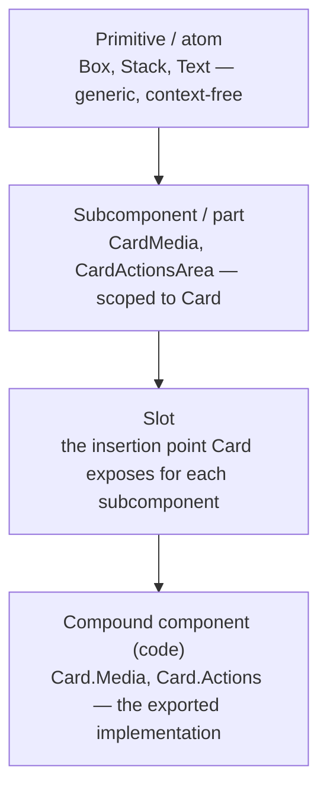

A component is rarely one indivisible thing. It's built from smaller pieces, and it may itself be a piece inside something bigger. Practitioners name these layers differently (primitive, atom, subcomponent, part, compound component, slot), and the words aren't synonyms for "small component." Each answers a different question: how generic is this piece, and where is it allowed to be used? This page covers how those layers are built in code. [Component composition in Figma](/ds101/component-composition-in-figma/) covers the same structure in the design file.

:::tip[Key takeaways]
- Tell primitives (reusable anywhere) apart from subcomponents (scoped to one parent)
- Keep subcomponents scoped to their parent in code
- Split out a subcomponent only when a second real use shows up
- Match part names across Figma and code
:::

## The problem

When "component" is the only word anyone has, every conversation about structure collapses into it. A designer calls the icon inside a button "part of the button." An engineer calls it a separate component because it's a separate file. Neither is wrong, but they're answering different questions.

The question underneath is whether a piece is safe to use on its own. Without separate words for a generic building block and a piece that only works inside one parent, the codebase can't signal the difference either. Every internal piece gets exported, with no hint of which ones go together, and consumers assemble combinations nobody designed or tested. Whether a piece should be a prop or a part in the first place is a separate decision, owned by [Component API design](/ds101/component-api-design/#choosing-configuration-or-composition).

## The model

The same Card, read through each layer:

<div class="mermaid-wrap">



</div>

### Primitives and atoms

[Brad Frost's atomic design](https://atomicdesign.bradfrost.com/chapter-2/) calls the smallest pieces **atoms**: things that "can't be broken down any further," like a label, an input, or an icon. A **primitive** is the same idea under a different name, more common in token-driven systems. It's a low-level, generic element, often literally called `Box` or `Stack`, with direct access to design tokens (spacing, color, radius) but no meaning of its own. Both are reusable *anywhere*, with no assumption about their parent.

### Subcomponents and parts

[Curtis](https://medium.com/eightshapes-llc/subcomponents-753ce9f6600a) defines a **subcomponent** as "an independently composable UI component with a well-defined API intended for use only within a specific parent component or context." His example: a Card can be split into `CardMedia` and `CardActionsArea`. Each has its own props, but neither is meant to be used outside a Card. The difference from a primitive isn't size. It's scope: a primitive is context-free, and a subcomponent is tied to one parent on purpose.

Here's how the two layers look together in a React tree. The highlighted lines are Card's subcomponents, which only work inside a Card. `Stack` and `Text` are primitives: they'd work the same way anywhere, including here, between Card's parts.

```tsx {2,7-9}
<Card>
  <Card.Media src={cover} alt="" />
  <Stack gap="sm">
    <Text weight="bold">Paris</Text>
    <Text>3 nights, 2 guests</Text>
  </Stack>
  <Card.Actions>
    <Button>Book</Button>
  </Card.Actions>
</Card>
```

[Radix Primitives](https://www.radix-ui.com/primitives/docs/guides/composition), a widely used code library for building design systems, calls the same thing **parts**. Its [Dialog anatomy](https://www.radix-ui.com/primitives/docs/components/dialog) shows each part as a separate piece the consumer assembles, rather than configuring one component through props:

```tsx
<Dialog.Root>
  <Dialog.Trigger />
  <Dialog.Portal>
    <Dialog.Overlay />
    <Dialog.Content>
      <Dialog.Title />
      <Dialog.Description />
      <Dialog.Close />
    </Dialog.Content>
  </Dialog.Portal>
</Dialog.Root>
```

The nesting carries meaning. `Dialog.Portal` renders its contents outside the page's normal layout, so the overlay and content sit on top of everything else. `Dialog.Trigger` stays where it was placed.

### Compound components

**Compound component** is the engineers' term for how subcomponents are built in code: "a pattern where higher level components are composed using smaller components, and you retain access to all the semantic elements of the higher level component." [Workday's Canvas Design System](https://github.com/Workday/canvas-kit/blob/master/modules/docs/mdx/COMPOUND_COMPONENTS.mdx) shows it with `Tabs` (shortened here):

```tsx
<Tabs>
  <Tabs.List>
    <Tabs.Item>First</Tabs.Item>
    <Tabs.Item>Second</Tabs.Item>
  </Tabs.List>
  <Tabs.Panel>…</Tabs.Panel>
  <Tabs.Panel>…</Tabs.Panel>
</Tabs>
```

`Tabs` is the container, and `Tabs.List`, `Tabs.Item`, and `Tabs.Panel` are its subcomponents. Each is reached as a property of the parent (`Tabs.Item`) rather than imported on its own, so the code itself says which pieces belong together. Because every piece is markup, a team that needs something extra, like a badge on one tab, puts it inside that `Tabs.Item` instead of asking for a new prop.

### Slots

A **slot** is the placeholder a parent exposes so a subcomponent, or any content, can be placed into it. [Curtis](https://nathanacurtis.substack.com/p/slots-in-design-systems) notes that "an increase in component slots and custom compositions within them" reduces how many configuration props a component needs. You trade prop count for a few well-defined insertion points.

In React, a slot is either `children` or a prop that accepts an element. [MUI's Button](https://mui.com/material-ui/api/button/) takes the second route with `startIcon`:

```tsx title="Slot"
<Button startIcon={<DownloadIcon />}>
  Download
</Button>
```

The Button renders whatever element it receives in that position. It doesn't need to know which icons exist, whether one is shown, or what they're called.

## Practices

### Keep subcomponents scoped to their parent

Don't export a subcomponent so it can be imported on its own, outside its parent's compound structure. That removes the "intended for use only within a specific parent" guarantee that Curtis's definition depends on. Consumers can then reassemble pieces in combinations nobody designed or tested.

The scoping happens in the package's index file, which is the list of everything other teams can import. Attach the parts to the parent, and leave them out of the list:

```tsx title="card/index.ts"
export const Card = Object.assign(
  CardRoot,
  {
    Media: CardMedia,
    Actions: CardActions,
  },
);

// Don't also export the parts:
// export { CardMedia } from './media';
```

`Object.assign` hangs `Media` and `Actions` off `Card`, so the only way to reach them is `Card.Media` and `Card.Actions`. A consumer who types `import { CardMedia }` gets an error instead of a part with no Card around it.

### Split out a subcomponent only on a second real use

The discipline that governs new components applies to subcomponents too: don't split one out until a real second use case shows up. See the [criteria for adding a component](/ds101/component-lifecycle/#criteria-for-adding-a-component).

### Match part names across Figma and code

What Curtis calls a subcomponent at the design and API level is what a frontend team builds as a compound component. Naming both sides the same way keeps a design file's nested components and a codebase's subcomponents mapped one-to-one. If Figma calls something a "part" and the code exports it as an unrelated component with a different name, the mapping breaks. That's the failure the [design-to-code contract](/ds101/design-to-code-contract/) exists to prevent.

Props follow the same rule, with rare exceptions where a tool's own convention forces a different word. [Component property naming](/ds101/component-property-naming/#use-the-same-names-options-and-defaults-in-both-tools) covers both.

## Common mistakes

- **Treating "primitive" and "subcomponent" as synonyms for "small component."** A primitive is generic and reusable anywhere. A subcomponent is composable but deliberately scoped to one parent. Mixing them up in documentation makes it unclear whether a piece is safe to reuse elsewhere.
