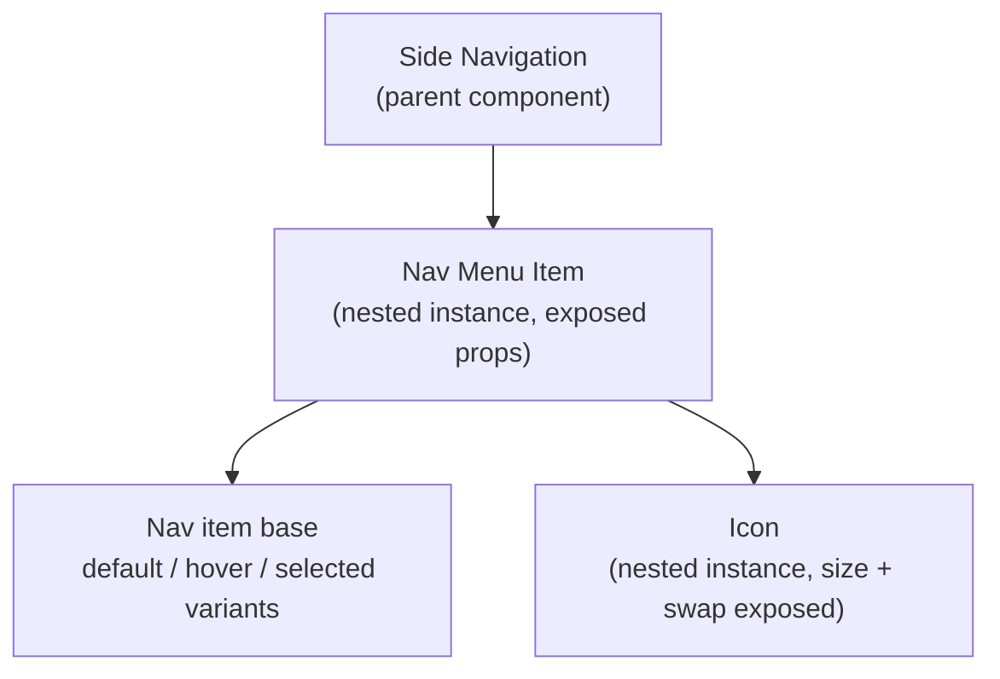

A component gets its flexibility from smaller components nested inside it, not from piling more variants and booleans onto one flat layer. This page covers how to build that structure in Figma. [Component composition in code](/ds101/component-composition-in-code/) defines the layers (primitives, subcomponents, slots) and how the same structure is built in code.

:::tip[Key takeaways]
- Build flexibility with nested instances, not more variants
- Treat every Figma component property like a code prop
- Nest in layers, base components first
- Expose only the properties each level needs
- Use variants for closed sets of states, nesting for reusable pieces
:::

## The problem

A component built as one flat layer tree, with a variant for every case, eventually hits a wall. A real product request doesn't match any existing variant, and two variants built as mutually exclusive options can't be combined. The designer's only way forward is to detach the instance and hand-edit it. That quietly removes the instance from the system: it stops getting updates, stops showing up in coverage metrics, and nobody notices until an audit finds it.

[Nathan Curtis's talk "Architecting Subcomponents"](https://www.youtube.com/watch?v=NiDoqI_ZhvY) (Schema by Figma, 2022) frames the subcomponent approach as the answer. Instead of the system team "playing constant catch-up, adding prop after prop," the system offers composable parts and lets the requester assemble their own answer. The flat alternative is the same "configuration collapse" failure from [Component API design](/ds101/component-api-design/), showing up in the Figma file instead of the code.

## Practices

### Build flexibility with nested instances

A subcomponent placed inside a parent, like an icon inside a Button or a `CardMedia` inside a Card, is a nested instance. Figma lets the parent expose the nested instance's own properties (its instance swap, its visibility boolean, its text) in the parent's properties panel. A designer working on the Button never has to drill into the icon's layer to change it. [fourzerothree.in](https://www.fourzerothree.in/p/crafting-components-with-subcomponents) describes this as the mechanical form of a slot: the nested instance is the subcomponent, and the exposed property makes it swappable from the parent. [story.to.design](https://story.to.design/blog/subcomponents-more-flexible-design-systems) describes the payoff: instead of detaching a component because the variant they need doesn't exist, a designer composes existing subcomponents into a slot. Their example is an icon nested inside a button.

### Treat every component property like a code prop

Figma's component properties (variant, boolean, text, and instance swap) are, as [Figma's own team](https://www.figma.com/blog/taking-cues-from-code/) puts it, "essentially React properties for Figma components." Each one should earn a permanent place the way a code prop does, not get added because one request needs it. Every property is a surface someone has to maintain and every consumer has to learn. The rule from [Component API design](/ds101/component-api-design/) applies before a single property gets added: configurable for the common case, composable for the uncommon one.

### Nest in layers, base components first

[fourzerothree.in's worked example](https://www.fourzerothree.in/p/crafting-components-with-subcomponents) builds bottom-up. A base nav item with default, hover, and selected states is nested inside a larger Nav Menu Item, which is nested inside a Side Navigation component.

<div class="mermaid-wrap">



</div>

Icons follow the same pattern one level down. One master icon component, with size and icon-swap properties exposed, is reused as a nested instance inside buttons, inputs, and nav items, instead of a separate icon baked into each.

### Expose only the properties each level needs

In the same example, each level exposes only the properties that matter at that level. Letting every nested property bubble all the way to the top-level component defeats the point of layered nesting. A designer should see what's relevant to the level they're editing, and nothing else.

### Nest only after a second real reuse

fourzerothree.in warns that nesting for flexibility nobody needs yet makes a component so deep that other designers can't find the layer they're supposed to edit. Wait for a second real reuse before splitting a piece into its own nested instance. It's the same discipline as the [criteria for adding a component](/ds101/component-lifecycle/#criteria-for-adding-a-component).

## Choosing variants or nesting

Nested instances don't replace variants. They solve different problems, and reaching for a variant when the real need is a swappable piece is how a variant set grows past the point anyone can read it at a glance.

### Variants

Use them for a closed set of mutually exclusive states on one component, like a button's default, hover, active, and disabled.

Know what they cost as the set grows: each new state multiplies every existing combination. [Nathan Curtis](https://nathanacurtis.substack.com/p/component-contracts-and-schemas) counts it for a disabled state. A Figma button with 96 variants "requires 96 more variants, each carrying the varied `opacity` property," which he calls "massive redundancy – maybe 500ish layers – for one simple intent." A contract written as data states the same decision once:

```yaml title="Contract excerpt"
button:
  variants:
    - configurations:
        disabled: true
      elements:
        root:
          opacity: 0.36
```

Read it as: whenever `disabled` is true, the button's root element gets 0.36 opacity, whatever the other props are. Figma can't express a rule like that, so the file repeats it 96 times. [Multi-platform component specs](/ds101/multi-platform-component-specs/#define-components-as-data-and-generate-figma-from-it) covers moving a component's definition into data.

### Nested instances

Use them when a piece needs its own independent properties, or gets reused inside more than one parent.

## Common mistakes

- **Detaching instead of nesting.** If the system doesn't yet offer the flexibility a designer needs, the fix is to add a well-scoped nested instance or property to the source component. A detached, hand-edited copy silently drops out of the system.
