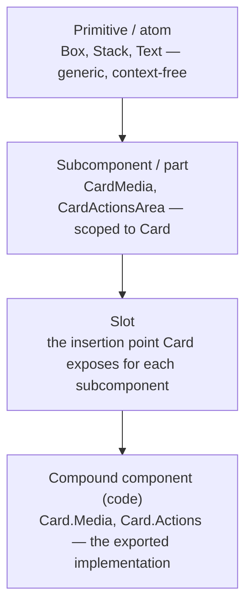

The Principle

## Every layer of a component needs its own name, and the names aren't interchangeable

A component is rarely one indivisible thing. It's built from smaller pieces (a Card is built from an image, a heading, and a set of actions), and it may itself be a piece inside something bigger. Different practitioners have named these layers differently — **primitive**, **atom**, **subcomponent**, **part**, **compound component**, **slot** — and the words aren't synonyms for "small component." Each one answers a different question: how generic is this piece, and where is it allowed to be used. Getting the vocabulary straight matters because the words show up in real decisions: what goes in a props table versus what gets its own name in the component tree, and what a designer is allowed to detach in Figma versus what they're expected to compose.

Why It Exists

## Without shared terms, teams design past each other

When "component" is the only word anyone has, every conversation about structure collapses into it. A designer calls the icon inside a button "part of the button"; an engineer calls it a separate component because it's a separate file. Neither is wrong, but they're answering different questions, and the mismatch is exactly the gap Nathan Curtis calls "configuration collapse": components accrete layout props, visibility toggles, and ad hoc nested structure because nobody had a name for "a composable piece scoped to this one parent," so it got jammed into the parent's prop list instead. — [Nathan Curtis, "Configuration Collapse"](https://nathanacurtis.substack.com/p/configuration-collapse); see also [Component API design](/component-api-design/)

The same gap shows up in code. Without a name for "a piece that only makes sense inside its parent," a team either exposes too little (one monolithic component with dozens of props) or too much (every internal piece exported and usable in isolation, with no signal about which pieces were meant to be assembled together).

---

## In Practice

#### 1. Primitives and atoms: the generic, context-free layer

Brad Frost's atomic design vocabulary calls the smallest, indivisible pieces **atoms** — the things that "can't be broken down any further," like a label, an input, or an icon. A **primitive** is the same idea under a different name, more common in token-driven systems: a low-level, generic element — often literally called `Box` or `Stack` — that carries direct access to design tokens (spacing, color, radius) but no domain meaning of its own. Both terms describe pieces that are reusable *anywhere*, with no assumption about what parent they'll end up in. — [Brad Frost, *Atomic Design*, Chapter 2](https://atomicdesign.bradfrost.com/chapter-2/)

#### 2. Subcomponents and parts: composable, but scoped to a parent

One level up, Nathan Curtis defines a **subcomponent** as "an independently composable UI component with a well-defined API intended for use only within a specific parent component or context." His example: a Card can be decomposed into `CardMedia` and `CardActionsArea` — each with its own props, but neither one meant to be reused outside a Card. The distinction from a primitive isn't size, it's scope: a primitive is context-free, a subcomponent is deliberately tied to one parent. — [Nathan Curtis, "Subcomponents"](https://medium.com/eightshapes-llc/subcomponents-753ce9f6600a)

Radix Primitives, a widely used code library for building design systems, uses the near-identical term **parts**: a Dialog is `Dialog.Root`, `Dialog.Trigger`, `Dialog.Portal`, `Dialog.Overlay`, `Dialog.Content`, `Dialog.Title`, and `Dialog.Close`, each a separate exported piece a consumer assembles rather than configures through props on one component. — [Radix Primitives, "Composition"](https://www.radix-ui.com/primitives/docs/guides/composition)

#### 3. Compound components: the code-level shape of the same idea

**Compound component** is the term engineers use for the pattern that implements subcomponents/parts in code: "a pattern where higher level components are composed using smaller components, and you retain access to all the semantic elements of the higher level component." Workday's Canvas Design System documents this with a `Tabs` example — `Tabs` is the container, while `Tabs.List`, `Tabs.Item`, and `Tabs.Panel` are its subcomponents, each accessed as a property of the parent rather than a standalone import. — [Workday Canvas Design System, "Compound Components"](https://github.com/Workday/canvas-kit/blob/master/modules/docs/mdx/COMPOUND_COMPONENTS.mdx)

The design-facing and code-facing vocabularies describe the same seam: what Curtis names a subcomponent at the design and API level is what a frontend team implements as a compound component in code. Naming both sides consistently is what keeps a design file's parts and a codebase's exported subcomponents mapped one-to-one instead of drifting apart.

#### 4. Slots: the mechanism that lets a parent accept subcomponents

**Slot** names the placeholder a parent component exposes so a subcomponent (or arbitrary content) can be placed into it, rather than the piece being placed. Curtis frames the shift explicitly: as systems lean more on slots, "an increase in component slots and custom compositions within them" reduces how many configuration props a component needs, trading prop count for a small number of well-defined insertion points instead. — [Nathan Curtis, "Slots in Design Systems"](https://nathanacurtis.substack.com/p/slots-in-design-systems)

story.to.design's write-up on the same pattern frames the payoff for design tools specifically: instead of a designer detaching a component because the one variant they need doesn't exist, they compose existing subcomponents into a slot — the icon nested inside a button is their example of a subcomponent occupying a slot. — [story.to.design, "Subcomponents: How to make your design system more flexible"](https://story.to.design/blog/subcomponents-more-flexible-design-systems)

#### 5. What stays a prop

None of this replaces props — it narrows what belongs in them. Behavioral and foundational state (`disabled`, `size`, `appearance`) still belongs as a top-level prop on the parent; structural and content variation is what moves into subcomponents and slots instead. See [Component API design](/component-api-design/) for the fuller rule of thumb on which is which.

## Diagram

The same Card, read through each layer of the taxonomy:

---

## Common mistakes

- **Treating "primitive" and "subcomponent" as synonyms for "small component."** They answer different questions — a primitive is generic and reusable anywhere; a subcomponent is composable but deliberately scoped to one parent. Mixing them up in documentation makes it unclear whether a piece is safe to reuse elsewhere.
- **Creating a subcomponent for a one-off need.** The same discipline that governs new components applies to subcomponents: don't split one out until a real second use case shows up. See the [rule of three](/contribution-models/).
- **Letting the design vocabulary and the code vocabulary drift.** If Figma calls something a "part" and the codebase exports it as an unrelated standalone component with a different name, the mapping between design and code breaks — exactly the failure mode the [design-to-code contract](/design-to-code-contract/) exists to prevent.
- **Exporting every internal subcomponent as if it were a primitive.** Making a subcomponent independently importable outside its parent's compound-component structure removes the "intended for use only within a specific parent" guarantee Curtis's definition depends on, and lets consumers reassemble pieces in combinations nobody designed or tested.
