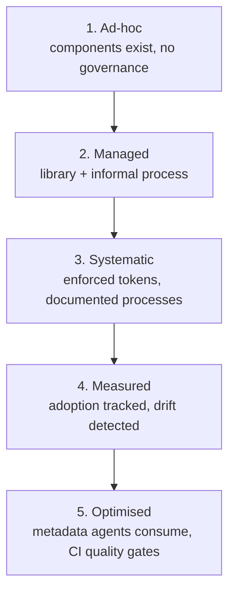

Governance is how a design system decides things on purpose, and how it remembers what it decided. A governed system can tell you *why* it looks the way it does. An ungoverned one just accumulates. This page covers who decides and how decisions get recorded. [Component lifecycle](/ds101/component-lifecycle/) covers the criteria for what enters and leaves the system. Governance matures in stages, and most teams aren't at the end state. That's fine, as long as they know which stage they're at.

:::tip[Key takeaways]
- Record every decision, including the proposals you declined
- Write down who owns each decision, so someone can close it
- Make accessibility everyone's standard, with a specialist as escalation
- Let knowledge flow upstream from product teams, not only down
- Know which governance maturity stage you're at
:::

## The problem

Without recorded decisions, teams argue the same questions forever. The design-system-ops governance notes ([`knowledge-notes/component-governance.md`](https://github.com/murphytrueman/design-system-ops/blob/main/knowledge-notes/component-governance.md)) put it plainly: "A team that has maintained records for two years knows why their system looks the way it does. A team that has not is perpetually re-litigating the same questions."

> "The biggest existential threat to any system is neglect."
>
> — Alex Schleifer, Airbnb, quoted in Brad Frost, *Atomic Design*, Chapter 5

Governance doesn't die from a bad decision. It dies from decisions nobody bothered to make or record.

## Practices

### Record decisions, including declined ones

The same notes keep the fix lightweight. A decision record needs only the context, the options considered, the decision, and its consequences. But it has to cover the decisions a new team member would need to understand, including *declined* proposals, so a future team doesn't reverse something without knowing it was already considered. [Governance for AI](/ds101/governance-for-ai/) adds that each record also needs an owner who re-checks it against reality.

### Write down who owns each decision

When a role is implied rather than stated, every question gets re-decided informally, and differently, each time: who owns a proposal once it's submitted, who can approve a deprecation, who a contributor asks when a request stalls. Ambiguity that's tolerable with five product teams turns into real friction once a system serves dozens.

A RACI matrix fixes this. It lists who is Responsible, Accountable, Consulted, and Informed for each recurring activity. [Design System Tactics](https://www.designsystemtactics.com/tactics/raci) builds one in five steps:

1. Identify the roles (design, development, content, QA, leadership), plus an "influence mapping" pass to catch less obvious stakeholders.
2. List the system's recurring activities: token updates, component reviews, releases, documentation, contribution workflows, QA, and governance decisions.
3. Assign R, A, C, and I for each activity.
4. Review the draft with the people it names.
5. Publish it, and revisit it as the org grows.

The guide stresses that RACI should follow the team model you've already chosen (centralized, federated, or cyclical, see [Team models](/ds101/team-models/)), not replace that decision.

[DesignX's enterprise governance guide](https://designx.co/design-system-governance-enterprise/) names the failure it prevents: "everyone gives feedback, but no one decides." A proposal collects opinions from everyone with a stake but never reaches one owner who can close it. Its worked example for a new component proposal, extended here to the other activities Design System Tactics names:

| Activity | Contributor | System team | Owner | Specialists | Product teams |
|---|:-:|:-:|:-:|:-:|:-:|
| New component | R | – | A | C | I |
| Token update | – | R | A | C | C |
| Component review | I | R | A | C | – |
| Release or deprecation | – | R | A | C | I |
| Docs update | R | R | A | C | I |

The contributor is the designer and engineer preparing the work. The system team is whichever system designer or engineer picks it up. Specialists are the accessibility reviewer, product champion, engineering lead, and content specialist, whichever the activity needs. For a token update, the affected teams are consulted and all other teams are informed. Look at the Owner column: every row has exactly one A, and that one person is what keeps feedback from piling up with no decision.

Only the first and fourth rows restate the sourced examples directly. The rest apply the same pattern to make a finished matrix concrete.

### Make accessibility everyone's standard

A common mistake at enterprise scale is routing every accessibility question to one specialist or a small team, on the theory that centralizing expertise centralizes quality. It does the opposite. Everyone else stops treating accessibility as their job, the specialist becomes a bottleneck on every release, and issues that should have been caught earlier surface at a late review nobody can act on cheaply. The [design-to-code contract](/ds101/design-to-code-contract/) puts accessibility in both the design and build contracts for this reason. Keep a specialist as the escalation path, not the only checkpoint.

### Let knowledge flow upstream too

Governance also matures in *direction*. [Murphy Trueman](https://blog.murphytrueman.com/the-bidirectional-design-system/) describes a bidirectional system: "when a developer implements better error handling, that pattern informs the design system." Jina Bolton, from her time at Salesforce, describes the same loop (quoted in Brad Frost's *Atomic Design*, Chapter 5): "The Design System informs our Product Design. Our Product Design informs the Design System."

Two practitioners at different companies landing on the same shape suggests it isn't a house style. It's what governance looks like when it works in both directions.

### Share ownership with the wider organization

[Jina Anne](https://24ways.org/2019/there-is-no-design-system/) argues a design system shouldn't be controlled by a small team dictating rules. It works when the wider organization feels real ownership: people can see how it works, learn from it, adopt it, contribute to it, and help it evolve.

### Know which maturity stage you're at

The design-system-ops notes describe five stages of governance maturity. It's a progression, not a scorecard:

This ladder tracks how governance practices build up within one team over time. [Design system maturity](/ds101/design-system-maturity/) covers a newer framework that treats governance as one of six independent dimensions, instead of one linear track.

## Common mistakes

- **Treating governance as gatekeeping.** A contribution process that protects the system *from* contributors, instead of helping them build it well, feels rigorous. But contribution rates drop, and teams quietly build locally instead. The system stays "pure" and becomes irrelevant. If nobody is contributing, the process isn't working. It's being avoided. See [Contribution models](/ds101/contribution-models/).
