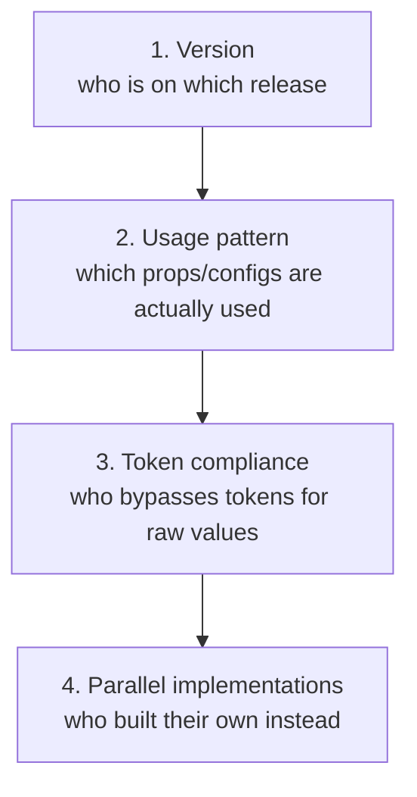

The Principle

## Adoption counts tell you who consumes; observability tells you how

[Measuring adoption](/adoption-measurement/) answers whether teams use the system at all, and at what stage — aware, installed, consuming, contributing, advocating. Dependency observability sits one layer beneath that question: for the teams that *are* consuming, which version are they on, which props do they reach for, which tokens do they quietly bypass in favor of raw values, and which have built a parallel solution because the system's component didn't fit. A system can have excellent adoption numbers and still be operating close to blind on all four of those questions.

Why It Exists

## Version and usage blindness turns every release into a guess

Without this visibility, a team shipping a breaking change has no way to know, before release, how many consumers it will actually affect, or which ones. [Murphy Trueman](https://blog.murphytrueman.com/we-know-how-to-build-design-systems-but-we-dont-know-how-to-operate-them/) names this directly as an industry-wide maturity gap: most teams can report adoption counts if they've set up analytics at all; "very few can tell you how components are being used, where props are being overridden, which tokens are getting bypassed in favour of raw values, or which teams have built parallel solutions because the system's components didn't fit their needs." Every one of those is a question a design system needs answered *before* it changes something, not discovered afterward from a flood of broken-build reports.

---

## In Practice

#### 1. Version fragmentation tracking

Before a design system can reason about how many consumers a release will break, it needs to know who's on what. **Spotify's** Encore team treats this as foundational infrastructure rather than a nice-to-have: they run low-level daily statistics gathering on precisely which teams are using precisely which version of the library. That single dataset is what turns "we're deprecating this in the next major" from a guess into a targeted rollout — the team knows in advance which consumers are still on the affected version and can reach them directly instead of broadcasting to everyone.

#### 2. Usage-pattern and prop-override analytics

**Spotify** also runs slot-pattern and prop-override analytics, surfacing which props get overridden most often and which configurations teams actually converge on. A component with a low-usage prop that nobody reaches for is a deprecation candidate; a prop that gets overridden constantly is a signal the default is wrong, not that consumers are misusing the API. This is the operational half of the API-design judgment calls in [Component API design](/component-api-design/) — that page describes how to design props well up front; this data is how a team finds out, after the fact, whether the design held up under real usage.

#### 3. Token bypass detection

[Measuring adoption](/adoption-measurement/) already names token compliance as "the adoption signal that most directly correlates with system value" — a team can use every system component correctly and still hardcode raw colors and spacing around them, quietly undermining the theming and consistency the tokens exist to guarantee. Dependency observability is what makes that bypass visible at all: without scanning for raw values living alongside token references, a system has no way to distinguish full token compliance from a codebase that looks compliant at the component layer and isn't underneath it.

#### 4. Watching for parallel, unofficial implementations

A team that built its own version of a component because the system's version didn't fit isn't visible in any import count — by definition, it isn't importing the system's component at all. This is the sharpest form of the neglect problem already named in [Component governance](/component-governance/): a team doesn't fork loudly, it just quietly stops asking. The only way to catch this is deliberately, by watching for lookalike patterns appearing in product codebases outside the design system's own repositories, not by waiting for it to surface as a governance complaint.

#### 5. Borrowing supply-chain security's inventory discipline

Tools like [**Dependency-Track**](https://docs.dependencytrack.org/) exist precisely to answer "which version of which component is running where" for security risk — ingesting a Software Bill of Materials (SBOM, a machine-readable manifest of every dependency an application ships with) and turning it into a queryable inventory across a whole portfolio of applications. The pattern transfers directly: a design system's dependency observability is the same question — which version, where, at what risk — asked about UI components instead of security vulnerabilities.

## Diagram

The four questions dependency observability answers, in order of how hard each one is to see:

Each rung down is progressively less visible from standard adoption analytics — version tracking is a dashboard query; parallel implementations require deliberately looking for lookalikes outside the system's own codebase.

---

## Common mistakes

Building version and usage tracking, declaring the observability problem solved, and stopping there:

- **Never instrumenting for token bypass.** Hardcoded values that skip the token layer entirely don't show up in an import-count dashboard.
- **Never instrumenting for parallel implementations.** Teams quietly rebuilding a component locally instead of consuming it are invisible to version and usage tracking alike.

A team that only tracks what's easy to query (versions, import counts) gets a false sense of completeness: the dashboard looks thorough while the two failure modes most likely to indicate the system isn't actually serving a team's needs stay invisible.
