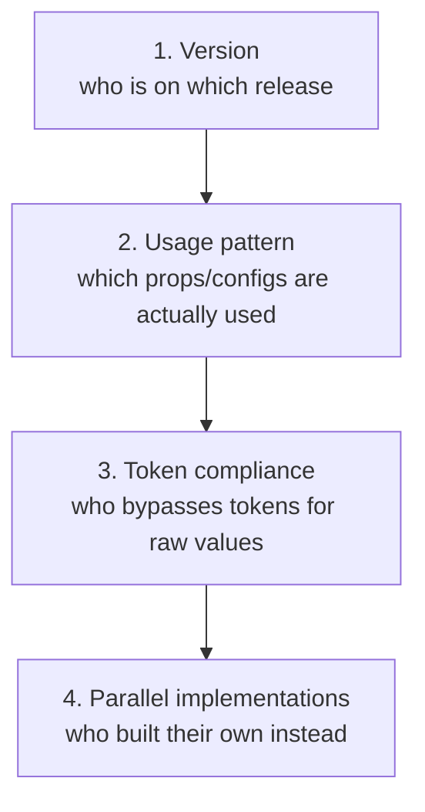

[Measuring adoption](/ds101/measuring-adoption/) tells you whether teams use the system at all. Dependency observability looks one layer down, at the teams that *are* using it. Which version are they on? Which props do they reach for? Which tokens do they quietly skip in favor of raw values? And who built their own version because the system's didn't fit? A system can have excellent adoption numbers and still be nearly blind on all four.

:::tip[Key takeaways]
- Know which team is on which version before shipping a breaking change
- Treat a constantly overridden prop as a wrong default
- Scan for raw values that bypass tokens
- Look for lookalike components outside the system's own repos
- Borrow inventory tools from supply-chain security
:::

## The problem

Without this visibility, a team shipping a breaking change can't know how many consumers it will affect, or which ones. [Murphy Trueman](https://blog.murphytrueman.com/we-know-how-to-build-design-systems-but-we-dont-know-how-to-operate-them/) calls this an industry-wide maturity gap. Most teams can report adoption counts, if they've set up analytics at all, but "very few can tell you how components are being used, where props are being overridden, which tokens are getting bypassed in favour of raw values, or which teams have built parallel solutions because the system's components didn't fit their needs." A system needs those answers *before* it changes something, not afterward from a flood of broken builds.

Each of the four questions is harder to see than the one before:

Version tracking is a dashboard query. Parallel implementations require deliberately looking for lookalikes outside the system's codebase.

## Practices

### Track who is on which version

**Spotify's** Encore team treats this as basic infrastructure. They gather low-level statistics daily on exactly which teams use exactly which version of the library. That one dataset turns "we're deprecating this in the next major" from a guess into a targeted rollout. The team knows in advance which consumers are still on the affected version and can reach them directly, instead of broadcasting to everyone.

### Watch which props get overridden

**Spotify** also tracks slot patterns and prop overrides: which props get overridden most, and which configurations teams actually settle on. A prop nobody uses is a deprecation candidate. A prop that's overridden constantly means the default is wrong, not that consumers are misusing the API. This is the after-the-fact half of [Component API design](/ds101/component-api-design/): that page covers designing props well up front, and this data shows whether the design held up.

### Scan for token bypass

[Measuring adoption](/ds101/measuring-adoption/) calls token compliance "the adoption signal that most directly correlates with system value." A team can use every component correctly and still hardcode raw colors and spacing around them, undermining the theming and consistency tokens exist for. Hardcoded values don't show up in an import-count dashboard. Only scanning for raw values next to token references reveals a codebase that looks compliant at the component layer but isn't underneath.

### Look for parallel implementations

A team that built its own version of a component isn't visible in any import count, because it isn't importing the system's version at all. It's the sharpest form of the neglect named in [Decision governance](/ds101/decision-governance/): a team doesn't fork loudly, it just quietly stops asking. The only way to catch it is to look on purpose, for lookalike patterns in product codebases outside the system's own repositories.

### Borrow supply-chain inventory tools

Tools like [**Dependency-Track**](https://docs.dependencytrack.org/) exist to answer "which version of which component is running where" for security risk. They read a Software Bill of Materials (SBOM, a machine-readable list of every dependency an application ships with) and turn it into a searchable inventory across a whole portfolio of apps. The pattern transfers directly. Design-system observability asks the same question (which version, where, at what risk) about UI components instead of security vulnerabilities. For the inward view, what depends on what inside the system itself, see [System inventory](/ds101/system-inventory/).

## Common mistakes

- **Stopping at what's easy to query.** A team that tracks versions and import counts, and declares observability solved, gets a false sense of completeness. The dashboard looks thorough while the two signals most likely to show the system isn't serving a team, token bypass and parallel implementations, stay invisible.
