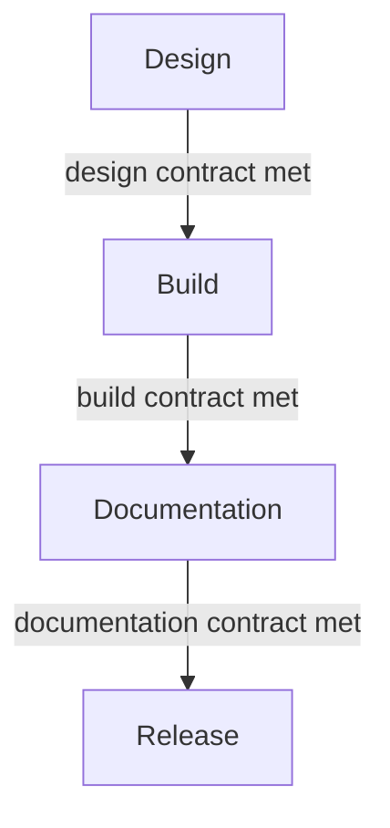

"Done" isn't one thing. A component can be done in the sense of "design approved," "built," "documented," or "released," and each is a different bar. A design-to-code contract spells out each one, so a component isn't finished until every stage has met its own standard.

:::tip[Key takeaways]
- Define "done" separately for design, build, docs, and release
- Close each stage's contract before the next stage starts
- Hand off the Figma file, never a screenshot
- Spec new components from the design, not from the old component
:::

## The problem

When "done" stays vague, everyone fills in their own definition. The designer means "the happy path looks right in Figma." The developer means "it renders and passed review." Nobody meant "accessible" or "documented," so those quietly don't happen. The gap shows up later as production bugs, accessibility regressions, and documentation debt that someone has to pay down under pressure.

## The model

The design-system-ops toolkit (`knowledge-notes/design-to-code-contract.md`) splits "done" into four contracts, one per stage.

### Design contract

Met when the spec can be built without clarifying questions:

- Every state is designed: default, hover, active, focus, disabled, loading, error.
- Responsive behaviour is specified.
- Edge cases like long strings and empty states are covered.
- Token usage is explicit in the file.
- The component API (props, types, defaults) is agreed before build.
- Accessibility (focus indicators, contrast, touch targets) is handled now, not deferred.

### Build contract

Met when:

- All specified states are implemented, not just the happy path.
- Token references are correct at every tier, with no hardcoded values.
- Accessibility is implemented *and tested*, not just reviewed.
- The result is checked against the spec, not built from memory.
- Unit tests and Storybook coverage exist.

### Documentation contract

Met when:

- Usage guidelines (when to use it, when not to, known anti-patterns) are written for someone who wasn't in the design conversations.
- Props are fully documented.
- Accessibility behaviour is described specifically, not "see WCAG."
- Examples cover the main use case plus at least one edge case.

### Release contract

Met when:

- The three contracts above are met.
- Affected teams get visibility before shipping.
- Release notes are written in plain terms.
- Breaking changes come with a documented migration path. See [Release management](/ds101/release-management/).

## Practices

### Close each contract before the next stage starts

A contract catches gaps at the stage where they're cheapest to fix. So treat each checklist above as the exit criteria for its stage, not as a final audit once everything is built.

## Common mistakes

Two handoff habits quietly break the design contract:

- **Delivering designs as screenshots.** A developer can't inspect token references or check spacing and states from a flat image. A screenshot is a visual reference, not a contract. The real spec lives in the Figma file, where every value can be inspected.
- **Saying "just copy the existing component."** That makes the old implementation the spec, so every problem in it (missing states, hardcoded values, accessibility gaps) gets faithfully copied into the new one. If the old component were a reliable spec, you probably wouldn't be building a new one.
