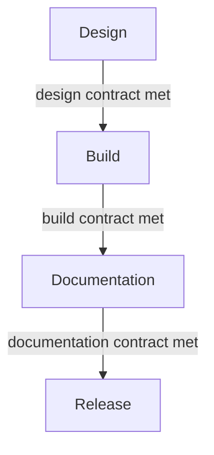

"Done" isn't one thing. A component can be done in the sense of "design approved," "built," "documented," or "released," and each is a different bar. A design-to-code contract spells out each one, so a component isn't finished until every stage has met its own standard.

:::tip[Key takeaways]
- Define "done" separately for design, build, docs, and release
- Close each stage's contract before the next stage starts
- Publish the contract where every team can see it
- Keep the contract cheap to keep current
- Change the contract only through recorded decisions
:::

## The problem

When "done" stays vague, everyone fills in their own definition. The designer means "the happy path looks right in Figma." The developer means "it renders and passed review." Nobody meant "accessible" or "documented," so those quietly don't happen. The gap shows up later as production bugs, accessibility regressions, and documentation debt that someone has to pay down under pressure.

## The model

The design-system-ops toolkit ([`knowledge-notes/design-to-code-contract.md`](https://github.com/murphytrueman/design-system-ops/blob/main/knowledge-notes/design-to-code-contract.md)) splits "done" into four contracts, one per stage.

### Design contract

Met when the spec can be built without clarifying questions:

- Every state is designed: default, hover, active, focus, disabled, loading, error.
- Responsive behaviour is specified.
- Edge cases like long strings and empty states are covered.
- Token usage is explicit in the file.
- The component API (props, types, defaults) is agreed before build.
- Accessibility is handled now, not deferred: focus indicators, contrast, touch targets, and the ARIA contract (the component's role, keyboard pattern, and how it gets its label).

### Build contract

Met when:

- All specified states are implemented, not just the happy path.
- Token references are correct at every tier, with no hardcoded values.
- Accessibility is implemented *and tested*, not just reviewed.
- The result is checked against the spec, not built from memory.
- Unit tests and Storybook coverage exist.

### Documentation contract

Met when:

- Usage guidelines (when to use it, when not to, known anti-patterns) are written for someone who wasn't in the design conversations.
- Props are fully documented.
- Accessibility behaviour is described specifically, not "see WCAG."
- Examples cover the main use case plus at least one edge case.

### Release contract

Met when:

- The three contracts above are met.
- Affected teams get visibility before shipping.
- Release notes are written in plain terms.
- Breaking changes come with a documented migration path. See [Release management](/ds101/release-management/).

## Practices

### Close each contract before the next stage starts

A contract catches gaps at the stage where they're cheapest to fix. So treat each checklist above as the exit criteria for its stage, not as a final audit once everything is built.

The exit can be a single signal. [Nathan Curtis](https://nathanacurtis.substack.com/p/component-contracts-and-schemas) describes how design handoff works on his team now: designers "simply mark a component `READY_FOR_DEV`, conduct an agentic pass to compose the behaviors and accessibility Figma can't, and field occasional Slack threads to clarify requirements as needed." An agentic pass is a run of an AI agent over the design, filling in what a Figma file can't hold. Before, he notes, delivering a component "would require a handoff meeting per platform team."

### Publish the contract where every team can see it

The toolkit calls the contract "not primarily a quality gate. It is a communication tool." It gives the system team and product teams a shared answer to what the system covers and what's the product team's job, so less gets negotiated at each handoff. That only works if people can find it: "Teams that know what the standard is can work toward it. Teams that are guessing cannot."

### Keep the contract cheap to keep current

A contract that lags behind the components does more harm than no contract. Curtis: "A rotted contract is worse than no contract at all, because people trust contracts." His test is whether "the cost of bringing the contract current is close to zero – in time, in tokens, and in human attention." If updating it takes a meeting, it will fall behind. The toolkit makes the same point about docs: they should describe the version that's released now, because "stale documentation is a reliability problem."

### Change the contract through recorded decisions

Strict doesn't mean frozen. Curtis: "A contract that can't change dies, and a contract that changes without governance was never actually a contract." He calls architectural decision records (ADRs), short notes on what changed and why, "the machinery to evolve component specs." [Decision governance](/ds101/decision-governance/) covers how to keep those records.

## Common mistakes

- **Delivering designs as screenshots.** A developer can't inspect token references or check spacing and states from a flat image. The toolkit is blunt: a screenshot "is not a design contract — it is a visual reference." The Figma file is the minimum. Curtis goes further: a definition taken straight from one party's tool, "like a Figma file," is "testimony, not a contract." [Multi-platform component specs](/ds101/multi-platform-component-specs/) covers writing the platform-neutral version.
- **Saying "just copy the existing component."** That makes the old implementation the spec, so every problem in it (missing states, hardcoded values, accessibility gaps) gets faithfully copied into the new one. If the old component were a reliable spec, you probably wouldn't be building a new one.
- **Deferring accessibility to QA.** Per the toolkit, accessibility issues found in QA "cost significantly more to fix than issues caught in design." That's why the design contract requires them before build starts.
- **Writing the docs after release.** Docs written under pressure after shipping "tend to describe the component as built rather than as intended," and they reach the teams who needed them after those teams have already worked it out for themselves, "sometimes incorrectly."
