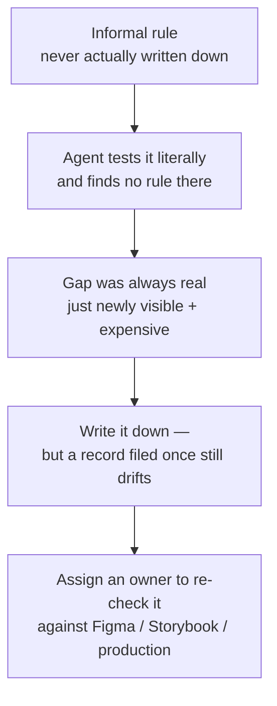

An agent treats every documentation gap as a rule to follow literally. [AI readiness](/ai-readiness/) asks whether a system's metadata is explicit enough for an agent to use. This page goes further: an agent treats every gap, stale doc, and "everyone just knows" convention as literal, because it has no instinct to fall back on when the written rule and the real one disagree. A human contributor papers over that gap without noticing. An agent executes exactly what's written, or exactly what it can infer from the code.

:::tip[Key takeaways]
- Write down the rules everyone "just knows" before an agent tests them
- Fix deferred gaps now: agents make them visible and expensive
- Give every decision record an owner who re-checks it against reality
- Name someone to referee when Figma, docs, and production disagree
:::

## The problem

Shane P Williams, founding editor of the Design Systems Collective, spent a 2026 run of essays on this shift: governance and documentation problems that were tolerable when only people read them stop being tolerable once agents do.

> "When an agent is handed your documentation and still reaches for freshly generated code instead of your component library, the system failed a legibility test, not a tool test."
> — Shane P Williams, ["Legibility Is the New Governance"](https://designsystemscollective.substack.com/p/legibility-is-the-new-governance)

The instinct is to blame the tool or the model. The real cause is almost always upstream: an ambiguous name, an undocumented exception, a rule that only lived in one engineer's head. "If your design system cannot be understood without a human translator, it was never really infrastructure. It was craft, maintained by goodwill."

His four essays form a progression:

## Practices

### Write down the rules everyone "just knows"

[Williams's sharpest claim](https://designsystemscollective.substack.com/p/the-informal-contract-is-over): a lot of what teams call governance was never enforced. It was a shared understanding people navigated by instinct, tone, and relationship. "The informal contract that humans could navigate by instinct becomes a hard boundary an agent will test without mercy," because "when a machine consumes your design system, it does not interpret intent. It executes whatever you actually built, not what you meant to build." His verdict on the old arrangement: "That was never a system. It was a relationship." The fix isn't stricter enforcement of the old informal rule. It's admitting it was never written down, and writing it down before something tests it.

### Fix deferred gaps before an agent finds them

Gaps a team has lived with for years, like an under-documented edge case or a component with two conflicting "correct" usages, don't cause new damage the day an agent shows up. They were always a cost. Williams: "the work that teams quietly deferred has not gone away. It has simply become more visible, and considerably more expensive." In [Documentation coverage](/documentation-coverage/) terms, a component stuck at "exists" instead of "guided" was already a risk for new people. An agent just removes the grace period.

### Give every decision record an owner

[Decision governance](/decision-governance/) argues for decision records, so a system doesn't argue the same question every 18 months. [Williams pushes further](https://designsystemscollective.substack.com/p/drift-doesnt-announce-itself): writing a record solves the *memory* problem, not the *staleness* problem. "Every design system claims a source of truth. Fewer are honest about how long ago anyone last checked it." And: "writing something down is not the same as keeping it true."

What prevented drift in practice wasn't better tooling. It was a habit: "one origin for a fact, checked against reality instead of copied from memory." A rule survives because "someone rewrote it, in the open, reasoning intact," when reality proved the old version wrong. So a decision record needs an owner who re-checks it against the real system, not just an author who filed it once.

### Name a referee for competing sources of truth

Design intent (Figma), documented behavior (Storybook), and production routinely disagree. [Williams](https://designsystemscollective.substack.com/p/the-job-nobody-is-hiring-for-yet): "none of the three is lying. They are each authoritative for a different question." Figma answers what was intended, Storybook what was built and documented, and production what actually shipped.

That creates a job that mostly doesn't formally exist yet: "once truth lives in layers, who is actually responsible for keeping them honest with each other." Telling a deliberate divergence (production adapted for a real constraint) from unintentional decay (nobody updated Storybook) "is judgment, and judgment needs an owner, not a dashboard." The job, in his words: "deciding, in public, which layer governs a given decision and being able to say why." Better tooling "will not do the deciding." It just gives that person better evidence.

## Common mistakes

- **Treating this as an AI problem with an AI fix**, like better prompts, a bigger context window, or a smarter agent. Williams: "Legibility has become a design constraint, not just a documentation problem. The systems that will hold up are the ones built to be understood without a human in the loop." The gap an agent exposes was already a gap for a new hire, a contractor, or a contributor from another team. The agent just removes the last people willing to quietly fill it in from memory.
