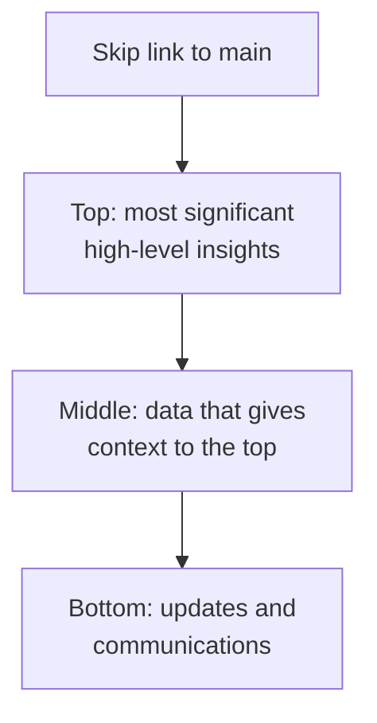

A screen can be built entirely from components that pass their audits and still be hard to use with a screen reader. The problems come from how the components are put together: the order the page is read in, its heading structure, and the landmarks that let someone jump between regions. These all exist only once components are combined into a layout, so a design system has to handle them in its page templates and layout guidance, not in single components. An accessible layout still needs accessible components inside it, which [Component accessibility](/ds101/component-accessibility/) covers.

:::tip[Key takeaways]
- Build landmarks and a skip link into the page shell
- Let the page set a heading's level, not the component
- Put the most important content first in the code, not just on screen
- Annotate a layout's keyboard order once, then only the differences
:::

## The problem

> "In HTML, heading tags assign semantic meaning to an element's role within a page's hierarchy. However, a component's tags don't or can't align with each every page's HTML on which it's used, especially across pages or a whole app."
>
> — [Nathan Curtis, "Typography in Design Systems"](https://nathanacurtis.substack.com/p/typography-in-design-systems-6ed771432f1e)

Dashboards show the problem most clearly, because many widgets compete for attention on one screen. Picture a dashboard built from system cards. Each card has its title fixed as a third-level heading, so the page has no real outline. The grid is arranged with CSS, so the order on screen doesn't match the order in the code. No part of the page is marked as the main content. A sighted user sees the most important numbers in the top row. A screen reader user hears the cards in whatever order the code happens to have them, under a flat list of identical headings, with no quick way to skip the navigation.

A screen reader doesn't have to read a page from top to bottom. [Carbon](https://carbondesignsystem.com/guidelines/accessibility/keyboard/) explains that when a page labels its areas with landmarks (named regions such as the header, navigation, main content, and footer), "screen reader users can then quickly jump to any area they want." Headings work the same way: users can pull up a list of them and jump to one. Both shortcuts depend on the layout, and no single component can provide them.

## Practices

### Build landmarks into the page shell

The simplest way to get landmarks onto every page is to have the system provide the page frame, often called a shell or template, so product teams don't set them up page by page. The W3C's [ARIA Authoring Practices Guide](https://www.w3.org/WAI/ARIA/apg/practices/landmark-regions/) calls this one of the most useful things a page can do: "Including all perceivable content on a page in one of its landmark regions and giving each landmark region a semantically meaningful role is one of the most effective ways of ensuring assistive technology users will not overlook information."

Several systems already ship a frame like this. The [GOV.UK page template](https://design-system.service.gov.uk/styles/page-template/) wraps each page in a skip link, a header, a `main` element, and a footer. [Carbon's UI shell header](https://carbondesignsystem.com/components/UI-shell-header/accessibility/) applies a header region and shows a "Skip to main content" link the first time a keyboard user presses Tab. [Cloudscape](https://cloudscape.design/foundation/core-principles/accessibility/Building-accessible-experiences/) recommends its app layout component "to build consistent and predictable pages with defined areas for navigation, content areas, and tools or help panel," including for dashboards. The GOV.UK template's frame looks like this, trimmed to its landmarks:

```html
<a href="#main-content">
  Skip to main content
</a>
<header>…</header>
<main id="main-content">
  …
</main>
<footer>…</footer>
```

Notice that the skip link comes first and points at `main`. A keyboard user can skip past the header and navigation in one step instead of tabbing through every link.

Components that fill a large region need a landmark too. Murphy Trueman's [per-component audit](https://github.com/murphytrueman/design-system-ops/blob/main/skills/accessibility-per-component/SKILL.md) asks whether a component that "occupies a significant section of a page (a navigation, a main content area, a complementary region)" is wrapped in the right landmark.

### Label landmarks that repeat

A dashboard often has more than one landmark of the same type, such as main navigation and a filter panel, or two side panels. The APG says each one needs its own label so a screen reader user can tell them apart. The exception is when both have the same content and purpose, like pagination above and below a table. Leave the role out of the label, because the screen reader already says it: a navigation labelled "Site Navigation" is read out as "Site Navigation Navigation," so label it "Site."

### Let the page set a heading's level

Curtis's point is that the same text can be the page title on one screen and a third-level heading on another. His example: "what might be the largest heading on one screen (such as a product spec's page title) may be the third largest heading on another page (such as a product's home page)." He recommends that teams "separate the concept of heading level (the visual outcome of applying style properties) from H tag (HTML elements like H1, H2, H3, and so on)."

In practice, a card, panel, or section component takes its heading tag as a setting, and its visual size is a separate setting. The team building the dashboard then gives the page one `h1`, gives each group of widgets an `h2`, and gives each card inside a group an `h3`, however big each title looks. [Cloudscape](https://cloudscape.design/foundation/core-principles/accessibility/Building-accessible-experiences/) asks for "descriptive section headings following a proper heading hierarchy." [Component API design](/ds101/component-api-design/) covers how to expose a setting like this without letting the component's options grow out of control.

### Put the most important content first in the code

What a screen reader reads, and where the Tab key goes next, follows the order of elements in the code (the source order), not where CSS places them on screen. WCAG 2.2's [Meaningful Sequence](https://www.w3.org/WAI/WCAG22/Understanding/meaningful-sequence.html) criterion requires that "when the sequence in which content is presented affects its meaning, a correct reading sequence can be programmatically determined." Its recommended technique is to make the order in the code match the order on screen. It lists using CSS to position content in a way that changes its meaning as a failure. Cloudscape says the same: "Ensure that the order of elements in the code matches the logical order of the information presented."

On a dashboard, that order should also be the order of importance. Cloudscape's [static dashboard pattern](https://cloudscape.design/patterns/general/service-dashboard/static-dashboard/) asks for content "distributed following a hierarchical order of importance." Its accessibility guidance asks for keyboard access "in a logical and predictable order."

<div class="mermaid-wrap">



</div>

Dashboards that users can rearrange are still an open question. Cloudscape's [configurable dashboard pattern](https://cloudscape.design/patterns/general/service-dashboard/configurable-dashboard/) lets users drag items so they can "better prioritize their content," but it doesn't say whether the order in the code should change to match. None of the sources cited here cover it.

### Annotate a layout's keyboard order once

Keyboard order is easy to lose between design and build, because a design file shows where things sit but not the order they're reached in. Carbon's [keyboard guidance](https://carbondesignsystem.com/guidelines/accessibility/keyboard/) gives a default: start with the header, then the main navigation, then the content "from left to right, top to bottom," and end with the footer. For its UI shell, Carbon asks each product for "a one-time design exercise to annotate the UI shell keyboard interaction." After that, "individual product pages only need to annotate the header if something differs." A system can take the same approach with its page templates: annotate the landmarks, heading levels, and tab order once per template, and ask product teams to note only what they change. [The design-to-code contract](/ds101/design-to-code-contract/) covers where annotations like these fit in the handoff.

## Common mistakes

- **Wrapping every dashboard card in its own landmark.** Cloudscape's dashboard guidance warns: "Don't add unnecessary markup for roles and landmarks." If every card is a landmark, the list of regions becomes as long as the page, and jumping between regions stops saving time.
- **Reordering the grid with CSS alone.** Moving a card to the top row with CSS changes what sighted users see first, but a screen reader still reads it in its old position. WCAG lists this as a failure when the order carries meaning.
- **Changing the shell without annotating the change.** Carbon asks for an annotation wherever a product's header departs from the default behaviour or labels, because headers "appear similar until interacted with."
