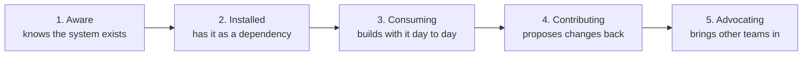

Coverage and adoption answer different questions. Coverage asks whether the system *provides* what teams need. Adoption asks whether teams *actually use* it. The fixes are opposites: low coverage is a supply problem (build more), and low adoption with high coverage is a demand problem (find out why teams don't use what already exists).

:::tip[Key takeaways]
- Track component imports and token compliance, and look at the long tail
- Break every number down by team, never just system-wide
- Match your help to each team's adoption stage
- Measure trust and adoption separately: people can trust a system and still not use it
- Watch for silence: disengaged teams stop complaining before they leave
:::

## The problem

Without this distinction, teams misdiagnose the problem and pour effort into the wrong fix. The classic case: a system has 100% component coverage but 20% adoption, because product teams keep building their own versions. The instinct is "we need more components," when the real question is why nobody wants the ones that already exist. The answer might be onboarding gaps, API friction, or missing docs. Shipping component number forty-one fixes none of them.

## Practices

### Track imports and token compliance

The design-system-ops adoption notes ([`knowledge-notes/adoption-measurement.md`](https://github.com/murphytrueman/design-system-ops/blob/main/knowledge-notes/adoption-measurement.md)) describe four signals, and two are especially concrete. The first is **component consumption**, measured by import analysis: scanning codebases to see which components teams pull in. The shape matters more than the headline: "a system where 5 components account for 90% of imports and 30 components are rarely used has an adoption problem in the tail, even if the headline number looks good."

The second is **token compliance**: whether teams use design tokens or hardcode raw color and spacing values. The notes call this "the adoption signal that most directly correlates with system value," because tokens are what make theming, rebranding, and consistency possible. A team can use every component and still undermine the system by hardcoding values around them.

### Break every number down by team

From the same notes: "a system with 85% overall token compliance might have three teams at 98% and two teams at 40%. The system-level number suggests health; the team-level numbers reveal a problem."

### Match your help to each team's adoption stage

The notes describe five stages, each needing a different kind of help, from onboarding at the start to involving teams in governance at the end:

### Measure trust and adoption separately

Trust usually isn't the bottleneck people assume. zeroheight's *Design Systems Report 2026* (147 practitioners) found 42% report high trust in their system and 49% moderate trust. Only 8% report low trust. Yet just 7% describe their system as fully adopted across all teams. People trust the system and still don't reach for it, so "build a better system and they'll come" isn't the fix. The bigger blockers are a missing mandate, incomplete coverage, and weak communication. [Murphy Trueman](https://murphytrueman.substack.com/p/the-component-adoption-gap-understanding) frames the psychology the same way: adoption gaps are often about friction and habit, not quality.

### Earn adoption, and watch for silence

[Ness Grixti](https://nessgrixti.com/articles/the-hidden-work-behind-design-system-adoption/) says adoption is "earned. Slowly, through trust, relevance and usefulness," not through a launch event or a mandate. Trust builds through consistency: responding to feedback, delivering promised updates, pairing with teams on problems, and being open about changes. Her clearest evidence is **Wise's** rebuild (the token restructure covered in [Brand alignment](/ds101/brand-alignment/)). It was built on deep audits and open conversations with the teams who'd use it, and won Best Adoption at the 2023 zeroheight Design System Awards. The system that wins on adoption isn't necessarily the most polished. It's the one people helped build.

Her sharpest warning sign: fading adoption shows up as quiet disengagement, like teams that stop asking questions or stop showing up, more than as complaints. A team still complaining still wants the system to work. A team gone silent may have already built around it.

## Choosing a measurement method

No method is solved. Each org below found a real limit, and knowing where each one breaks is more useful than treating any as the answer.

### Usage scanning

**Pinterest** built FigStats to track component use from the Figma API, and **Atlassian** built a custom adoption scanner for code (via the zeroheight help centre, "How to measure the dev side of a design system"). Both decided surveys and manual tracking weren't precise enough. The limit, found by **Mews**: import counts get unreliable once components are extended and re-exported internally, because it's unclear what should count.

### Visual coverage

[**Productboard**](https://www.productboard.com/blog/how-we-measure-adoption-of-a-design-system-at-productboard/) colored every system component on a screen to see coverage at a glance. It was informative, but it couldn't become one clean metric, because almost no real screen uses *only* system components. Each screen needed a manually set, somewhat arbitrary threshold. Mews adds that large container components dominate the visible area while being a small share of the actual component count.

### Production data

[**Mews**](https://developers.mews.com/design-system-adoption-metric-building/) built its adoption metric from production data. The limit it hit: complexity goes unweighted. A simple tag counts the same as a complex date picker in most naive metrics.

## Common mistakes

- **Turning team breakdowns into a public league table.** Ranking "best" and "worst" adopters makes people defensive instead of honest about their numbers. It flattens context: a team building a custom data-visualization library isn't failing to adopt, the system may just not cover their domain. And it blurs two findings a good report keeps apart, "chose not to use" and "needed something the system doesn't provide." Only the first is an adoption problem (design-system-ops adoption notes).

These numbers stop at "is it used." They don't say whether an adopted component is helping or hurting in a specific flow. [Performance in context](/ds101/performance-in-context/) covers that next layer.
