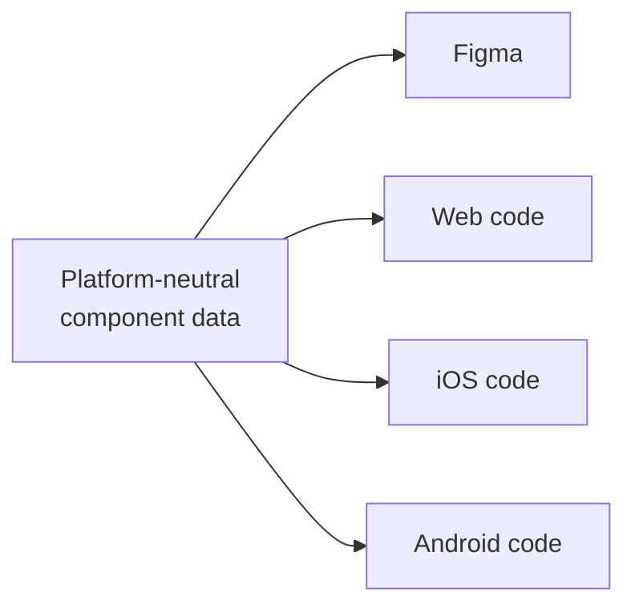

Once a design system ships to several platforms, a component's source of truth has to be platform-neutral data, not one tool's file. That's the only way independent platform teams build the same thing without drifting apart.

:::tip[Key takeaways]
- Write specs precise enough for teams who never talk to each other
- Define components as structured data, and generate Figma and code from it
- Use the shared DTCG format as the token floor
- Keep one neutral definition, not one hand-written spec per platform
:::

## The problem

Most design systems no longer ship to one codebase. [Nathan Curtis](https://medium.com/eightshapes-llc/component-specifications-1492ca4c94c) notes that "a three platform setup (iOS, Android, and web) is common, and some systems like IBM Carbon spread across many more." One design decision now has to reach several development teams who never sit in the same standup.

If the source of truth is a Figma file, each platform team reads the same screen and fills the gaps differently. One guesses a spacing value, another rounds a corner radius, a third invents a prop name. Within a year, a button's disabled state looks slightly different on iOS than on Android. Nobody decided that. Nobody had to reconcile it. The failure stays hidden until a user switches platforms and notices the same concept behaving differently, which is usually too late for a quick fix.

## Practices

### Write specs for teams who never meet

[Curtis](https://medium.com/eightshapes-llc/component-specifications-1492ca4c94c) argues that as a system grows past one platform, spec quality has to rise to match. A spec's job is no longer documenting a design for one dev team sitting next to the designer. It's declaring intent precisely enough that platform teams who never talk to each other still build the same thing. The [EightShapes Specs plugin](https://nathanacurtis.substack.com/p/the-eightshapes-specs-figma-plugin-2892f21adc96) exists because listing elements, props, and token mappings by hand doesn't scale once a spec serves three or more teams.

### Define components as data, and generate Figma from it

In ["Components as Data,"](https://medium.com/@nathanacurtis/components-as-data-2be178777f21) Curtis goes further and stops treating Figma as the source at all. A component's anatomy, props, styles, and variants are written directly as structured data (YAML or JSON). Figma becomes one *output* of that data, alongside generated code, instead of the input everything else is reverse-engineered from.

Because the definition is structured rather than a picture, it can also be checked automatically. Curtis's example: a raw color value in a variant where a token reference was required. That error is invisible in a rendered mockup and obvious in the data. It's the same shift [Component API design](/component-api-design/) describes for props, applied one layer earlier: to how the component is defined in the first place.

### Use the shared DTCG format as the token floor

Tokens are the part most systems get to first. As of October 2025, there's a shared, tool-independent format to build on. The [Design Tokens Community Group's specification](https://www.w3.org/community/design-tokens/2025/10/28/design-tokens-specification-reaches-first-stable-version/) reached its first stable release, with editors from Figma, Adobe, Google, Microsoft, Meta, and others agreeing on one file format. Style Dictionary, Tokens Studio, Terrazzo, and Figma can all read it. Co-chair Kaelig Deloumeau-Prigent: "design systems teams can now maintain one source of truth that works everywhere — from design to production code across iOS, Android, and web." [Token architecture](/token-architecture/) covers the tiers this format organizes.

## Common mistakes

- **Writing one spec per platform by hand.** Hand-maintained parallel specs drift from each other the same way hand-maintained parallel implementations do. Keep one neutral definition that outputs to all of them.
- **Confusing multi-platform with cross-platform.** The goal isn't one implementation forced to look identical everywhere (see Wealthfront's "design once, build anywhere" in [Component API design](/component-api-design/)). It's one set of decisions expressed natively per platform, which still requires the *decisions* to live somewhere neutral.
- **Adopting the DTCG format without checking tool support.** A stable spec doesn't mean every tool in your stack has caught up. Check that your version of Style Dictionary, Tokens Studio, or another pipeline tool actually supports 2025.10 before depending on it.
