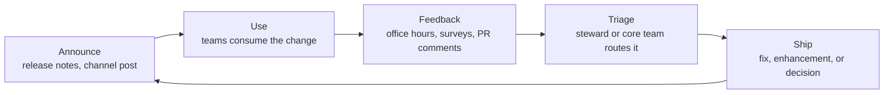

[Governance](/component-governance/) decides what's in the system and why. Operating cadence makes sure people outside the core team actually *know* that. It takes several channels working together: a release rhythm, a standing place to ask questions, a named guide for bigger work, advocates, and a route for feedback to get back in. A system can be perfectly governed and still fail if nobody hears about a change, knows who to ask, or has anywhere to complain.

:::tip[Key takeaways]
- Organize channels by audience, not by topic
- Release on a regular rhythm, and run big changes like a campaign
- Hold recurring office hours with a stated purpose
- Assign a steward to every larger contribution
- Start with the smallest cadence your team can actually sustain
:::

## The problem

[Nathan Curtis](https://medium.com/eightshapes-llc/design-system-communications-ca679ffc36d3) observes that "not every system team runs a predictable cadence... but every system has some kind of cadence to plan, work, critique, demo, and release things." The question isn't whether a rhythm exists. It's whether it's designed or accidental.

Left undesigned, communication defaults to whoever happens to be in the room. That's why [adoption measurement](/adoption-measurement/) keeps surfacing "weak communication" as a top blocker, even for systems people already trust. Trusting a system isn't the same as knowing what changed, who to ask, or where to send feedback.

## Practices

### Organize channels by audience

[Curtis](https://medium.com/eightshapes-llc/design-system-communications-ca679ffc36d3) recommends organizing around who needs to hear what, not around subject matter:

- `#system-design` for help, shared ideas, cross-product visibility, and critique notes.
- `#system-development` for API and PR review calls and working-session summaries.
- `#system-general` for major announcements, sprint reviews, and calls for planning input.

He also suggests a "message matrix" that plots problem, channel, audience, and frequency together, as a planning tool to keep the cadence intentional.

### Release on a regular rhythm

[EightShapes' account of release cadence](https://medium.com/eightshapes-llc/design-system-release-cadence-2e3e6694ba21) across **Morningstar**, **Discovery Ed's Comet**, **Adobe Spectrum**, and **Shopify** describes teams shipping regular minor releases about every sprint (commonly two weeks). They still allow irregular hotfix releases for browser defects, documentation typos, or broken elements, which ship outside the normal cycle.

For anything bigger than a routine release, like a redesign, a tool migration (Sketch to Figma), or a framework upgrade, [Curtis](https://medium.com/eightshapes-llc/design-system-communications-ca679ffc36d3) says to run the rollout "like a marketing campaign." Plan a sequence of messages before, during, and after the change, instead of one announcement and then silence. [Release management](/release-management/) covers the versioning and changelog side.

### Hold recurring office hours

Three teams run the same idea at different rhythms:

- **Twilio's** Paste runs [weekly office hours every Thursday](https://github.com/twilio-labs/paste/discussions/categories/office-hours) for planning UI needs, getting feedback, or debugging. A public `#help-design-system` Slack channel and an "Office Hours" category on GitHub Discussions cover other timezones.
- **GOV.UK's** Design System runs a [monthly community chat](https://team-playbook.design-system.service.gov.uk/community/a-guide-to-the-design-system-monthly-chat), mixing show-and-tell with open discussion, on Zoom for up to 500 people. It's on a different weekday each month, so the same working pattern isn't always excluded.
- **Mozilla's** Acorn runs [weekly office hours every Monday](https://acorn.firefox.com/latest/support/help-and-support/office-hours-UePgrNIe), alternating between 11:00 AM and 2:00 PM EST so US and EU timezones both get a turn. People sign up through a form so the team can prepare, but drop-ins are welcome. The team states the purpose outright: "provide an alternative communication avenue for teams to ask questions" and "foster collaboration between teams."

Brad Frost's *Atomic Design* (Chapter 5) pairs office hours with a second ritual: periodic "state of the union" meetings that bring makers, users, and stakeholders into one room to review what's working and discuss the roadmap.

### Assign a steward to larger contributions

[Curtis](https://medium.com/eightshapes-llc/stewarding-design-system-contributions-817665b6c7dd) settles on "steward" for this role ("shepherd" was the other contender): someone "selfless, knowledgeable, attentive, and warm" who guides a contributor through work they don't yet know how to finish. A bug fix can be autonomous and fast. But "most prospective contributors don't know, or want to know, every step involved" in delivering something larger. Without a steward, that work stalls or never starts. See [Contribution models](/contribution-models/) for the size-based workflow this belongs to.

### Build advocates deliberately

[Figma's Design Executive Council research](https://www.figma.com/blog/the-future-of-design-systems-is-marketing/) lists tactics teams use to build internal advocates:

- hands-on workshops and FigJam working sessions
- concise documentation over exhaustive documentation
- short videos of real use cases, not feature lists
- presentations timed to land inside existing team meetings and quarterly planning
- a formal advocate program, with recognition that shows up in performance reviews, not just a Slack shout-out

In the same research, **Spotify's** team prioritized collaboration and feedback loops when reworking their system, and **News UK** relied on onboarding resources and empowered advocates to ship a multi-brand system. [Governance case studies](/governance-case-studies/) covers Grammarly's ten-person advocate network.

Two larger programs show what triggers a formal ambassador structure. **Salesforce** built its Lightning Design System Ambassador program because support had become "centralized with a design systems team, and not scaling well." Implementation was inconsistent, contribution paths were unclear, and core-team responses were slow. Ambassadors embedded in product teams closed the gap ([Catriona Shedd](http://www.catrionashedd.com/portfolio/design-systems-ambassador-at-salesforce/)). **Thomson Reuters** runs the model across 150+ brands, organized into more than a dozen product "pods," each with an ambassador (usually lead level or higher) in a weekly meeting. Director Guy Segal describes the payoff as visibility in both directions. One ambassador called the meetings "the first time...we can all come together as a group and see what all the other teams are working on" ([Omlet](https://omlet.dev/blog/scaling-design-system-adoption-and-advocacy-with-guy-segal/)).

### Route feedback back in automatically

Frost's list of feedback routes is deliberately plural: issue trackers (GitHub, Jira), open forums, proactive outreach to developers already using the system, and periodic surveys or interviews, rather than waiting for complaints. **Shyp's** Micah Sivitz automates it: "whenever someone makes a pull request, it sends a notification to our `#Design` Slack channel." Feedback shows up where the team already is (Brad Frost, *Atomic Design*, Chapter 5).

## Common mistakes

- **Designing a cadence for a team you don't have.** Everything on this page together is a reasonable operating model for a team with the headcount to sustain it. zeroheight's *Design Systems Report 2026* (147 practitioners) found 56% name staffing as their biggest challenge, ahead of buy-in or tooling. 16% of systems are maintained by one person, 61% of teams have five or fewer people, and only 23% feel adequately resourced. Layering all of it onto a one- or two-person team produces obligations that get quietly dropped within a month, which damages trust worse than never promising them. Start with releases and one standing way to ask a question. Add channels only once the existing ones run without heroics.
