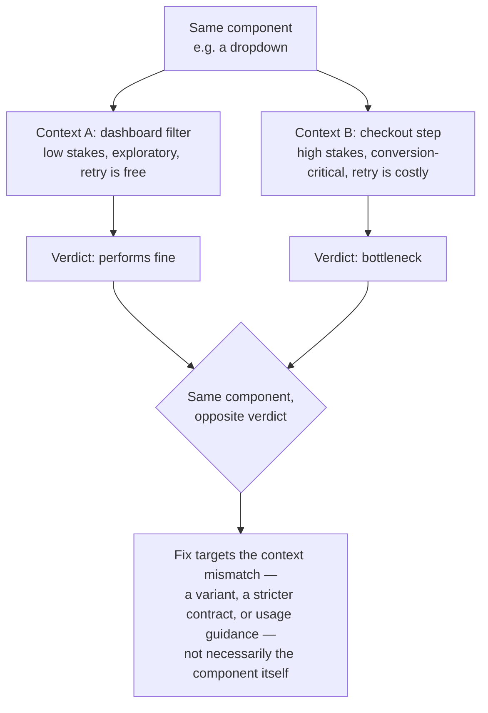

A component's quality depends on where it's used. A component that passes isolated testing (accessibility checks, visual QA, token compliance) can still fail where it actually lives. [Measuring adoption](/measuring-adoption/) asks "does the system provide this?" and "do teams use it?" This page adds a third question: *does it perform in the specific context and journey it's placed in?*

:::tip[Key takeaways]
- Tag analytics events with both the component and its journey context
- Rate a component's risk per placement, not once per component
- Slice detachment spikes by page to tell a flaw from a context mismatch
- Trace funnel drop-offs back to the component at that step
- Demand more evidence for context-level findings, not less
:::

## The problem

The same dropdown behaves differently depending on what it's embedded in. A filter dropdown on a dashboard can survive a moment of confusion. The same dropdown in a checkout step can't, because hesitation there costs a sale, not a re-click.

Two common measurement habits share this blind spot. Isolated QA asks "does this component work correctly," once, in a vacuum. Usage analytics asks "how often is it used," summed across every place it appears. Both can look healthy while the component hurts one high-stakes flow. Without measuring in place, a team either rebuilds a component that's fine in 9 of 10 contexts, or misses the problem entirely because the totals stay green.

## Practices

### Tag analytics with component and journey

Product analytics tools built to measure friction are page- and flow-aware by design. Think funnel drop-off (where users abandon a multi-step flow), rage clicks (repeated fast clicks on something unresponsive), dead clicks (clicks with no visible response), and session replay (a recorded playback of a real user's screen). But they have no concept of "design system component."

Component usage tools are the mirror image. Import scanners like **Pinterest's** FigStats or **Atlassian's** custom scanner (see [Measuring adoption](/measuring-adoption/)) know the component but not the context. An import count doesn't know whether that instance sits in checkout or settings. Closing the gap means tagging analytics events with both the component and its journey context. That has to be built in-house, because no tool connects the two out of the box.

### Rate risk per placement

[Scaling AI effort](/scaling-ai-effort-to-risk/) borrows a Challenge Rating (CR) that ranks how dangerous a component is to implement incorrectly: badges low, date pickers and data tables high. It's usually treated as fixed. It isn't. The same dropdown can be CR 1 in a dashboard filter and effectively CR 6 in a payment step, because the cost of the same mistake scales with what the journey is trying to do. Ask the CR question per placement.

### Slice detachment spikes by page

[Figma's design-system metrics research](https://www.figma.com/blog/design-systems-104-making-metrics-matter/) quotes **athenahealth's** Veronica Agne treating a rise in component detachment as worth investigating: "it can mean one of three things: there's a bug, people want an enhancement, or..." The diagnosis gets much sharper when sliced by *where* detachment happens. Detached everywhere points to a flaw in the component. Detached only on one journey's screens points to a context mismatch, which calls for a variant or contract change, not a rebuild.

### Trace drop-offs back to the component

A component can be adopted, accessible, and on-brand, and still be the exact step where checkout, onboarding, or an upgrade flow slows down or loses users. Product teams' existing funnel tools can answer that. The missing piece is linking a drop-off step to the component instance at that step, so the finding reaches the design system team instead of dead-ending as "step 3 has high abandonment."

### Demand more evidence for context-level findings

**Mews** found that import counts are unreliable once components are extended and re-exported, large containers distort visual measurement, and naive metrics ignore complexity (see [Measuring adoption](/measuring-adoption/)). Slicing any of these down to one journey shrinks the sample and amplifies the same noise. A context-level finding needs more evidence before you trust it.

## Open question: unified analytics platforms

No team appears to be doing this publicly yet. This section is a speculative sketch, not a documented practice.

Platforms like [PostHog](https://posthog.com/docs/llm-analytics) now combine product analytics (funnels, session replay, and feature flags, which switch a feature on for some users without a new deploy) with LLM and agent observability: traces (a step-by-step record of what an AI agent did), evaluations, and cost and latency per model call. There, "every trace has a person behind it." An LLM call and the human session around it already share one record. That opens a few possibilities nobody has written up as a pattern:

- **Tag component instances like LLM traces.** If components already send an analytics event on mount or interaction for adoption tracking, adding a `journey_stage` or `page_type` property costs almost nothing and makes existing funnel tools component-aware.
- **Join agent traces with component outcomes.** If one platform records both "an agent generated or migrated this component" and "this component then underperformed in checkout," the two can be linked automatically. [Agentic workflow design](/agentic-workflow-design/) argues agent actions need auditable output. This would turn a one-off finding into a standing feedback signal.
- **Test context-specific variants behind flags.** Ship a checkout-specific variant behind a feature flag and read the conversion change from the same platform that holds the baseline.
- **Let a scheduled job flag regressions.** Some platforms already run scheduled checks that report when a slice of LLM cost, latency, or error rate regresses. Pointing that at "this component's completion rate dropped in this journey stage" is a natural extension, though not documented.

All of this is custom instrumentation a team would have to build on purpose. No vendor ships it for design systems today. It's the same discipline [AI readiness](/ai-readiness/) argues for in component metadata, applied to analytics events.

## Common mistakes

- **Treating one global number as the whole answer.** "94% token compliance" or "imported in 40 repos" can be true system-wide while the component works against the one journey leadership tracks.
- **Rebuilding on the strength of one bad flow.** A component underperforms in one high-visibility journey, and the team rebuilds it without checking whether it's fine everywhere else. The real fix is often a context-specific variant or guidance, not a system-wide change.
