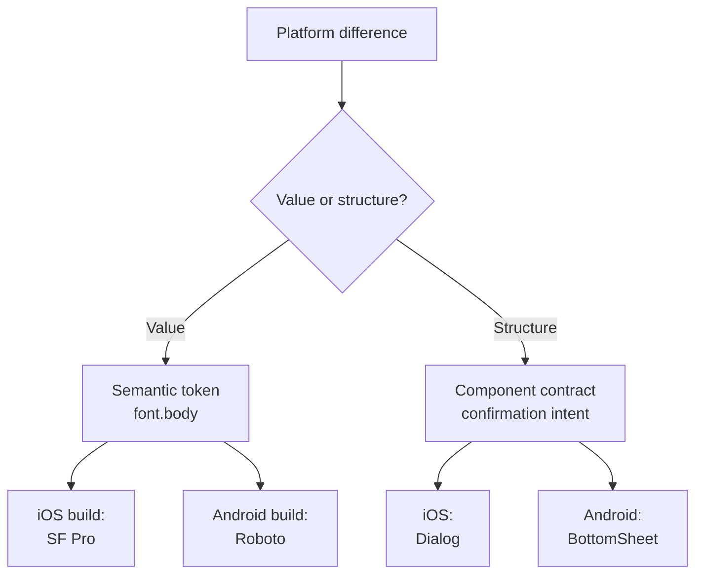

Some differences between iOS, Android, and web are legitimate, not drift. Every such difference is either a **value** (a different typeface for the same role) or a **structure** (a different control for the same intent), and each is fixed at a different layer. Value differences are resolved in tokens, and structural ones in component contracts.

:::tip[Key takeaways]
- Push value differences down into tokens, structural ones up into contracts
- Let platform live in the build pipeline, not in token names
- Make contracts checkable, not just descriptive
- Respect a platform's own conventions on purpose, not by accident
- Record every divergence decision where it's made
:::

## The problem

Nothing in a component's file distinguishes "this platform is different on purpose" from "nobody reconciled this yet." [Nathan Curtis](https://medium.com/eightshapes-llc/finding-platform-balance-in-a-design-system-47eaae48de98) describes the moment this becomes explicit. Early on, teams talk about "how design is the same" across platforms. Once the fundamentals are shared, the conversation moves to "how design is different and how teams draw boundaries around such exceptions."

A divergence made silently, with one team quietly building it differently, looks exactly like a bug until a user switches devices and notices the "same" feature behaving two ways. The two kinds of difference also get mixed up constantly. Teams either force one Dialog implementation onto platforms with real conventions, or fork a token per platform for something that was never a value problem.

## The model

<div class="mermaid-wrap">



</div>

### Value differences: resolved in tokens

San Francisco on iOS and Roboto on Android fill the same type role. That's a value difference, and [token layering](/ds101/token-architecture/) resolves it. The semantic token stays one thing, and platform becomes a dimension the build pipeline exports against.

[Curtis traces a token's path](https://medium.com/eightshapes-llc/reimagining-a-token-taxonomy-462d35b2b033) through a production pipeline. A value defined once in Style Dictionary doesn't reach a component directly. It flows through a build step into platform-specific output files, and design teams often don't know this middle layer exists. A `font.body` semantic token resolves to a different platform file, not a different token:

```
tokens/semantic.json
{
  "font": {
    "body": {
      "$type": "typography",
      "$value": {
        "fontFamily": "{font.family.platformDefault}",
        "fontSize": "{font.size.100}",
        "fontWeight": "{font.weight.regular}"
      }
    }
  }
}
```

`{font.family.platformDefault}` is a primitive alias, not a hardcoded name. It's the one primitive Style Dictionary resolves differently per build target:

```
// iOS build target
"font.family.platformDefault": "SF Pro Text"

// Android build target
"font.family.platformDefault": "Roboto"

// Web build target
"font.family.platformDefault":
  "-apple-system, Roboto, sans-serif"
```

`font.body` never forks. It's one semantic token with three build targets and three output files (Swift, XML, SCSS).

### Structural differences: resolved in component contracts

A confirmation pattern might be a centered Dialog on iOS but a bottom-anchored sheet on Android for heavier content. There's no shared value to alias, so a token can't resolve it. It's handled one level up, in the component's definition.

[Curtis's distinction](https://nathanacurtis.substack.com/p/component-contracts-and-schemas): "a description informs. A contract arbitrates." A description is documentation a team can interpret loosely. A contract states what a component *must* do, precisely enough that React, iOS, Android, Web Components, and Figma can each build against it on their own and still behave the same. For a confirmation pattern, the contract might say "block interaction until the user acknowledges or dismisses, present the heaviest content without truncation." Each platform decides *how*. It's the same reasoning behind the Dialog/BottomSheet example in [Component API design](/ds101/component-api-design/).

## Practices

### Push values down, structure up

When a difference is a *value* (a size, a color, a type role), resolve it at the semantic token layer, so one alias serves every platform. When it's *structural or behavioral* (which control appears, how it's triggered, what happens on dismiss), push it up to the component contract, where each platform can implement it natively.

### Make contracts checkable, not just descriptive

Curtis lists what makes a contract hold up. It's well-typed rather than loose prose. It's platform-neutral, not secretly biased toward whichever tool wrote it first. And it's verifiable: a machine, not just a reviewer, can confirm an implementation still satisfies it after either side changes. Loose prose isn't arbitrating anything. Two platforms will read the same paragraph and build two different things.

### Respect platform conventions on purpose

Curtis's example: a system adopted the Streamline icon set everywhere, until Android designers pointed out that "the design system shouldn't project a Streamline-based icon set unaltered onto that platform." Android already had its own icon conventions, and forcing Streamline onto it would have fought the OS instead of fitting it. That exception was legitimate because it was made explicitly.

### Record every divergence decision

Neither mechanism decides the interesting cases for you. Whether a difference should be unified or platform-native is a judgment call. What matters is writing the decision down wherever it's made, in the token file or the contract. Then the next platform team inherits a decision instead of reverse-engineering one.

## Common mistakes

- **Forking a token per platform for something that was never a value problem.** If two platforms need different components, not different values, adding `spacing.4.ios` and `spacing.4.android` doesn't fix the mismatch. It hides a contract problem inside the token layer, where the next person won't think to look. Source: [Curtis, "Reimagining a Token Taxonomy"](https://medium.com/eightshapes-llc/reimagining-a-token-taxonomy-462d35b2b033).
