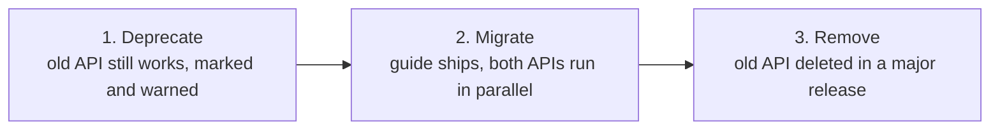

A version number, a changelog entry, and a migration guide are three views of the same event: they tell consuming teams what upgrading will cost them. When all three tell the truth, teams keep upgrading. When they don't, teams stop.

:::tip[Key takeaways]
- Use SemVer so impact is readable before anyone opens the diff
- Version token changes as their own releases
- Deprecate, then migrate, then remove, never remove by surprise
- Put every breaking change for a release on one migration page
- Keep the changelog public, and push each release to the teams it affects
:::

## The problem

Without a reliable signal for impact, teams do one of two things. They upgrade blindly and get broken by changes they had no warning about. Or they stop upgrading, because every past upgrade cost them unplanned work. Both have the same cause: the version number, changelog, and migration path didn't tell the truth about what the change would cost.

## Practices

### Use SemVer as the impact signal

Semantic Versioning (SemVer) tells a consuming team the *impact* of a change before anyone reads the diff. Major means something will break. Minor means something new is safe to ignore. Patch means nothing about your code needs to change. [Nathan Curtis](https://medium.com/eightshapes-llc/versioning-design-systems-48cceb5ace4d) notes that nearly every design system he's worked with uses SemVer for this reason: it's cheap to adopt, and it's the one signal a team can act on without reading release notes first.

### Version token changes on their own

Tokens sit underneath every component, so a token change reaches more components than any other kind of change. A renamed or re-scoped color token can quietly break dozens of components that never touched their own code. The [Design Tokens Substack](https://designtokens.substack.com/p/how-to-manage-breaking-changes-in) recommends treating token changes as release events in their own right, with their own major/minor/patch reasoning, instead of folding them into a component release where the impact is easy to miss.

### Deprecate before you remove

[zeroheight](https://zeroheight.com/blog/handling-breaking-changes-in-a-design-system-without-causing-chaos/) frames a breaking change as a lifecycle with three phases. Skipping straight to removal is what turns an upgrade into an incident.

The mechanics in [zeroheight's deprecation guide](https://help.zeroheight.com/hc/en-us/articles/36474257606555-Deprecating-in-design-systems-When-it-s-time-to-say-goodbye): put a visible marker like `[DEPRECATED]` in the item's description field. Where possible, have build tooling detect continued usage and warn, or in a mature system, fail the build. The specific marker doesn't matter. What matters is that the deprecation is visible *where the item is used*, not just announced once in a changelog.

This is the release-side view of the removal lane in [Component governance](/component-governance/), where Inayaili de León Persson asks for "deprecation shipped with advance notice, not a surprise."

### Put breaking changes on one migration page

**Carbon Design System's** [migration guide](https://v10.carbondesignsystem.com/help/migration-guide/design/) is the reference example. Instead of scattering breaking changes across changelog entries, every breaking change in a release goes on one page, next to what to do instead. A guide that says what changed, but not what a team should now do, has done half the job.

### Sort the changelog into standard categories

The [Keep a Changelog](https://keepachangelog.com) categories are Added, Changed, Deprecated, Removed, Fixed, and Security. They give every entry a home. A team checking "does this affect me?" should be able to answer from the category headers alone. [UXPin's changelog guide](https://www.uxpin.com/studio/blog/how-to-create-a-design-system-changelog/) adds: put the version number and date on every entry.

### Keep the changelog public and current

A visible changelog, even a shared Notion page, builds trust. [UXPin](https://www.uxpin.com/studio/blog/how-to-create-a-design-system-changelog/) puts it this way: "when people can see what changed and why, they're more likely to update their implementations and less likely to fork the system out of frustration." A stale changelog reads to consumers like an unmaintained system, whether or not the system is healthy. [Component governance](/component-governance/) names the same risk.

### Push every release to consuming teams

A changelog that teams have to remember to check gets missed by the teams who most need the warning. Post every release automatically, not just major ones, to Slack or email. That's what turns a written record into something teams act on before it breaks them.

## Choosing a versioning strategy

[Supernova's survey of real systems](https://www.supernova.io/blog/8-examples-of-versioning-in-leading-design-systems) finds both strategies below in production. Neither is more correct. The right one depends on how centralized the system team and its consumers already are.

### System-wide versioning

Everything ships under one number ("we're on 4.2"), and releases are synchronized. This fits a centralized team shipping tokens, components, and guidelines together. The cost: a fix to one component forces every consumer into an upgrade.

### Component-level versioning

Each component ships its own fixes on its own schedule, so an unrelated fix doesn't force anyone to upgrade. The cost: consumers track many numbers instead of one.

## Common mistakes

- **Treating the migration guide as optional polish.** A major version with no guide makes every consuming team reverse-engineer the same diff on its own. Writing the guide once costs far less than dozens of teams doing that work in parallel. If a release is big enough for a major version, it's big enough for the guide.
