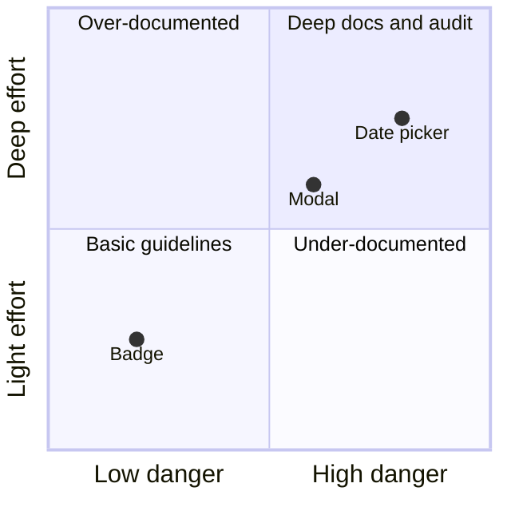
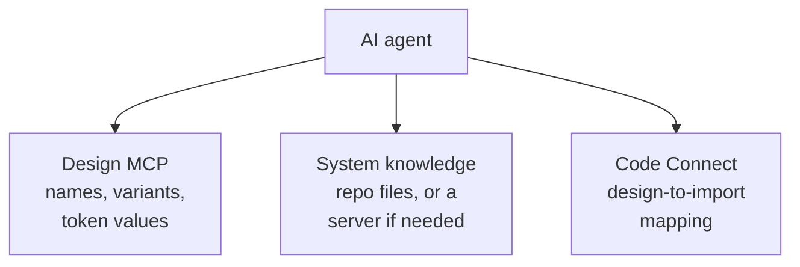

Not every component deserves the same documentation depth, audit rigor, or level of AI access. Effort should scale with implementation risk, and agent access with proven value: scoped on purpose, not maximized by default. Knowing where to spend depth is itself a design-system skill.

:::tip[Key takeaways]
- Rate components by how dangerous they are to get wrong, not how complex they look
- Spend documentation and audit depth where the rating is highest
- Split agent access into separate, scoped layers
- Add one tool connection at a time, and expand only once it proves useful
- When a connection fails, say so and carry on without it
:::

## The problem

Time and attention are scarce. An over-documented badge burns the same hours that an under-documented date picker badly needs. One bar applied to everything quietly starves your riskiest components. The same goes for AI access: an agent wired into every possible tool at once is harder to reason about and debug, because you can't tell which connection produced which behavior. In both cases, "more" isn't safer. Calibrated is safer.

## The model

### Challenge Rating

The design-system-ops notes ([`knowledge-notes/component-bestiary-reference.md`](https://github.com/murphytrueman/design-system-ops/blob/main/knowledge-notes/component-bestiary-reference.md)) borrow a mechanic from a companion project, the Component Bestiary, which catalogues UI components as D&D-style creatures. A **Challenge Rating (CR)** ranks *implementation danger*, not visual complexity. A high-CR component "is not necessarily large or visually complex — it is dangerous to implement incorrectly."

- **Badges, CR 1–2**: misuse creates minor inconsistency, so basic usage guidelines are enough.
- **Modals, CR 5–7**: misuse causes real user harm through accessibility regressions.
- **Date pickers and data tables, CR 7–9**: these should trigger a mandatory [accessibility audit](/ds101/component-accessibility/) before release.

## Practices

### Spend depth where the rating is highest

The rating calibrates everything downstream: documentation depth ("the cost of an AI tool getting a modal wrong is higher than the cost of it getting a badge wrong"), audit order, and contribution standards. A high-CR component contributed without enough expertise "is worse than no component, because it provides false confidence while introducing real risk." The rating isn't fixed per component, either. The same component's effective CR shifts with where it's placed. See [Performance in context](/ds101/performance-in-context/).

### Split agent access into layers

The same notes ([`knowledge-notes/mcp-setup-guide.md`](https://github.com/murphytrueman/design-system-ops/blob/main/knowledge-notes/mcp-setup-guide.md)) apply the same scoping to agent access through **MCP** (Model Context Protocol, the interface that lets an AI agent read component definitions and token values from their real sources instead of a stale copy). Instead of one giant connection, the setup has three separate **MCP layers**, and only the outer two need a server:

- **A design MCP, like Figma's**: the design source of truth, with names, variants, and token values, but no code-level props.
- **The system's own knowledge**: a component inventory, per-component metadata, governance rules, and decision pages. The toolkit "does not ship a design system MCP server, and most teams don't need one," because coding agents read these files straight from the repo. A server only pays off for agents that don't have the repo open.
- **Code Connect**: maps "this design uses a Button" to `import { Button } from '@system/components'`, but not the full source.

Cross-layer questions like "what code component should I use for this Figma frame?" resolve one layer at a time, and no single layer becomes a bottleneck.

The same scoping shows up in product UI. AWS Cloudscape's [user-authorized actions](https://cloudscape.design/gen-ai/patterns/user-authorized-actions/) pattern scopes an agent's permission per decision ("Allow this time," "Allow for this chat," or "Always allow") instead of one blanket grant. See [Agentic UI patterns](/ds101/agentic-ui-patterns/).

### Add one connection at a time

[Romina Kavcic](https://learn.thedesignsystem.guide/p/5-mcp-connections-every-design-system) makes the adoption-side argument: "With MCP, you control exactly what data and tools AI can access. It's not about giving AI free rein, but about creating specific, controlled bridges." Her advice: "Start small: Pick one tool, set up MCP, and automate one repetitive task. Once you see the value, expand from there." She suggests starting with Figma. Each bridge she names is scoped to one job:

- **Figma**: reads components, tokens, and variants for spec generation and token review.
- **Mintlify**: turns published docs into a searchable knowledge base without leaving the editor.
- **GitHub**: reviews PRs and diffs token definitions to catch design-code drift (see [Dependency observability](/ds101/dependency-observability/)).
- **GitLab**: manages issues, merge requests, and CI pipelines through AI workflows.
- **PostHog**: checks design decisions against real adoption and conversion data (see [Measuring adoption](/ds101/measuring-adoption/)).
- **Slack**: makes chat history searchable for decision tracking and adoption signals.

### Fail honestly when a connection breaks

From the design-system-ops MCP guide: "Never retry a failed Figma call in a loop. If the first call fails, note it, proceed without Figma, and let the user fix the connection for the next run." A well-scoped workflow treats a missing layer as an unavailable data source and says so, rather than pretending or breaking.

## Common mistakes

- **Assuming more is always better.** More access, more documentation, and more retries feel safer. But an agent connected to everything can't be debugged, and a uniform documentation bar starves the components that need depth most. Scoped and honest beats maximal and opaque.
