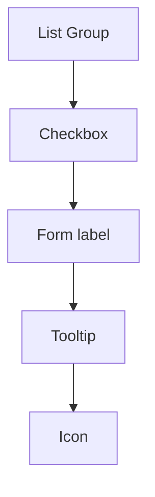

A system inventory is the record of what the design system itself contains: every token, every component, what state each one is in, and what depends on what. Keep it generated from the repo rather than typed by hand, and link each part to the parts it touches. Then any change to a token or component starts with a lookup instead of a guess.

:::tip[Key takeaways]
- Generate the inventory from the repo, don't maintain it by hand
- Link every token to the components that use it
- Record what each component uses and what uses it
- Give every item a lifecycle status and a version
- Track a large build with a doneness matrix
:::

## The problem

Without an inventory, the team can't answer the first question any change raises: what else does this touch? Tokens make that question harder than it looks, because the coupling they create doesn't show up in any import statement.

> Two components that both bind to `color.action.primary` are implicitly coupled. A token value change affects both.
>
> — [Murphy Trueman, `design-system-ops`, `knowledge-notes/component-governance.md`](https://github.com/murphytrueman/design-system-ops/blob/main/knowledge-notes/component-governance.md)

This page covers a different inventory from the other two in this wiki. The [interface inventory](/ds101/ui-audit/) catalogs what's already shipping in products, before a system exists. [Dependency observability](/ds101/dependency-observability/) looks outward at how consuming teams use the system. The system inventory looks inward, at the system's own parts and how they depend on each other.

## Practices

### Generate the inventory from the repo

An inventory someone updates by hand starts drifting from the code the day after it's written. Two sources already in this wiki solve this the same way on their own: the repo stays the source of truth, and the inventory is a view generated from it.

[Romina Kavcic](https://learn.thedesignsystem.guide/p/gamechanger-automatically-sync-design) syncs token files one way, from GitHub into Airtable, so the Airtable base is where people browse and discuss tokens but never where values get edited. Her rule: "Stop manually copying token values from your repo to documentation." Trueman's [`codebase-index`](https://github.com/murphytrueman/design-system-ops/blob/main/skills/codebase-index/SKILL.md) skill scans the component code and writes the inventory as files committed next to it, to be regenerated after any component is added or removed.

### Link every token to its components

A token list on its own tells you what exists. Linked to components, it tells you what a change will reach. Trueman's inventory records each component's token bindings, the token names its styles reference, in the shape below.

```yaml
components:
  Button:
    category: atoms
    metadata: true
    tokens:
      - --color-action-primary
      - --space-inset-md
```

Read the `tokens` list in reverse and you have the token-to-component map: every component that changes when `--color-action-primary` does.

[Nathan Curtis](https://nathanacurtis.substack.com/p/reimagining-a-token-taxonomy-462d35b2b033) starts a token taxonomy project from the same link. He sets up "a sheet to track components to be audited and what components are in scope overall," then logs every token he finds against it, from Figma styles, from Style Dictionary (a build tool that turns token files into platform code), and from variables inside component code. "While Google Sheets and Excel are sufficient, I favor Airtable," he writes. A separate sheet of proposed tokens records each token's name, type, value, and aliases, the other tokens it points to.

The same link works for newer parts of the system. Kavcic's [agentic flows inventory](https://learn.thedesignsystem.guide/p/building-an-agentic-flows-inventory) adds a table of AI features whose "Components Used" field links back to the component table, so a component's use inside AI features shows up next to its other uses. See [Agentic UI patterns](/ds101/agentic-ui-patterns/) for what those flows contain.

### Record what each component uses

Components depend on each other as well as on tokens. Trueman's [`codebase-index`](https://github.com/murphytrueman/design-system-ops/blob/main/skills/codebase-index/SKILL.md) records the link in both directions: Card `uses` Button, and Button is `usedBy` Card. From that he sorts components into three kinds:

- **leaf**: uses no other system component
- **root**: nothing else in the system renders it
- **high-fan-in**: rendered by many other components, so a change to it spreads widely

[Curtis](https://nathanacurtis.substack.com/p/planning-a-design-system-generation-ce4120393557) shows the same structure from the build side, as a chain where each component depends on the next:

<div class="mermaid-wrap">



</div>

"It's difficult to consider larger things complete if the smaller things they depend on are incomplete," he writes, so Icon gets built first. The same chain read in the other direction is a warning: a breaking change to Icon reaches List Group, even though List Group never imports Icon directly. Check a component's `usedBy` list before changing it, the same way [Dependency observability](/ds101/dependency-observability/) checks which teams are on which version.

Trueman's governance notes also track dependencies *across* systems, for organizations running several brand or platform systems on shared tokens. That only pays off at that scale. A single system can stop at its own graph.

### Give every item a status and version

An inventory that lists components without their state can't answer "can I use this yet?" or "is this on its way out?". Curtis's [Figma component review](https://nathanacurtis.substack.com/p/the-figma-component-review-f42114450b4d) checks this on every component: "Is status up-to-date, such as version (`1.5.0`, aligned with code) and/or stability (`Stable`, `Experimental`, `Beta` or …)?"

Take the status values from your lifecycle rather than inventing new ones. Trueman's [governance notes](https://github.com/murphytrueman/design-system-ops/blob/main/knowledge-notes/component-governance.md) name eight stages, from proposal through design, build, documentation, release, and maintenance, to deprecation notice and removal. [Component lifecycle](/ds101/component-lifecycle/) covers the decisions that move a component between them.

### Track a large build with a doneness matrix

A **doneness matrix** is what [Curtis](https://nathanacurtis.substack.com/p/doneness-matrices-c7f0a026365f) calls "a grid (usually, just a spreadsheet)" that tracks many parts through the same stages. He first described it in 2010, well before design systems. For a new system generation, [he sets it up](https://nathanacurtis.substack.com/p/planning-a-design-system-generation-ce4120393557) with "top level tasks and/or outputs as columns, features as rows grouped by type (Foundations, Components, Patterns) and ordered by release milestones (Alpha, Beta 1, Beta 2…)."

Expect to update it by hand. Curtis finds it "difficult to automate producing this matrix in task management tools like Jira or Asana," though custom fields on a release board get part of the way. The matrix tracks one build. The inventory outlasts it.

## Common mistakes

- **Inventorying only the code.** Curtis pulls tokens from Figma styles as well as from token files and component code, because each holds tokens the others don't. Trueman's index checks the Figma inventory against the code inventory for the same reason: to find components that exist in design but not in code, or the reverse.
- **Marking a component unused because nothing imports it directly.** In Trueman's example, no page imports Tooltip, but CopyButton renders it and CodeBlock renders CopyButton. He also warns that a public component with no users inside the system's repo is still meant for product repos the index doesn't scan. "No in-repo consumers" isn't "unused." Check [Dependency observability](/ds101/dependency-observability/) before treating it as a [removal candidate](/ds101/component-lifecycle/#criteria-for-removing-a-component).
- **Using a doneness matrix for work that doesn't fit one.** [Curtis](https://nathanacurtis.substack.com/p/doneness-matrices-c7f0a026365f) says to skip it when there are only a few parts, when the parts can't progress in parallel, when the list of parts keeps changing, or when different parts need different stages.
