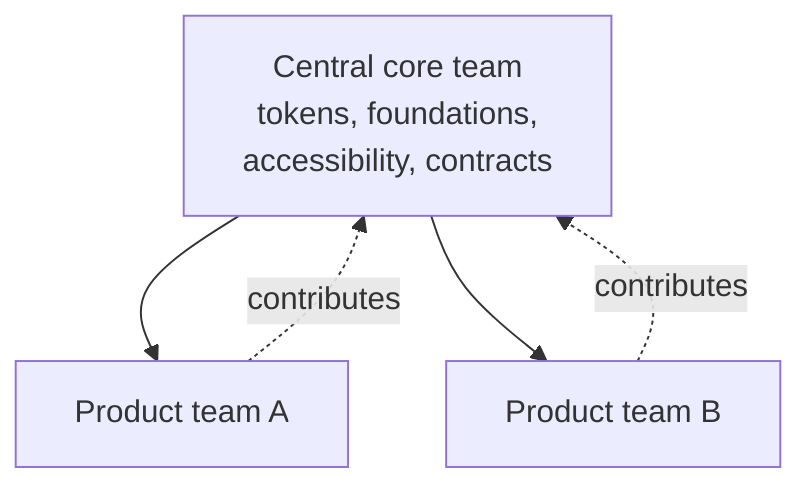

A team model decides who builds and owns the design system: one dedicated team, a federation of product teams, or a core and a federation feeding each other. Nathan Curtis's taxonomy is still the reference point, and his own article on it is called ["Team Models for Scaling a Design System."](https://medium.com/eightshapes-llc/team-models-for-scaling-a-design-system-2cf9d03be6a0) No model fits every org. The right one changes with size and maturity.

:::tip[Key takeaways]
- Start centralized on the core, and add federation on top on purpose
- Don't federate to fix a staffing shortage: it spreads the shortage out
- Staff the core team across disciplines, not just design and engineering
- Revisit the model as the org grows
:::

## The problem

Pick the wrong model for your org's size and maturity, and you get one of two failures. Either a central team becomes a bottleneck everyone routes around, or an open free-for-all produces components nobody maintains.

## Choosing a team model

Start centralized, then add federation on purpose. [Curtis](https://medium.com/@nathanacurtis/the-fallacy-of-federated-design-systems-23b9a9a05542) has revised his own framing: treating centralized and federated as alternatives was a mistake. Federation is never pursued first, and it never succeeds without a funded centre underneath. Keep the core centralized (tokens, foundations, accessibility, component contracts), and layer federation on top deliberately.

The first three models come from Curtis's 2015 taxonomy. Share figures come from zeroheight's *Design Systems Report 2026* (147 practitioners).

### Solitary

One team builds mostly for itself and makes the result available to others. Bootstrap, seen from an outside designer's perspective, works this way.

### Centralized

A dedicated team produces and supports the system for everyone else. It's the most common model: 51% of teams run it, and 31% run a hybrid. It still strains: 53% of centralized teams say they don't have enough people.

### Federated

Designers from several product teams decide on the system together. Only 13% of teams run it purely federated, and staffing complaints go up as teams federate: 68% of hybrid and 74% of federated teams say they're understaffed.

### Cyclical

[Jina Anne](https://medium.com/salesforce-ux/the-salesforce-team-model-for-scaling-a-design-system-d89c2a2d404b), drawing on her time at Salesforce, adds a fourth model. A central core team and a federated contributor group keep informing each other, rather than one replacing the other.

## Practices

### Staff the core team across disciplines

[Jina Anne](https://24ways.org/2017/design-systems-and-hybrids/) points out that design-systems work is often the natural home for hybrid practitioners, such as designer-coders who don't fit a pure design or pure engineering team. Build the model around cross-functional roles (design, code, content, accessibility, product). That gives hybrids a home instead of leaving them caught between two teams.

### Revisit the model as the org grows

A small org that over-invests in federation pays for coordination it doesn't need. An enterprise still run by one maintainer is understaffed for its scale. Treat the model as something that grows with the org, not a one-time decision. [Design system maturity](/design-system-maturity/) scores this as "team effectiveness," read against the org's size.

## Common mistakes

- **Federating to solve a staffing shortage.** The zeroheight numbers above show understaffing complaints rising, not falling, as teams federate. Federation doesn't solve the resourcing problem. It spreads it out and makes it harder to see.
