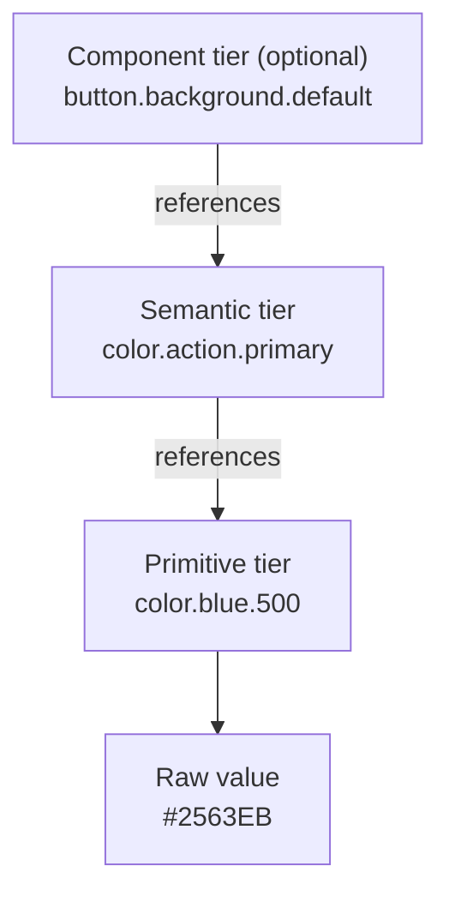

Tokens work in three layers: raw values, the intent those values serve, and optionally the components that use them. References only ever point one layer down. That's what makes a rebrand or a dark theme a one-line change instead of a search through the whole codebase.

:::tip[Key takeaways]
- Reference strictly downward: component → semantic → primitive
- Name semantic tokens for intent, never appearance
- Store tokens in the shared DTCG format
- Keep platforms out of token names; let tooling translate
- Treat every token name as a contract with its consumers
:::

## The problem

If a button's background is hardcoded, or points straight at `color.blue.500`, then a rebrand or a dark theme means hunting down every place that value was used. If it points at `color.action.primary` instead, you change one semantic mapping and everything downstream follows. [Brand alignment](/brand-alignment/) shows how this structure is where a real brand refresh meets the product system.

## The model

The three tiers come from the token notes in Murphy Trueman's design-system-ops toolkit (`knowledge-notes/token-architecture.md`).

### Primitives

Raw values, named for what they are: `color.blue.500`. Nothing in a product should point at a primitive directly, except a semantic token.

### Semantic tokens

Intent: what a value is *for*, like `color.action.primary` or `color.feedback.error`. A semantic token gets its value by pointing at a primitive. This is the layer a theme or rebrand changes.

### Component tokens

An optional third tier that scopes semantic intent to one component, like `button.background.default`. It points at a semantic token, never at a primitive.

## Practices

### Reference strictly downward

References flow component → semantic → primitive, never sideways and never skipping a tier. The design-system-ops notes call a skipped tier "the most architecturally damaging token violation." `button.background.default: {color.blue.500}` *appears* to work, because the right colour shows up. But "a rebrand or theme change that correctly updates the semantic tier will not reach this component." It breaks silently, and you only find out mid-rebrand.

### Name semantic tokens for intent, never appearance

The same notes: "A semantic token that describes visual appearance has failed its purpose. `color.semantic.blue` is a primitive with extra steps." The moment the brand shifts to purple, `color.semantic.blue` is either a lie or a mass rename. Name semantic tokens by role and intent (`category.role.variant.state`), never by colour names, vague size terms, or generic qualifiers.

### Store tokens in the shared DTCG format

The Design Tokens Community Group (DTCG) format is now a shared standard. Its first stable spec, DTCG 2025.10 (October 2025), defines 13 token types (color, dimension, fontFamily, and so on) and composite tokens like typography and shadow. In a composite token, each sub-value must itself reference tokens correctly, not just the top-level value. The spec also defines resolver files, which combine token sets into modes like light/dark or brand variants.

### Keep platforms out of token names

Per the design-system-ops notes, platform differences (web pixels vs. iOS points, different typefaces) are handled by transformation tooling, never encoded in the name. Transformation tooling is software like Style Dictionary that converts one token file into each platform's native format. So it's `spacing.4`, not `spacing.web.4`. [Platform divergence](/platform-divergence/) walks through that transformation step end to end. [Multi-platform component specs](/multi-platform-component-specs/) applies the same platform-neutral idea to whole components.

### Treat token names as contracts

[Murphy Trueman](https://blog.murphytrueman.com/your-next-design-system-user/) argues that "your design system is already an API; the question is whether it's a good one." A token name isn't a label. It's a contract with every consumer, human or machine. Renaming one is a breaking change ([Release management](/release-management/)). [Documentation for agents](/documentation-for-agents/) covers the machine consumers.

## Common mistakes

- **Running a primitives-only system.** Without a semantic layer, theming is impossible. Every value change means hunting down every primitive reference instead of repointing one alias.
- **Letting token count grow faster than the product.** That growth usually means one-off tokens are being created instead of existing intent being reused.
