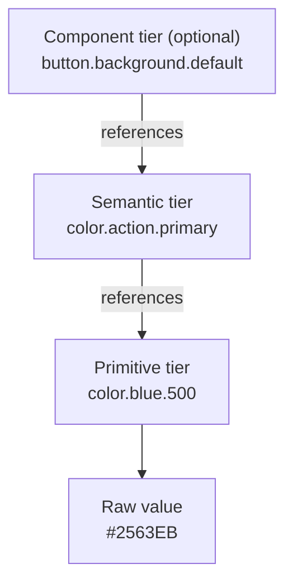

# Token Architecture: The Three-Tier Model

The Principle

## Tokens work in three layers, referenced strictly downward

Tokens work best in layers. **Primitives** hold raw values and are named for what they are (`color.blue.500`). **Semantic tokens** encode intent — what a value is *for* (`color.action.primary`, `color.feedback.error`) — and get that value by pointing at a primitive. **Component tokens**, an optional third tier, scope semantic intent to one component. References flow strictly downward: component → semantic → primitive, never sideways or skipping levels. — design-system-ops, knowledge-notes/token-architecture.md

Why It Exists

## Layers keep rebrands and theme changes cheap

The layers exist so change stays cheap. If a button's background is hardcoded — or points straight at `color.blue.500` — then a rebrand or a dark theme means hunting down every place that value was used. If it points at `color.action.primary` instead, you change one semantic mapping and everything downstream follows. See [Brand alignment](brand-alignment.md) for how this three-tier structure is where a real brand refresh actually meets the product system.

That's why skipping a tier is so damaging. The same team's notes call cross-tier references at the wrong level "the most architecturally damaging token violation": `button.background.default: {color.blue.500}` *appears* to work — the right colour shows up — but "a rebrand or theme change that correctly updates the semantic tier will not reach this component." It breaks silently, and you only find out mid-rebrand. — design-system-ops, knowledge-notes/token-architecture.md

---

## In Practice

#### 1. Shared token format standard

There's now a shared standard: the Design Tokens Community Group format. Its first stable spec (DTCG 2025.10, released October 2025) defines 13 token types (color, dimension, fontFamily, and so on) and composite tokens like typography and shadow, whose sub-values must themselves reference tokens correctly, not just the top-level value. It also defines resolver files, which compose token sets into modes like light/dark or brand variants for theming. — design-system-ops, knowledge-notes/token-architecture.md

#### 2. Platform-agnostic naming, tooling handles translation

The same notes cover cross-platform naming: platform differences (web pixels vs. iOS points, different typefaces) are handled by transformation tooling — software like Style Dictionary that converts one token file into each platform's native format — never encoded into the name itself. It's `spacing.4`, not `spacing.web.4`.

#### 3. Token names as contracts

Murphy Trueman argues that "your design system is already an API; the question is whether it's a good one" — [Murphy Trueman, "Your next design system user is an agent"](https://blog.murphytrueman.com/your-next-design-system-user/). A token name isn't a label; it's a contract with every consumer, human or machine. (More on the machine consumers in pages 07–09.)

## Diagram

Token resolution order — references flow strictly downward:

## Common mistakes

- **Naming a semantic token after its appearance.** "A semantic token that describes visual appearance has failed its purpose. `color.semantic.blue` is a primitive with extra steps." — design-system-ops, knowledge-notes/token-architecture.md. The moment the brand shifts to purple, `color.semantic.blue` is either a lie or a mass rename. Semantic names should describe role and intent (`category.role.variant.state`), never colour names, ambiguous size terms, or generic qualifiers.
- **Running a primitives-only system.** Without a semantic layer, theming becomes impossible — every value change means hunting down every primitive reference instead of repointing one alias.
- **Letting token count grow faster than the product.** That growth is usually a sign of one-off tokens getting created instead of intent being reused.
